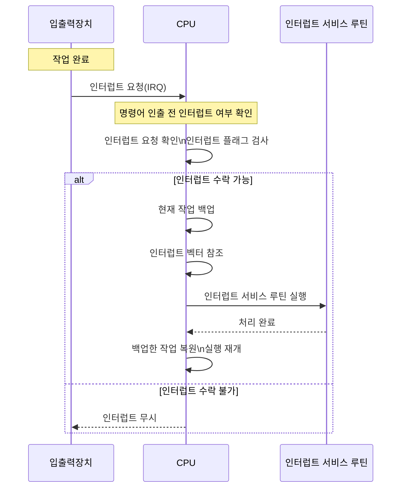

# 💻 컴퓨터 구조 정리 (보완 버전)

## 1. 컴퓨터가 이해하는 정보

컴퓨터는 오직 **0과 1(이진수)**로 표현된 **데이터**와 **명령어**만을 이해한다.

- **데이터**: 정적인 값 (예: 숫자, 문자, 이미지 등)
    
- **명령어**: 컴퓨터가 수행해야 할 동작 (연산, 이동, 비교 등)
    

📌 **명령어 = 연산 코드(OpCode) + 오퍼랜드(피연산자 또는 주소)**

→ 명령어는 CPU에 의해 해석되고 실행된다.

---

## 2. 컴퓨터의 핵심 부품

|부품|설명|
|---|---|
|CPU|중앙처리장치. 명령어 해석 및 실행 담당|
|메모리(RAM)|현재 실행 중인 프로그램과 데이터를 저장|
|캐시 메모리|CPU와 RAM 간 속도 차이를 보완하는 고속 메모리|
|보조기억장치|HDD, SSD 등. 프로그램, 데이터의 영구 저장|
|입출력장치|외부 장치와의 데이터 입출력 담당 (예: 마우스, 모니터 등)|

---

## 3. CPU (중앙처리장치)

### 구성 요소

- **ALU (산술논리장치)**: 산술 연산 및 논리 연산 수행
    
- **제어장치**: 명령어 해석 후 제어신호 생성 (클럭 기반)
    
- **레지스터**: 초고속 임시 저장장치
    

### 주요 레지스터

|이름|역할|
|---|---|
|PC (Program Counter)|다음 실행할 명령어의 주소 저장|
|IR (Instruction Register)|현재 실행 중인 명령어 저장|
|MAR (Memory Address Register)|접근할 메모리 주소 저장|
|MDR (Memory Data Register)|메모리와 CPU 간 데이터 전달|
|범용 레지스터 (AX, BX 등)|연산 대상 값 임시 저장|
|플래그 레지스터|조건 결과 저장 (예: Carry, Zero 플래그 등)|
|스택 포인터 (SP)|현재 스택의 최상단 위치 저장|

---

## 4. 메모리와 캐시 메모리

### 메모리 구조

- **RAM (휘발성)**: 전원 OFF 시 데이터 사라짐
    
- **ROM (비휘발성)**: 읽기 전용, 부팅 시 BIOS 등 저장
    

### 캐시 메모리 계층

|구분|설명|
|---|---|
|L1 캐시|가장 빠르며, 각 코어에 존재|
|L2 캐시|약간 느리지만 큰 용량|
|L3 캐시|여러 코어가 공유|

📌 **지역성(Locality)** 원칙 기반으로 데이터 사전 예측하여 캐시에 저장함  
→ 시간 지역성, 공간 지역성

---

## 5. 보조기억장치

- RAM보다 느리지만, **비휘발성**이고 **용량이 큼**
    
- HDD, SSD, USB, DVD 등이 포함됨
    

📌 **RAID**: 디스크를 묶어 **속도 향상(Striping)** 또는 **안정성 향상(Mirroring)**

---

## 6. 입출력장치 (I/O 장치)

- CPU와 외부 세계(사용자 또는 장치) 간 데이터 전달
    
- 예: 키보드, 마우스, 모니터, 프린터 등
    
- 종류: **입력 장치**, **출력 장치**, **입출력 겸용 장치**
    

📌 **I/O 방식**

- **폴링**: CPU가 주기적으로 상태 확인
    
- **인터럽트 기반**: 장치가 이벤트 발생 시 CPU에게 알림
    
- **DMA (Direct Memory Access)**: CPU 개입 없이 메모리에 직접 접근
    

---

## 7. 메인보드와 시스템 버스

- **마더보드**: 부품 간 전기적 연결 역할
    
- **시스템 버스**: 데이터/주소/제어 신호를 전달하는 통로
    

|버스 종류|역할|
|---|---|
|데이터 버스|실제 데이터를 전송|
|주소 버스|접근할 메모리 주소 전송|
|제어 버스|읽기/쓰기 등 제어 신호 전송|

---

## 8. 단위와 워드

- 1 Byte = 8 bit
    
- 1 KB = 1024 Byte (표준적으로는 2¹⁰)
    
- 워드(Word): CPU가 한 번에 처리할 수 있는 데이터 단위 (보통 32bit 또는 64bit)
    

📌 **Word 크기**는 CPU 아키텍처에 따라 다름 (예: 32bit CPU는 4Byte)

---

## 9. 데이터 표현과 오류 검출

- **정수 표현**: 2의 보수 방식 사용
    
- **실수 표현**: IEEE 754 부동소수점 방식 사용
    
- **문자 표현**: ASCII 또는 유니코드
    
- **오류 검출**: 패리티 비트, 해밍 코드 사용
    

---

## 10. 명령어와 명령어 사이클

### 명령어 구성

- **Opcode (연산 코드)**: 수행할 연산 지정
    
- **Operand (피연산자)**: 연산에 사용할 데이터 or 주소
    

### 명령어 사이클

1. **인출(Fetch)**: 메모리에서 명령어 가져오기
    
2. **해독(Decode)**: 명령어 해석
    
3. **실행(Execute)**: 연산 수행
    
4. **기억(Write back)**: 결과 저장
    
5. **간접 접근(Optional)**: 주소 계산 후 다시 메모리 접근 필요 시
    

---

## 11. 인터럽트

### 정의

- **비정상적 사건에 의해 현재 실행 중인 명령을 잠시 중단하고 처리**
    

### 종류

|구분|예시|
|---|---|
|동기 인터럽트|0으로 나누기, 명령어 오류 등|
|비동기 인터럽트|하드웨어 입출력 완료, 타이머 등|

### 목적

- 외부 장치의 신호에 빠르게 대응
    
- CPU의 불필요한 대기시간 제거
    

### 구분

- **마스크 가능 인터럽트**: 우선순위 낮음, 무시 가능
    
- **마스크 불가능 인터럽트**: 반드시 처리 (ex. 전원 이상, 시계 오류)
    

---

## 12. 예외(Exception)

|구분|의미|처리 후|
|---|---|---|
|폴트(Fault)|오류 감지 → 복구 가능|해당 명령어 재시도|
|트랩(Trap)|예외적 상황 (ex. syscall)|다음 명령어로 진행|
|어보트(Abort)|복구 불가능한 치명적 오류|프로그램 강제 종료|

---

## 13. CPU 성능 향상 기법

- **클럭 속도**: 초당 처리 속도 (Hz)
    
- **파이프라이닝**: 명령어를 단계별로 나눠 병렬 처리
    
- **슈퍼스칼라 구조**: 여러 명령어를 동시에 처리
    
- **분기 예측**: 조건문 결과를 미리 예측하여 처리
    

---

## 14. 멀티코어 & 멀티스레드

### 멀티코어

- 하나의 CPU에 여러 개의 **독립적인 코어**
    
- 각 코어는 별도의 명령어를 처리할 수 있음
    

### 멀티스레드

- **스레드(Thread)**: 실행 흐름의 최소 단위
    
- 프로그램을 여러 스레드로 분리하여 병렬 실행 가능
    

|구분|설명|
|---|---|
|하드웨어 스레드|하나의 코어가 여러 명령어 흐름을 동시에 처리 (SMT 등)|
|소프트웨어 스레드|OS 또는 프로그램 레벨에서 생성된 실행 흐름 단위|

📌 **논리 프로세서 = 하드웨어 스레드 수**  
(예: 4코어 8스레드 → 논리 프로세서 8개)

병렬성과 동시성의 차이
병렬성을 일을 동시에 처리할 수 있는가
동시성은 빠르게 한 코어에서 동시에 일을 처리하는 것 처럼 보이는 방법

---

### 파이프라이닝을 통한 명령어 병렬 처리
- 여러 명령어를 동시에 처리하여 CPU를 한시도 쉬지 않고 작동시킴으로써 CPU 성능을 높이는 기법을 말함. 

1. 명령어 인출
2. 명령어 해석
3. 명령어 실행
4. 결과저장
단계가 겹치지 않는 다면 각각의 단계를 동시에 실행할 수 있다는 점

제어 위험
구조적 위험

---

## 메모리

휘발성 저장 장치

랜덤 엑세스 메모리

직접 접근이라고도 함.

반대로는 순차 접근

---

DRAM, SRAM, SDRAM, DDR SDRAM, 

빅엔디안 : 낮은 번지의 주소에 상위 바이트부터 ㅈ저장하는 빙식
리틀 엔디안 낮은 번지의 주소에 하위 바이트부터 저장하는 방식

장단점

### 캐시메모리
CPU와 메모리 사이에 위치한 SRAM 기반의 저장 장치

캐시 히트와 캐시 미스

캐시 적중률

참조 지역성의 원리
시간 지역성 
공간지역성

캐시 메모리으 ㅣ쓰기 정책과 일관성

즉시 쓰기 지연 쓰기

원리

## 보조거익 장치와 입출력 장치 

하드디스드라이브, 플래시 메모리 기반 저장 장치 -> SSD

RAID 데이터의 안전성 혹은 성능을 확보하기위해 여러개의 독립적인 보조기억장치를 마치 하나의 보조기억장치처럼 사용하는 기술

RAID0 1 2 3 4 5 6 

10 50 이 이씁니다. 

DMA 입출력
