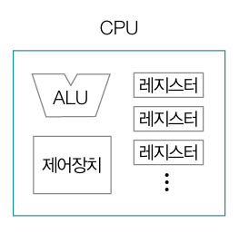
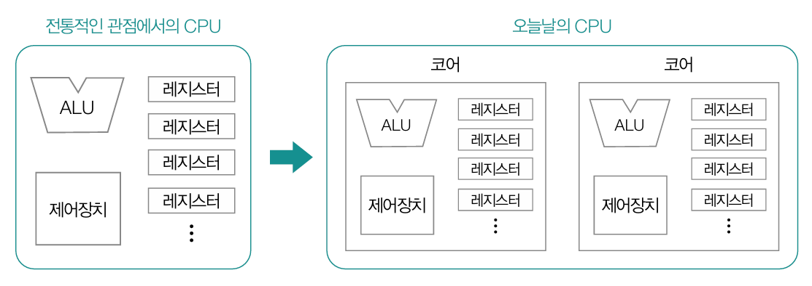
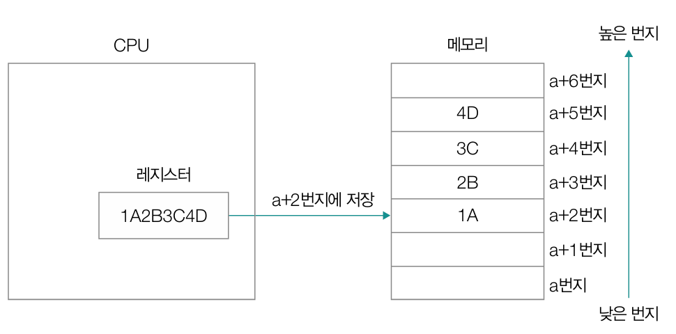
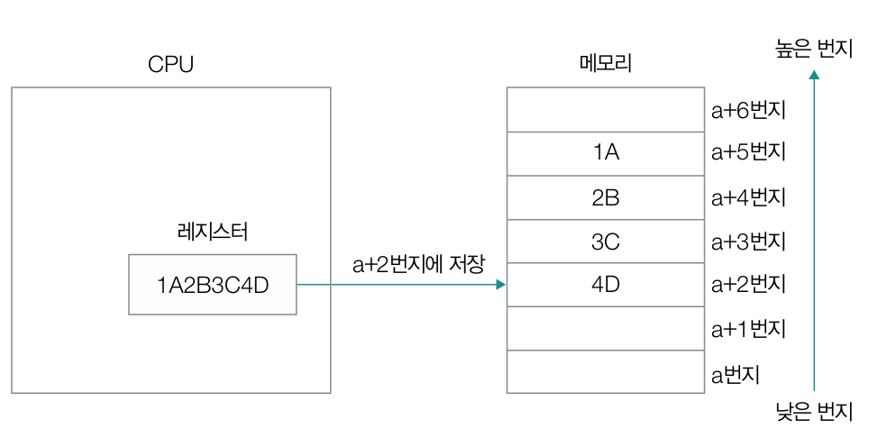

# CH02. 컴퓨터 구조

- [컴퓨터 구조의 큰 그림](#1-컴퓨터-구조의-큰-그림)
- [컴퓨터가 이해하는 정보](#2-컴퓨터가-이해하는-정보)
- [CPU](#3-cpu)
- [메모리](#4-메모리)
- [보조기억장치와 입출력장치](#5-보조기억장치와-입출력장치)

## 📌 핵심 개념 요약

## 1. 컴퓨터 구조의 큰 그림


### 컴퓨터의 핵심 부품

컴퓨터는 데이터와 명령어로 동작한다. 명령어를 실행하는 주체인 CPU의 종류에 따라 실행 가능한 세부적인 명령어의 종류와 처리의 양상이 달라질 수 있다.

컴퓨터의 핵심 부품에는 CPU, 메모리, 캐시, 보조기억장치, 입출력장치가 있다.

> CPU : 빠른 명령어 처리를 위한 기술  
> 메모리와 캐시 메모리 : RAM, 엔디안(메모리가 데이터에 저장되는 순서), 캐시 메모리  
> 보조기억장치 : RAID(안전하고 안정적으로 보조기억장치를 구성하는 기술)  
> 입출력장치 : 입출력 기법

---

`CPU`는 다음과 같이 구성된다.

<div style="display: flex; gap: 20px;">
    
    <div style="flex: 1;">
        <ul>
            <li><b>산술논리연산장치(ALU, Arthmetic and Logic Unit)</b> <br>CPU가 처리할 명령어를 실질적으로 연산하는 일종의 계산기 </li>
            <li><b>제어장치(CU, Control Unit)</b><br> 명령어를 해석해 제어 신호를 내보내는 장치</li>
            <li><b>레지스터{register}</b><br>작은 임시 저장장치로, CPU 내에는 여러 개의 레지스터가 존재하며 각기 다른 이름과 역할을 가진다.</li>
        </ul>
    </div>
</div>

CPU가 처리하는 명령어는 반드시 레지스터에 저장된다!

---

`메모리와 캐시 메모리`  
CPU가 처리하는 모든 정보는 메모리에 저장되어 있다.
`메인 메모리(main memory)` 역할을 하는 하드웨어에는 `RAM`과 `ROM`이 있고, 일반적으로 ‘(메인)메모리’라는 용어는 RAM을 지칭하는 경우가 많다.
메모리는 <u>현재 실행 중인 프로그램</u>을 구성하는 데이터와 명령어를 저장하는 부품이다.

메모리의 정보가 저장되는 공간에는 각각 주소가 할당되어 있다. 이를 사용해서 CPU가 원하는 데이터에 접근할 수 있다.
메모리는 `휘발성(volatile)`으로, 전원이 공급되지 않을 때에는 저장하고 있는 정보가 지워진다.

`캐시 메모리(cache memory)`는 CPU와 메모리 사이에서 CPU가 좀 더 빠르게 메모리에 저장된 값에 접근할 수 있도록 하는 저장장치이다.

`보조기억장치`는 비휘발성(non-volatile) 저장장치로, CD-ROM이나 DVD, 하드 디스크 드라이브, 플래시 메모리(SSD, USB 메모리), 플로피 디스크 등이 있다.
CPU가 보조기억장치에 저장된 프로그램을 가져와 실행하는 것이 아닌, 보조기억장치에서 보관하고 있는 프로그램을 메모리로 복사하여 사용한다는 것을 유의하자.

`입출력장치(I/O 장치, input/output device)`는 컴퓨터 외부에 연결되어 컴퓨터 내부와 정보를 교환하는 장치를 말한다. 보조기억장치와 입출력장치 모두 메모리를 보조하는 임무를 수행하며 컴퓨터 내부와 정보를 주고받는 방식이 유사하여 `주변장치(peripheral device)`라고 통칭하기도 한다.

`메인 보드(main board 또는 mother board)`는 위에서 설명한 컴퓨터의 핵심 부품들을이 고정된 기판이다. 각각의 부품들은 `시스템 버스(system bus)`를 통해서 서로 정보를 주고 받는다.

## 2. 컴퓨터가 이해하는 정보

CPU는 기본적으로 2진법을 사용하며, 0 또는 1만 가지는 `비트`를 시작으로 다음과 같은 단위가 존재한다.

| 항목            | 1 byte | 1 kB         | 1 MB             | 1 GB             | 1 TB             |
| --------------- | ------ | ------------ | ---------------- | ---------------- | ---------------- |
| **비트 / 단위** | 8 비트 | 1,000 바이트 | 1,000 킬로바이트 | 1,000 메가바이트 | 1,000 기가바이트 |

| 항목            | 1 byte | 1 KiB        | 1 MiB            | 1 GiB            | 1 TiB            |
| --------------- | ------ | ------------ | ---------------- | ---------------- | ---------------- |
| **비트 / 단위** | 8 비트 | 1,024 바이트 | 1,024 키비바이트 | 1,024 메비바이트 | 1,024 기비바이트 |

`워드(word)`란 CPU가 한 번에 처리할 수 있는 데이터의 크기이다.

### 컴퓨터에서의 소수 표현

컴퓨터에서는 내가 표현하고자 하는 소수와 실제로 저장된 소수 간에 오차가 존재할 수 있다는 점을 명심해야한다.

```py
a = 0.1
b = 0.2
c = 0.3

print(a + b == c) # false
```

컴퓨터 내부에서는 소수점을 나타내기 위해 `부동 소수점(floating point)` 표현 방식을 이용하는데, 이 방식의 정밀도에 한계가 있어 이러한 오차가 발생한다.

> `부동소수점`이란 소수(실수)를 근사하여 표현하는 방식으로, 아주 크거나 아주 작은 숫자도 저장할 수 있게 한다. 정수 표현과 달리 `지수(exponent)`와 `가수(mantissa, significand)`를 사용해 실수를 표현한다.
> 부동소수점 표준으로 `IEEE 754`를 사용하며, 데이터의 타입에 따라 구조를 다르게 한다.

| 형식            | 전체 비트 수 | 부호(Sign) | 지수(Exponent) | 가수(Mantissa) | 바이어스(bias) |
| --------------- | ------------ | ---------- | -------------- | -------------- | -------------- |
| 단정도 (float)  | 32비트       | 1비트      | 8비트          | 23비트         | 127            |
| 배정도 (double) | 64비트       | 1비트      | 11비트         | 52비트         | 1023           |

> 부호는 0이면 양수, 음이면 1이다.  
> 부동소수점은 근사값이기 때문에 오차가 발생할 수 있다. 따라서 직접 비교 대신 `허용 오차(epsilon)`를 두어 비교해야한다.

---

추가 내용!

그러면 어떻게 매우 근소한 값이 차이를 구별할 수 있을까?  
(1) 절대오차  
: 두 값의 차이가 작은 고정값 이하인지 비교한다. 값의 크기 자체가 작거나 상대 오차가 무의미할 때 사용한다.

```
def approx_equal(a, b, epsilon=1e-9):
    return abs(a - b) < epsilon
```

(2) 상대오차  
: 비교하는 값의 크기에 비례해서 허용 오차를 조정한다. 상대적인 차이를 중요하게 다룰 때 사용한다.

```
def is_close_rel(a, b, rel_tol=1e-9):
    return abs(a - b) < rel_tol * max(abs(a), abs(b))
```

(3) ULP(Unit in the Last Place)  
ULP는 어떤 부동소수점 수에서 다음으로 표현 가능한 가장 가까운 수까지의 거리로, 부동소수점 숫자 사이의 최소 단위이며, 숫자의 크기에 따라 달라진다. 비트 수준에서 얼마나 떨어져있는지를 측정하기 때문에, 정밀도가 얼마나 손상되었는지, 두 수가 거의 같은지를 정확하게 판단하는 기준이 된다.

---

### 컴퓨터에서의 문자

컴퓨터가 이해할 수 있는 문자들의 집합인 `문자 집합(charactor set)`은 컴퓨터가 이해하는 언어로 변환하는 `인코딩(incording)`과 이를 사람들의 언어로 변환하는 `디코딩(decording)`과정을 통해 사용된다.

(1) `아스키`

- 영어의 알파벳과 아라비아 숫자, 일부 특수 문자를 포함
- 하나의 아스키 문자당 8비트(1바이트)를 사용, 8비트 중 1비트는 `패리티 비트(parity bit)`로 오류 검출을 위해 사용 => 실질적으로는 128개의 문자를 표현
- 아스키 코드(코드 포인트) : 아스키 문자에 대응된 고유한 수
- 아스키 문자와 아스키 코드

| 문자 | 아스키 코드 | 설명     |
| ---- | ----------- | -------- |
| `a`  | 97          | 소문자 a |
| `A`  | 65          | 대문자 A |
| `0`  | 48          | 숫자 0   |

(2) `EUC-KR`

- 한글 인코딩 방식 중 하나, 아스키 문자는 1바이트 / 하나의 한글 글자는 2바이트 크기의 코드가 부여
- 모든 한글 조합을 표현할 수는 없음

(3) `유니코드(unicode)`

- 한글을 포함한 다양한 언어, 특수문자, 이모티콘 등을 포함한 통일된 문자 집합
- 현대에서 가장 많이 사용
- 글자에 부여된 값을 다양한 방법으로 인코딩(UTF-8, UTF-16, UTF-32) => 가변 길이 인코딩 방식으로 같은 문자에 대해서도 다른 인코딩 결과가 도출될 수 있다.

(4) `base64`

- 이진 데이터를 인코딩하는데에 주로 사용, 이미지 등의 데이터도 아스키 문자 형태로 표현
- 원본 데이터를 3바이트(24비트)씩 끊음 -> 6비트씩 나눠서 → 총 4개의 숫자로 분할 (2⁶ = 64 가능) -> 이 숫자들을 Base64 인코딩 테이블에서 대응되는 문자로 치환, 부족한 비트는 `패딩`으로 채워진다.
- 바이너리를 텍스트로 안전하게 변환할 수 있으나, 원본보다 인코딩 크기가 커진다는 단점이 있음

### 기계어와 어셈블리어

`연산 코드(opcode)` : 명령어가 수행할 동작, 연산자  
= 데이터 전송, 산술/논리 연산, 제어 흐름 변경, 입출력 제어

`오퍼랜드(operand)` : 동작에 사용될 데이터 또는 데이터가 저장된 위치, 피 연산자

`기계어(machine code)` : CPU가 이해할 수 있도록 0과 1로 표현된 정보를 그대로 표현한 언어.

`어셈블리어(assembly language)` : 기계어를 읽기 편한 형태로 단순 번역한 영어.
구체적인 연산 코드의 종류나 레지스터의 이름, 명령어의 생김새가 CPU 마다 다를 수 있다.
따라서 CPU가 다르면 기계어도 달라지고, 이를 번역한 어셈블리어도 달라지게 된다.

`명령어 사이클(instruction cycle)` : CPU가 한 개의 명령어를 실행하기 위해 수행하는 일련의 정형화된 작업 과정

<div style="display: flex; align:center; gap: 20px; margin:20px;">
    
        <div style="flex: 1;">
        <ul>
            <li>메모리에서 CPU로 명령어 가져오기</li>
            <li>만약 오퍼랜드 필드에 메모리 주소가 명시된 경우 CPU는 한번 더 메모리에 접근</li>
            <li>실행하기</li>
        </ul>
    </div>
</div>

## 3. CPU

### 레지스터

`레지스터(register)`는 CPU 안에 있는 작은 임시 저장장치. 디버깅 도구를 이용해 관찰할 수 있다.  
CPU 안에는 다양한 레지스터들이 있고, 각기 다른 이름과 역할이 있다.

- `프로그램 카운터(program counter, instruction pointer)` : 메모리에서 다음으로 읽어 들일 명령어의 주소 저장
  일반적으로 프로그램 카운터는 1씩 증가하나 조건에 따라 다르다.

- `명령어 레지스터(instruction register)` 메모리에서 방금 읽어들인 명령어를 저장하는 레지스터  
  CPU가 fetch cycle을 통해 메모리에서 명령어를 가져오면 그 명령어를 IR에 저장, 제어 장치가 IR 안에 있는 명령어를 해석하고 ALU 또는 다른 부품에 제어 신호 전송한다.

- `범용 레지스터(general purpose register)` : 다양하게 사용 가능, 데이터와 명령어, 주소 모두 저장 가능

- `플래그 레지스터(flag register)` : 연산 결과 혹은 CPU 상태에 대한 부가정보(flag) 값을 저장하는 레지스터.

- `스택 포인터(stack pointer)` : 메모리 내 스택 영역의 최상단 스택 데이터 위치를 가리키는 레지스터

### 인터럽트

`인터럽트(interrupt)` : CPU의 작업을 방해하는 신호

- `동기 인터럽트(예외, exception)` : CPU에 의해 발생하는 인터럽트  
  e.g. 프로그래밍 오류

- `비동기 인터럽트(하드웨어 인터럽트)` : 주로 입출력장치에 의해 발생하는 인터럽트  
  e.g. 프린터가 작업을 완료하고 CPU에게 완료 알림(인터럽트)을 보낸다.
  키보드가 어떤 입력을 받아들였을 때, 이를 처리하기 위해 CPU에게 입력 알
  림(인터럽트)을 보낸다.  
  => 막을 수 있는 인터럽트 와 막을 수 없는 인터럽트(정전, 하드웨어 고장 등)로 나눌 수 있음

---

### 하드웨어 인터럽트

일반적으로 입출력장치의 속도는 CPU에 비해 느리다. 입출력장치의 결과를 기다리고 있을 수는 없기 때문에 하드웨어 인터럽트를 사용하여 결과가 나올 때까지 다른 작업을 처리할 수 있다.

- CPU가 하드웨어 인터럽트를 처리하는 순서

  > 1. 입출력장치는 CPU에게 인터럽트 요청 신호를 보냅니다.
  > 2. CPU는 실행 사이클이 끝나고 명령어를 인출하기 전에 항상 "인터럽트 여부를 확인"합니다.
  > 3. CPU는 인터럽트 요청을 확인하고, 인터럽트 플래그를 통해 현재 인터럽트를 받아들일 수 있는지 여부
  >    를 확인합니다.
  > 4. 인터럽트를 받아들일 수 있다면 CPU가 지금까지의 작업(프로그램 카운터, 레지스터 값 등)을 스택에 저장하여 이후 복귀할 수 있도록 백업합니다.
  > 5. CPU는 인터럽트 벡터를 참조하여 인터럽트 서비스 루틴을 실행합니다.
  > 6. 인터럽트 서비스 루틴 실행이 끝나면 `4` 에서 백업해 둔 작업을 복구하여 실행을 재개합니다.

<br>

- 용어 정리  
  `폴링 (Polling)` : CPU가 주기적으로 I/O 장치의 상태를 직접 확인하여 서비스가 필요한지 검사하는 방식.
  `인터럽트 요청 신호 (Interrupt Request, IRQ)` : I/O 장치나 다른 하드웨어가 CPU의 처리를 요구할 때 보내는 전기적 신호.  
  `인터럽트 플래그 (Interrupt Flag)` : CPU가 인터럽트를 받아들일지 여부를 제어하는 비트. (예: 0 => 인터럽트 무시, 1 => 허용)  
  `인터럽트 벡터 (Interrupt Vector)` : 특정 인터럽트 발생 시 실행할 서비스 루틴의 시작 주소를 가리키는 테이블(목록).  
  `인터럽트 서비스 루틴 (Interrupt Service Routine, ISR)` : 인터럽트 발생 시 CPU가 자동으로 실행하는 프로그램 코드(= 핸들러).

### 동기 인터럽트

- 폴트와 트랩
  - `폴트(fault)` : 예외를 처리한 후 예외가 발생한 명령어부터 실행  
    e.g. 보조기억장치에서 데이터를 가져와야한다.
  - `트랩(trap)` : 예외를 처리한 후 예외가 발생한 명령어의 다음 명령어부터 실행  
    e.g. 디버깅 브레이크 포인트(개발자가 프로그램 실행 도중 특정 지점에서 실행을 멈추도록 설정한 지점. 코드 검사와 오류 추적에 사용), 산술 오류(연산 과정에서 발생하는 오류로, 예를 들어 정수를 0으로 나누려 할 때 발생하는 예외)
- `중단` : 프로그램을 강제로 중단
- `소프트웨어 인터럽트` : 시스템 콜이 발생했을 때 발생하는 예외

### CPU 성능 향상을 위한 설계

- `클럭(clock)`  
  : 컴퓨터의 부품을 움직일 수 있게 하는 시간의 단위, CPU 내부에서 일정한 간격으로 발생하는 신호(펄스)

- `클럭 속도(Clock Speed)`  
  : 클럭 신호가 1초에 몇 번 발생하는지를 나타내는 값  
   단위는 `헤르츠(Hz)`, 보통 `GHz` 단위  
   (e.g. 1GHz = 초당 1억(10^9) 번 클럭 발생)
  클럭 속도가 높을수록 CPU가 더 많은 명령어를 처리할 수 있는 잠재력이 있음

### 멀티 코어와 멀티스레드

`코어(core)`

- CPU 내에서 명령어를 읽어 들이고, 해석하고, 실행하는 부품
- 여러 개의 코어를 포함하고 있는 CPU를 멀티 코어 CPU 또는 멀티코어 프로세서라고 부른다.



`스레드(thread)`

- 실행 흐름의 단위
- 다양하게 사용되지만 크게 `하드웨어 스레드`와 `소프트웨어 스레드`로 나누어 생각
  - `하드웨어 스레드(논리 프로세서)` : 하나의 코어가 동시에 처리하는 명령어의 단위  
    `a코어 n스레드 CPU` == 명령어를 읽어 들이고, 해석하고, 실행하는 부품 a개가 한 번에 n개의 명령어를 처리
  - `소프트웨어 스레드` : 하나의 프로그램에서 독립적으로 실행되는 단위

> 소프트웨어에서의 프로그램 vs 스레드 (e.g. 크롬)<br><br> > `프로그램` : 전체 애플리케이션, 사용자가 실행하는 하나의 독립된 소프트웨어 단위이고, CPU나 메모리 자원을 할당받아 동작<br>
> e.g. 크롬 설치파일(chrome.exe) 하나 == 프로그램<br><br> > `스레드(Thread)` : 프로그램 안에서 독립적으로 실행되는 작업 단위  
> 여러 개의 탭, 확장 프로그램, 렌더링 작업 등이 각각 스레드로 동작해서 동시에 일을 처리할 수 있음  
> e.g.유튜브 탭에서 동영상 재생하는 스레드, 구글 검색 탭에서 검색하는 스레드가 각각 따로 돌아가면서 서로 간섭 없이 일함.

### 파이프라이닝을 통한 명령어 병렬 처리

`동시성과 병렬성`

- `동시성(Concurrency)`  
   하나의 CPU(혹은 한정된 자원)에서 여러 작업을 겹치게 실행하는 개념
  실제로 동시에 실행되는 건 아니지만, 빠른 전환으로 동시에 실행되는 것처럼 보임

- `병렬성(Parallelism)`
  여러 CPU(또는 코어)를 사용하여 여러 작업을 진짜 동시에 실행하는 개념

  동시성: 한 사람이 밥 → 국 → 반찬을 빠르게 번갈아 먹는 것

  병렬성: 두 사람이 한 명은 밥, 다른 한 명은 국을 동시에 먹는 것

<br>

명령어 병렬 처리 기법

- `명령어 병렬 처리 기법` : CPU가 여러 명령어를 동시에 처리하여 성능을 높이는 방법

- `명령어 파이프라이닝 (Instruction Pipelining)` : 명령어를 명령어 파이프라인에 넣고 동시에 처리하는 기법. 명령어 실행 과정을 단계별(인출, 해석, 실행, 저장)로 나누어, 여러 명령어를 겹쳐서 처리하는 기법.

- `슈퍼스칼라 (Superscalar)` : 파이프라인 구조를 여러 개 두어, 한 사이클에 여러 명령어를 동시에 발행·실행할 수 있는 구조. (공장에서 생산라인을 여러개 두어서 작업하는 것과 같다.)
- `파이프라인 위험 (Pipeline Hazard)` : 파이프라이닝 중 명령어 실행이 지연되거나 충돌이 발생하여 성능 향상이 이루어지지 않는 상황
  종류: 데이터 위험(데이터 의존성에 의해 발생), 제어 위험(프로그램 카운터의 갑작스러운 변화에 의해 발생), 구조적 위험(자원 위험, 서로 다른 명령어가 동시에 CPU 부품을 사용하려고 할 때)

- `CISC`와 `RISC`

  - `CISC (Complex Instruction Set Computer)` : 복잡하고 다양한 명령어를 제공하는 CPU 구조.
    한 명령어가 여러 단계 작업을 수행할 수 있어 코드 길이가 짧음. (예: x86)

  - `RISC (Reduced Instruction Set Computer)` : 단순하고 빠른 명령어를 사용하는 CPU 구조. 명령어 실행 시간이 균일하고 파이프라이닝에 유리함.(예: ARM)

| 구분                 | **CISC** (Complex Instruction Set Computer) | **RISC** (Reduced Instruction Set Computer) |
| -------------------- | ------------------------------------------- | ------------------------------------------- |
| **명령어 수**        | 많음 (복잡하고 다양한 명령어 제공)          | 적음 (단순하고 기본적인 명령어만 제공)      |
| **명령어 길이**      | 가변적                                      | 고정적                                      |
| **명령어 실행 시간** | 명령어마다 다름 (복잡함)                    | 대부분 1클럭 (균일함)                       |
| **하드웨어 복잡도**  | 높음 (복잡한 디코더 필요)                   | 낮음 (단순한 구조)                          |
| **코드 길이**        | 짧음 (한 명령어로 많은 작업 가능)           | 김 (여러 단순 명령어 필요)                  |
| **파이프라이닝**     | 구현하기 어려움                             | 구현하기 쉬움                               |
| **대표 예시**        | x86 (인텔, AMD)                             | ARM, MIPS                                   |

## 4. 메모리

### RAM

`RAM(random access memory)`

- RAM의 용량이 충분히 크면 보조기억장치로부터 많은 데이터를 가져와 미리 RAM에 저장할 수 있기 때문에 많은 프로그램을 동시에 실행하는 데 유리
- `임의 접근`과 `순차 접근`
  - `임의 접근(random access)` : 임의의 위치에 곧장 접근 가능한 방식, 직접 접근 => 주소에 상관없이 접근하는 시간이 동일
  - `순차 접근(sequential access)` : 처음부터 순차적으로 접근하는 방식
- RAM의 종류
  - `DRAM(Dynamic RAM)`  
    시간이 지나면 저장된 데이터가 점차 사라지는 RAM => 데이터의 소멸을 막기 위해 일정 주기로 데이터를 재활성화(다시 저장)
    소비 전력이 낮고, 저렴하며, 집적도가 높아 메모리를 대용량으로 설계하기에 용이
  - `SRAM(Static RAM)`  
    시간이 지나도 저장된 데이터가 사라지지 않는 RAM(비휘발성 X!!)  
    캐시 메모리에 사용
  - `SDRAM(Synchronous Dynamic RAM)`  
    클럭에 맞춰 작동하며 CPU와 정보를 주고받을 수 있는 DRAM
  - `DDR SDRAM(Double Data Rate SDRAM)`  
    대역폭(data rate, 데이터를 주고받을 길의 너비)을 넓혀 속도를 빠르게 만든 SDRAM  
    SDRAM이 한 클럭당 한 번씩 CPU와 데이터를 주고받을 수 있다면, DDR SDRAM은 두 배의 대역폭으로 한 클럭당 두 번씩 CPU와 데이터를 주고받을 수 있다.  
    => e.g. DDR SDRAM == 너비가 두 배인 자동차 도로
    DDR SDRAM은 한 클럭당 하나씩 데이터를 주고받을 수 있는 SDRAM보다 전송 속도가 두 배 가량 빠르다.  
    `DDR4 SDRAM` = SDR SDRAM 보다 2^4배 넓은 대역폭을 가진 SDRAM

### 메모리에 바이트를 밀어 넣는 순서

현대의 메모리는 대부분 데이터를 바이트 단위로 저장하고 관리 => 한 주소에 1바이트씩을 저장하는 메모리는 n 바이트의 데이터를 n개의 주소에 저장  
e.g. 16진수 1A2B3C4D5A6B7C8D는 1A, 2B, 3C, 4D, 5A, 6B, 7C, 8D로 나누어 8개의 주소에
저장

바이트를 어떤 순서로 저장하는지에 따라 `빅 엔디안`과 `리틀 엔디안`으로 나뉜다.

<div style="display: flex; gap: 20px;">
    <div style="flex: 1">
        
        <p>빅 엔디안</p>
        <p>: 낮은 번지의 주소에 상위 바이트부터 저장</p>
    </div>
    <div>
        
        <p>리틀 엔디안</p>
        <p>: 낮은 번지의 주소에 하위 바이트부터 저장</p>
    </div style="flex: 1">
</div>

- MSB와 LSB  
   `MSB(Most Significant Bit)` : 숫자의 크기에 가장 큰 영향을 미치는 유효 숫자, 가장 왼쪽에 있는 비트  
   `LSB(Least Significant Bit)` : 숫자의 크기에 가장 적은 영향을 미치는 유효 숫자, 가장 오른쪽에 있는 비트

### 캐시 메모리

`캐시 메모리cache memory`

- CPU의 연산 속도와 메모리 접근 속도의 차이를 줄이기 위해 탄생한 저장장치(CPU와 메모리 사이에 위치한 SRAM 기반의 저장장치)
- L1, L2, L3 순으로 코어와 가깝고, 메모리 크기가 작으며, 속도가 빠르다. CPU는 가장 가까운 캐시 메모리부터 데이터를 검색한다.
- 멀티코어 프로세서의 경우 일반적으로 L1 캐시 메모리와 L2 캐시 메모리는 코어마다 고유한 캐시 메모리로 할당되고, L3 캐시는 여러 코어가 공유하는 형태로 구현
- L1 캐시 메모리는 `L1I 캐시(명령어만 저장)`와 `L1D 캐시(데이터만을 저장)`로 구분하기도 함(`분리형 캐시split cache`)
- 메모리에 있는 모든 데이터를 다 가지고 있을 수는 없기 때문에 CPU가 사용할 법한 것만을 저장한다.  
   `캐시 히트(cache hit)` : CPU에 의해 실제로 사용되는 경우  
   `캐시 미스(cache miss)` : 자주 사용될 것으로 예측하였으나 틀린 경우  
   => `캐시 적중률(cache hit ratio)` : 캐시 히트 횟수 / (캐시 히트 횟수 + 캐시 미스 횟수)

캐시 메모리는 `참조 지역성의 원리(locality of reference, principle of locality)`라는 특정한 원칙에 따라 메모리로부터 가져올
데이터를 결정

- CPU가 메모리에 접근할 때 보이는 주된
  경향 - 시간 지역성: CPU는 최근에 접근했던 메모리 공간에 다시 접근하려는 경향이 있다. (변수) - 공간 지역성: CPU는 접근한 메모리 공간의 근처에 접근하려는 경향이 있다.(배열)  
   `+` 공간 지역성에 차이가 생기면, 실행속도에도 차이가 발생

- 캐시 메모리의 쓰기 정책과 일관성  
   (1) 캐시 메모리와 메모리 간의 불일치  
   `즉시 쓰기(write-through)` : 캐시 메모리와 메모리에 동시에 쓰는 방법  
   => 일관성은 유지할 수 있으나 이를 위한 버스의 사용 시간과 쓰기 시간이 늘어남.  
   ` 지연 쓰기(write-back)` : 캐시 메모리에만 값을 써 두었다가 추후 수정된 데이터를 한 번에 메모리에 반영하는 방법  
   => 속도는 더 빠르지만 일관성이 깨질 수 있음
  (2) 다른 코어가 사용하는 캐시 메모리와의 불일치

=> 자주 사용할 법한 대상을 가까이 위치시킴으로써 성능 향상 가능  
But 캐싱을 할 때는 언제나 캐시된 데이터와 원본 데이터 간의 불일치와 데이터의 일관성을 고려해야한다.

## 5. 보조기억장치와 입출력장치

### 보조기억장치

`하드 디스크 드라이브` : 자기적인 방식으로 데이터 읽고 쓰는 보조기억장치  
e.g.

`플래시 메모리` : 전기적인 방식으로 데이터 읽고 쓰는 보조기억장치  
e.g. SSD

`RAID(Redundant Array of Independent Disks)`

- 데이터의 안전성 혹은 성능을 확보하기 위해 여러 개의 독립적인 보조기억장치를 마치 하나의 보조기억장치처럼 사용하는 기술

- RAID 레벨에 따른 방식
  - `RAID0` : 단순하게 나누어 저장하는 방식(스트라이팅), 읽고 쓰는 속도가 빨라지지만 저장된 정보가 안전하지 않음
    e.g. 4TB인 저장장치 1개 => RAID0으로 구성된 1TB인 저장장치 4개
  - `RAID1` : 완전한 복사본을 만들어 저장하는 구성 방식(미러링,mirroring)  
    복구가 간단하고 안전성 높으나 데이터 작성시에 속도가 느려지고, 복사본에 의해 사용 가능한 용량이 적어진다.
  - `RAID4` : `패리티(parity, 오류를 검출할 수 있는 정보)`를 저장하는 디스크를 따로 두는 구성 방식  
    패리티를 저장하는 장치에 병목 현상이 발생
  - `RAID5` : 패리티를 분산하여 저장하는 구성 방식
  - `RAID6` : RAID5 + 서로 다른 2개의 패리티를 두는 구성 방식
    => 오류를 검출하고 복구할 수 있는 수단이 2개가 되어 안정성 높아짐 but 쓰기 속도는 저하
  - ` Nested RAID` : 레벨을 혼합하여 사용

### 입출력장치

다양한 입출력장치가 있으며, 제조사별 규격/방식이 달라, CPU가 모든 장치를 직접 제어하기 어려움.
=> `장치 컨트롤러 (Device Controller)`와 `장치 드라이버 (Device Driver)`를 통해 CPU와 입출력장치가 상호작용한다.

- `장치 컨트롤러 (Device Controller)`  
  CPU와 입출력 장치 사이의 중개자 역할을 하는 하드웨어.  
  각 입출력 장치는 자신의 장치 컨트롤러를 통해 컴퓨터와 연결됨.  
  일부 컨트롤러는 RAM 등의 저장장치 내장하여 중간 데이터 저장, 대부분 휘발성 → 안전 제거 안 하면 데이터 손상 가능.

- `장치 드라이버 (Device Driver)`  
  장치 컨트롤러와 CPU 간 통신을 가능하게 해주는 소프트웨어. 장치 컨트롤러의 작동 방식과 프로토콜을 알고 있음.  
  운영체제가 기본 제공하는 드라이버도 있으며, 제공되지 않은 경우(예: 특수 프린터)에는 별도 설치 필요.

입출력 작업 방식 (I/O 방식)

- `프로그램 입출력(Programmed I/O) `
  프로그램 속 명령어로 입출력 작업을 수행하는 방법

- `인터럽트 기반 입출력(Interrupt-Driven I/O, 하드웨어 인터럽트)`  
  인터럽트가 여러 입출력장치로부터 동시다발적으로 발생하는 경우 - 우선순위가 더 높은 인터럽트가 우선적으로 처리 => 현재 처리중인 인터럽트보다 우선순위가 높은 인터럽트가 들어온다면 현재의 작업을 멈추고 높은 것 처리한 후에 다시 원래의 작업 처리한다.
- `프로그래머블 인터럽트 컨트롤러(PIC, Programmable Interrupt Controller)`  
   여러 장치 컨트롤러에 연결되어 있어 장치 컨트롤러에서 보낸 하드웨어 인터럽트 요청들의 우선순위를 판별

- `DMA 입출력(Direct Memory Access I/O)`  
   CPU를 거치지 않고, 입출력장치와 메모리 간 직접 데이터 전송이 가능한 방식.

  - DMA 컨트롤러 =>시스템 버스에 연결.
  - 입출력 장치의 장치 컨트롤러들 => 입출력 버스 (I/O Bus)에 연결.

  > CPU가 DMA 컨트롤러에게 입출력장치의 주소, 수행할 연산, 연산할 메모리 주소 등의 정보와 함께 입출력 작업을 명령합니다.  
  > DMA 컨트롤러가 CPU 대신 장치 컨트롤러와 상호작용하며 입출력 작업을 수행합니다. 이때 DMA 컨트롤러는 필요한 경우 메모리에 직접 접근하여 정보를 읽거나 씁니다. 입출력장치와 메모리 사이에 주고 받을 데이터가 CPU를 거치지 않습니다.  
  > DMA 컨트롤러는 입출력 작업이 끝나면 CPU에게 인터럽트를 걸어 작업이 끝났음을 알립니다.

  `+` `사이클 스틸링(cycle stealing)`  
   공용 자원인 버스는 두 장치가 동시에 하나의 버스를 이용할 수 없다  
   DMA 컨트롤러는 시스템 버스를 통해 메모리에 직접 접근이 가능하지만, 시스템 버스는 동시 사용이 불가능 => CPU가 시스템 버스를 사용할 때는 DMA 컨트롤러가 시스템 버스를 사용할 수 없고, DMA 컨트롤러가 시스템 버스를 사용할 때는 CPU가 시스템 버스를 사용할 수 없다.
  DMA 컨트롤러는 CPU가 시스템 버스를 사용하지 않을 때마다 조금씩 사용하거나, CPU가 시스템 버스 사용을 양보

  - e.g. `PCIe(Peripheral Component Interconnect express)`  
    PCIe 버전에 따라 최대 속도가 달라질 수 있으며, PCIe 버스가 여러 레인(정보를 송수신하는 단위)을 이용해 정보를 주고받을 수 있다.

## 💡 면접 예상 질문

### 교재에 작성된 질문

<div style="font-family: sans-serif; line-height: 1.6;">
  <details>
    <summary><strong style="color: #007B8F;">Q.</strong> <strong style="font-size: 1.05em;">RAM과 하드 디스크의 차이를 설명해 보세요.</strong></summary>
    <p><strong style="color: #999;">A.</strong> RAM이 CPU가 실행할 프로그램을 저장하는 부품이라면, 하드 디스크는 전원이 꺼져도 보관할 대상을 저장하는 부품입니다. 휘발성 저장장치인 RAM은 전원이 꺼지면 저장된 내용을 잃지만, 하드 디스크는 비휘발성 저장장치이기 때문에 전원이 꺼져도 저장된 내용을 잃지 않는다는 차이가 있습니다.</p>
  </details>
</div>

<div style="font-family: sans-serif; line-height: 1.6;">
  <details>
    <summary><strong style="color: #007B8F;">Q.</strong> <strong style="font-size: 1.05em;">병렬성과 동시성, 두 개념의 차이를 예시와 함께 설명해 보세요.</strong></summary>
    <p><strong style="color: #999;">A.</strong> 병렬성은 작업을 실제로 같은 시각에 동시 처리하는 성질을 의미하고, 동시성은 작업을 동시에 처리하는 것처럼 보이는 성질을 의미합니다. 멀티코어 CPU의 여러 코어가 같은 시각에 명령어를 동시에 처리하는 것이 <strong>병렬성</strong>의 예시이고, 1코어 1스레드 CPU가 여러 작업을 빠르게 번갈아 가며 처리하는 것이 <strong>동시성</strong>의 예시입니다.</p>
  </details>
</div>

<div style="font-family: sans-serif; line-height: 1.6;">
  <details>
    <summary><strong style="color: #007B8F;">Q.</strong> <strong style="font-size: 1.05em;"> CPU가 자발적으로 발생시키는 인터럽트와 CPU가 받아들이는 인터럽트의 차이가 무엇인지 설명해 보세요.</strong></summary>
    <p><strong style="color: #999;">A.</strong> CPU가 자발적으로 발생시키는 인터럽트는 동기적인 인터럽트로, CPU가 프로그래밍 오류와 같은 예외적으로 예상치 못한 상황을 마주쳤을 때 주로 발생하는 인터럽트입니다. 반면, CPU가 받아들이는 인터럽트는 비동기적인 인터럽트로, 주로 입출력장치로부터 받아들이는 하드웨어 인터럽트를 말합니다.</p>
  </details>
</div>

<div style="font-family: sans-serif; line-height: 1.6;">
  <details>
    <summary><strong style="color: #007B8F;">Q.</strong> <strong style="font-size: 1.05em;">0.1 + 0.2가  ‘0.30000000000000004’로 계산되는 이유를 설명해 보세요.</strong></summary>
    <p><strong style="color: #999;">A.</strong> 컴퓨터는 내부적으로 부동 소수점 방식을 통해 소수를 표현합니다. 부동 소수점 방식은 2진수로 소수를 표현하는 방식으로, 가수×2지수의 형태를 띕니다. 소스 코드에 제시된 ‘0.1’과 ‘0.2’는 10진수 소수로, 가수×10지수의 형태로 표현할 수 있지만, 이를 부동 소수점 방식의 2진수로 표현하면 무한 소수가 됩니다. 무한 소수에 무한 소수를 더한 결과를 10진수 소수로 표현하다 보니 오차가 발생한 것입니다</p>
  </details>
</div>

<div style="font-family: sans-serif; line-height: 1.6;">
  <details>
    <summary><strong style="color: #007B8F;">Q.</strong> <strong style="font-size: 1.05em;">2차원 배열을 열 우선(column-major order)으로 접근하는 경우 어떠한 문제가 발생하나요?</strong></summary>
    <p><strong style="color: #999;">A.</strong> 배열에 열 우선으로 접근하는 것은 캐시 친화적이지 않기 때문에 성능 상의 문제가 될 수 있습니다. 배열이 저장된 위치에 순차적으로 접근하지 않기 때문에 성능 저하를 가져오게 됩니다. 이차원 배열이 메모리에 저장된 순서에 따라 행 우선(row-major order) 방식으로 접근하도록 코드를 수정하면 프로그램의 속도를 개선할 수 있습니다</p>
  </details>
</div>

<div style="font-family: sans-serif; line-height: 1.6;">
  <details>
    <summary><strong style="color: #007B8F;">Q.</strong> <strong style="font-size: 1.05em;">장치 드라이버는 왜 설치해야 하나요?</strong></summary>
    <p><strong style="color: #999;">A.</strong>CPU가 장치 컨트롤러를 작동시키기 위한 정보를 알아야 하기 때문입니다. CPU는 장치 드라이버가 설치되어 있지 않으면 해당 입출력장치를 어떻게 작동시켜야 할지, 즉 장치 컨트롤러와 어떻게 정보를 주고받아야 하는지 알 수가 없습니다.</p>
  </details>
</div>

<div style="font-family: sans-serif; line-height: 1.6;">
  <details>
    <summary><strong style="color: #007B8F;">Q.</strong> <strong style="font-size: 1.05em;"> 파이프라이닝이란 무엇이며, 어떻게 CPU의 성능을 향상시키는지 설명해 보세요.</strong></summary>
    <p><strong style="color: #999;">A.</strong> 파이프라이닝이란 명령어 병렬 처리 기법 중 하나로, 하나의 명령어를 처리하는 과정을 비슷한 시간 간격으로 쪼갠 뒤, 쪼개진 각각의 단계에서 동시에 실행 가능한 단계를 겹쳐서 실행해 CPU의 처리 성능을 높입니다.</p>
  </details>
</div>

<div style="font-family: sans-serif; line-height: 1.6;">
  <details>
    <summary><strong style="color: #007B8F;">Q.</strong> <strong style="font-size: 1.05em;">GPU와 CPU를 비교하여 설명해 보세요</strong></summary>
    <p><strong style="color: #999;">A.</strong> GPU는 주로 산술 연산과 같이 단순 연산을 병렬적으로 수행하기 위한 장치이고, CPU는 범용적인 연산을 수행하기 위한 장치입니다. GPU는 병렬 처리를 위한 코어가 수백에서 수천 개까지 포함되어 있지만, CPU처럼 코어마다 복잡한 연산을 지원하지는 않습니다. </p>
  </details>
</div>

<div style="font-family: sans-serif; line-height: 1.6;">
  <details>
    <summary><strong style="color: #007B8F;">Q.</strong> <strong style="font-size: 1.05em;">base64 인코딩이란 무엇이며, 어디에서 base64 인코딩을 사용하는지 설명해 보세요.</strong></summary>
    <p><strong style="color: #999;">A.</strong> base64 인코딩은 문자뿐만 아니라 아스키 코드로 표현할 수 없는 이미지 등의 이진 데이터까지 아스키 형태의 문자로 표현하기 위해 사용하는 인코딩 방식입니다. 주로 이메일에서 첨부파일을 전송하거나 웹에서 이미지 및 파일 데이터를 텍스트 형식으로 포함할 때 사용합니다.</p>
  </details>
</div>

<div style="font-family: sans-serif; line-height: 1.6;">
  <details>
    <summary><strong style="color: #007B8F;">Q.</strong> <strong style="font-size: 1.05em;"> 동일한 소스 코드라 하더라도 애플 M1 컴퓨터에서 컴파일해 만든 실행 파일을 인텔 x86 컴퓨터로 옮겨 실행할 수 없는 이유를 설명해 보세요</strong></summary>
    <p><strong style="color: #999;">A.</strong>동일한 소스 코드라도 각기 다른 명령어로 변환될 수 있기 때문입니다. 실행 파일은 각각의 컴퓨터가 이해할 수 있는 명령어의 모음이기 때문에 CPU마다 이해하는 명령어의 집합이 다릅니다. 따라서 실행할 수 있는 실행 파일도 달라집니다. 이런 이유로 애플 M1 컴퓨터에서 컴파일해 만든 실행 파일을 인텔 x86 컴퓨터로 옮겨서 실행하면 실행이 되지 않는 것입니다.</p>
  </details>
</div>

<div style="font-family: sans-serif; line-height: 1.6;">
  <details>
    <summary><strong style="color: #007B8F;">Q.</strong> <strong style="font-size: 1.05em;">하드웨어적 스레드와 소프트웨어적 스레드의 차이에 대해 설명해 보세요.</strong></summary>
    <p><strong style="color: #999;">A.</strong>하드웨어 스레드는 하나의 코어가 동시에 처리하는 명령어의 단위를 의미합니다. 논리 프로세서라고도 부릅니다. 소프트웨어 스레드란 하나의 프로그램에서 독립적으로 실행되는 단위를 의미합니다. 따라서 1코어 1스레드 CPU에서도 여러 소프트웨어 스레드를 빠르게 번갈아 가며 실행할 수 있습니다</p>
  </details>
</div>

<div style="font-family: sans-serif; line-height: 1.6;">
  <details>
    <summary><strong style="color: #007B8F;">Q.</strong> <strong style="font-size: 1.05em;">코딩을 하다가 한글이 깨지면 어떻게 대처해야 할까요?</strong></summary>
    <p><strong style="color: #999;">A.</strong> 한글이 깨지는 경우는 컴퓨터가 이해할 수 있는 문자의 모음, 문자 집합을 인식하지 못했거나 문자 집합을 코드로 표현하는 인코딩 방법을 인식하지 못한 경우입니다. 따라서 다른 문자 집합을 지원하는 다양한 인코딩 방법을 시도해 봐야 합니다</p>
  </details>
</div>

<div style="font-family: sans-serif; line-height: 1.6;">
  <details>
    <summary><strong style="color: #007B8F;">Q.</strong> <strong style="font-size: 1.05em;">PCIe란 무엇이며, PCIe가 연결 부품의 성능과 어떤 연관이 있는지 설명해 보세요.</strong></summary>
    <p><strong style="color: #999;">A.</strong> PCIe란 대표적인 입출력 버스의 일종으로, 버전에 따라 지원되는 최대 속도(대역폭)이 다르므로 연결되는 부품의 성능에 영향을 끼칠 수 있습니다. PCIe 3.0의 최대 지원 속도는 PCIe 6.0의 최대 지원 속도에 비해 느리기 때문에 같은 부품이라 하더라도 PCIe 3.0에 연결할 경우 입출력 버스의 최대 지원 속도가 더 느릴 수 있습니다.</p>
  </details>
</div>

<div style="font-family: sans-serif; line-height: 1.6;">
  <details>
    <summary><strong style="color: #007B8F;">Q.</strong> <strong style="font-size: 1.05em;">캐시 미스란 무엇이며, 캐시 미스가 프로그램의 성능에 어떤 영향을 끼치는지 설명해 보세요.</strong></summary>
    <p><strong style="color: #999;">A.</strong> 캐시 미스란 캐시에 있을 것이라고 기대했던 데이터가 캐시에 존재하지 않는 상황을 의미합니다. 캐시 미스가 발생하면 캐시를 활용할 수 없고, 메모리와 같이 실제로 데이터가 위치하고 있는 먼 곳까지 접근해야 합니다. 따라서 프로그램의 성능에 악영향을 끼치게 됩니다.  </p>
  </details>
</div>

<div style="font-family: sans-serif; line-height: 1.6;">
  <details>
    <summary><strong style="color: #007B8F;">Q.</strong> <strong style="font-size: 1.05em;">유니코드란 무엇인지 설명해 보세요.</strong></summary>
    <p><strong style="color: #999;">A.</strong> 여러 국가의 언어나 이모티콘 등을 표현할 수 있는 통일된 문자 집합을 말합니다. 유니코드마다 부여되어 있는 고유한 수, 코드 포인트를 어떻게 코드로 표현하는지에 따라 ‘utf-8, utf-16, utf-32’ 등 다양한 인코딩 방법으로 구분할 수 있습니다</p>
  </details>
</div>

---

### 질문할 리스트

<div style="font-family: sans-serif; line-height: 1.6;">
  <details>
    <summary><strong style="color: #007B8F;">Q.</strong> <strong style="font-size: 1.05em;">보조기억장치와 메모리의 차이를 설명하고, 프로그램 실행 시 어떤 과정을 거쳐 메모리에 로드되는지 설명하세요.</strong></summary>
    <p><strong style="color: #999;">A.</strong> 보조기억장치는 SSD나 HDD 같은 비휘발성 장치로 데이터를 영구 저장하고, 메모리는 RAM 같은 휘발성 장치로 실행 중인 프로그램과 데이터를 임시 저장합니다. 프로그램 실행 시 운영체제가 보조기억장치에서 실행 파일을 읽어 메모리에 적재하고, CPU는 메모리에 로드된 명령어와 데이터를 가져와 실행합니다.</p>
  </details>
</div>

<div style="font-family: sans-serif; line-height: 1.6;">
  <details>
    <summary><strong style="color: #007B8F;">Q.</strong> <strong style="font-size: 1.05em;">프론트엔드에서 애니메이션이 버벅일 때 CPU 파이프라인 동작 관점에서 원인을 설명할 수 있나요?</strong></summary>
    <p><strong style="color: #999;">A.</strong> 현대의 CPU는 기본적으로 파이프라이닝 구조를 사용합니다. 이를 고려해 버벅이는 원인을 판단해보면, 화면의 애니메이션의 버벅임은 파이프라인에서 파이프라인 위험에 의해 지연되거나, 캐시 미스로 인한 메모리 접근 지연이 누적되면서 발생할 수 있습니다.</p>
  </details>
</div>

<div style="font-family: sans-serif; line-height: 1.6;">
  <details>
    <summary><strong style="color: #007B8F;">Q.</strong> <strong style="font-size: 1.05em;">레지스터와 캐시 메모리의 차이를 설명해보세요.</strong></summary>
    <p><strong style="color: #999;">A.</strong>레지스터는 CPU 내부에 있는 초고속 기억장치로, CPU가 연산을 수행할 때 직접 사용하는 공간입니다. 속도가 가장 빠르지만 용량은 매우 제한적입니다. 반면, 캐시 메모리는 CPU와 주기억장치 사이에 위치하여 자주 사용하는 데이터나 명령어를 저장해 CPU가 메인 메모리에 자주 접근하지 않도록 도와줍니다. 레지스터보다는 느리지만 메인 메모리보다는 훨씬 빠르며, CPU 성능 향상에 중요한 역할을 합니다. </p>
  </details>
</div>
<div style="font-family: sans-serif; line-height: 1.6;">
  <details>
    <summary><strong style="color: #007B8F;">Q.</strong> <strong style="font-size: 1.05em;">동기 인터럽트와 비동기 인터럽트의 예시를 들어 설명해보세요.</strong></summary>
    <p><strong style="color: #999;">A.</strong> 동기 인터럽트는 CPU가 명령어를 실행하는 과정에서 발생하는 인터럽트입니다. 예를 들어, 0으로 나누는 연산이나 페이지 폴트, 불법 명령어 수행 같은 경우가 이에 해당합니다. 반면, 비동기 인터럽트는 CPU 명령 실행과 직접 관련이 없는 외부 요인에 의해 발생합니다. 대표적으로 키보드 입력이나 마우스 클릭, 그리고 I/O 장치의 데이터 전송 완료 같은 상황이 비동기 인터럽트 예시입니다.</p>
  </details>
</div>
<div style="font-family: sans-serif; line-height: 1.6;">
  <details>
    <summary><strong style="color: #007B8F;">Q.</strong> <strong style="font-size: 1.05em;">캐시 메모리의 참조 지역성(Locality of Reference)이란 무엇이며, 어떤 경우에 성능이 저하될 수 있나요?</strong></summary>
    <p><strong style="color: #999;">A.</strong> 캐시 메모리는 프로그램이 메모리에 접근할 때 일정한 패턴을 보이는 참조 지역성 원리를 활용합니다. 시간적 지역성은 최근에 접근한 데이터가 곧 다시 사용될 가능성이 높은 성질이고, 공간적 지역성은 접근한 주소 근처의 데이터가 곧 참조될 가능성이 높은 성질입니다. 하지만 접근 패턴이 무작위적이거나, 캐시 용량보다 큰 데이터를 반복적으로 접근할 때는 캐시 미스가 자주 발생하여 성능이 저하될 수 있습니다. 또한 멀티스레드 환경에서는 캐시 라인 충돌 같은 문제로 효율이 떨어질 수 있습니다.</p>
  </details>
</div>

<div style="font-family: sans-serif; line-height: 1.6;">
  <details>
    <summary><strong style="color: #007B8F;">Q.</strong> <strong style="font-size: 1.05em;">병렬성과 동시성, 두 개념의 차이를 예시와 함께 설명해 보세요.</strong></summary>
    <p><strong style="color: #999;">A.</strong> 병렬성은 작업을 실제로 같은 시각에 동시 처리하는 성질을 의미하고, 동시성은 작업을 동시에 처리하는 것처럼 보이는 성질을 의미합니다. 멀티코어 CPU의 여러 코어가 같은 시각에 명령어를 동시에 처리하는 것이 <strong>병렬성</strong>의 예시이고, 1코어 1스레드 CPU가 여러 작업을 빠르게 번갈아 가며 처리하는 것이 <strong>동시성</strong>의 예시입니다.</p>
  </details>
</div>

<div style="font-family: sans-serif; line-height: 1.6;">
  <details>
    <summary><strong style="color: #007B8F;">Q.</strong> <strong style="font-size: 1.05em;">0.1 + 0.2가  ‘0.30000000000000004’로 계산되는 이유를 설명해 보세요.</strong></summary>
    <p><strong style="color: #999;">A.</strong> 컴퓨터는 내부적으로 부동 소수점 방식을 통해 소수를 표현합니다. 부동 소수점 방식은 2진수로 소수를 표현하는 방식으로, 가수×2지수의 형태를 띕니다. 소스 코드에 제시된 ‘0.1’과 ‘0.2’는 10진수 소수로, 가수×10지수의 형태로 표현할 수 있지만, 이를 부동 소수점 방식의 2진수로 표현하면 무한 소수가 됩니다. 무한 소수에 무한 소수를 더한 결과를 10진수 소수로 표현하다 보니 오차가 발생한 것입니다</p>
  </details>
</div>

<div style="font-family: sans-serif; line-height: 1.6;">
  <details>
    <summary><strong style="color: #007B8F;">Q.</strong> <strong style="font-size: 1.05em;">"CPU 파이프라이닝에서 발생할 수 있는 주요 위험(Hazard)에는 어떤 것들이 있나요?</strong></summary>
    <p><strong style="color: #999;">A.</strong> 파이프라이닝 중 명령어 실행이 지연되거나 충돌이 발생하여 성능 향상이 이루어지지 않는 상황을 파이프라이닝 위험이라고 말하며, 데이터 위험(데이터 의존성에 의해 발생), 제어 위험(프로그램 카운터의 갑작스러운 변화에 의해 발생), 구조적 위험(자원 위험, 서로 다른 명령어가 동시에 CPU 부품을 사용하려고 할 때)가 있습니다.</p>
  </details>
</div>

## ❓스터디에서 논의하고 싶은 질문

- 실제 백엔드, 프론트엔드 작업시에 이러한 컴퓨터 구조를 고려하여 작성해야하는 부분이 있다면 무엇일까요?

## 🔗 참고 자료

- [명령어 파이프라이닝](https://www.robotstory.co.kr/raspberry/?vid=144#google_vignette)
