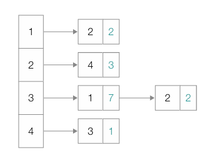

# CH04. 자료구조

- [시간복잡도와 공간복잡도](#시간-복잡도와-공간-복잡도)
- [Array](#array)
- [Stack과 Queue](#stack과-queue)
- [Tree](#tree)
- [Hash Table](#hash-table)
- [Graph](#graph)

## 📌 핵심 개념 요약

### 시간 복잡도와 공간 복잡도

프로그램을 만드는 과정에서 소스 코드를 통해 다양한 데이터를 다루고(자료구조), 그 데이터를 활용해 특정 목적을 이루기 위한 연산(알고리즘)을 구현한다.
이 때에 같은 목적의 코드이더라도 자료구조와 알고리즘을 고려한 코드는 보다 뛰어난 성능을 보일 수 있다.

그렇다면, 그 "성능"은 어떠한 기준으로 판단할까?

이는 "시간 복잡도"와 "공간 복잡도"를 통해 알 수 있다.
"시간 복잡도"란 입력의 크기에 따른 프로그램 실행 시간의 관계를 의미한다.
대중적으로 빅 오 표기법(big O notation)을 사용한다. 빅 오 표기법은 함수의 점근적 상한을 표기하는 방법으로, 입력의 크기 n에 대한 빅 오 표기법은 흔히 실행 시간의 O(상한(n)) 형태로 표현된다.

`O(상한(n)) = 입력하는 n이 점점 증가해 무한대로 커진다고 하더라도 실행 시간이 대략 이 이상(상한)은 커지지 않을 것`

```
빅 오 : 증가율이 상한보다 크지 않다.
빅 세타 : 증가율이 상한과 같다
빅 오메가 : 증가율이 상한보다 작지 않다.
```

문장에서 알 수 있듯이 n이 무한대로 커졌을 때를 논하기 때문에, 점근적 상한을 표현할 때에는 최고차항의 차수만을 고려한다.

공간 복잡도는 프로그램이 실행되었을 때 필요한 메모리 자원의 양을 의미한다.

### Array

`배열`이란 일정한 메모리 공간을 차지하는 `여러 요소들이 순차적으로 나열된 자료구조`이다.
각 요소에는 0부터 시작하는 고유한 순서 번호인 인덱스가 매겨진다.
이 인덱스로 배열의 요소를 식별할 수 있다.
`인덱스를 통해 요소를 검색하거나 값을 재할당`하는 것에는 `O(1)`의 시간복잡도를 가진다. 그러나 `요소를 삭제하거나 삽입`하는 경우 기존요소의 재배치가 발생하므로 `O(n)`의 시간복잡도를 가진다.

이러한 단점을 보완할 수 있는 자료구조가 `연결 리스트(Linked Array)`이다. 연결리스트는 각 요소들이 자신의 값과 함께 다음 원소의 주소값을 함께 가지고 있다. 따라서 어떠한 요소를 삽입하거나 삭제할 경우 `O(1)`의 시간복잡도를 가지게 된다. 그러나, 특정 위치에 요소를 삽입하고자 할 경우에는 처음 요소부터 차례대로 조회해야하므로 `O(n)`의 시간복잡도를 가지게 된다는 단점이 있다.

### Stack과 Queue

`Stack`이란 데이터의 삽입과 삭제가 한쪽 끝에서만 발생하는 자료구조로, `후입선출(Last In First Out) 방식`을 따른다.
대표적인 예시로 웹페이지의 뒤로 가기 기능, 함수의 매개 변수 처리 등을 들 수 있다.

`Queue`는 한쪽 끝에서 삽입이 이루어지면 다른 한쪽 끝에서 삭제가 이루어지는 자료구조로, `선입선출(First In First Out) 방식`을 따른다.
대표적인 예시로 프린터의 인쇄 작업 순서를 들 수 있다.

`Queue`는 여러 변형된 형태로 사용된다. `원형 큐(circle queue)`는 데이터를 삽입하는 쪽과 삭제하는 쪽을 하나로 연결해 원형으로 사용하는 자료구조이다. `덱(deque)`은 `양방향 큐(double-ended queue)`의 약자로 양쪽으로 데이터를 삽입/삭제할 수 있는 큐를 말하며, `우선순위 큐(priority queue)`는 저장된 요소들이 정해진 우선순위가 높은 순서대로 빠져나가는 큐이며, `힙(heap)`이라는 자료구조를 기반으로 구현된다.

### Tree

`Tree`는 계층적인 구조를 표현하기 위한 자료구조로, 데이터가 저장되어 있는 `노드(node)`, 노드와 노드를 연결하는 `간선(edge) 또는 링크(link)`로 이루어져 있으며 각 연결된 노드는 상하 관계를 형성한다.

```md
- 노드(node) : 트리를 구성하는 각각의 요소
- 간선(edge) 또는 링크(link) : 노드와 노드를 연결하는 선
- 루트 노드 또는 단말 노드(loot node) : 최상단에 위치한 노드, 부모 노드가 없는 노드
- 리트 노드(leaf node) : 최하단에 위치한 노드, 자식 노드가 없는 노드
```

상하 관계에 따라 `부모 노드`와 `자식 노드`로 표현할 수 있다.

** 추가적인 표현 **

- 차수(degree) : 각 노드가 가지는 자식 노드의 수
- 레벨(level) 또는 깊이(depth) : 특정 노드에 이르기까지 거치게 되는 간선의 수
- 높이(height) : 가장 높은 레벨

모집단의 일부를 표본이라 부르듯이 트리 안에 포함되어 있는 트리를 `서브트리(subtree)`라고 부른다.

`트리의 순회(tree traversal)`는 트리의 모든 노드를 한 번씩 방문하는 것으로 3가지의 대표적인 방법이 있다.

> `전위 순회(preorder traversal)` : 루트 노드 -> 왼쪽 서브트리 -> 오른쪽 서브트리  
> `중위 순회(inorder traversal)` : 왼쪽 서브트리 -> 루트 노드 -> 오른쪽 서브트리  
> `후위 순회(postorder traversal)` : 왼쪽 서브트리 -> 오른쪽 서브트리 -> 루트 노드

트리에는 다양한 종류가 있다.

`이진트리(Binary Tree)`는 노드의 개수가 2개 이하인 트리이다. 이 중에서 모든 자식 노드가 한 쪽으로 치우친 이진 트리는 편향된 이진 트리(skewed binary tree)라고 부른다.

<p align="center">
  
  
</p>

> Full Binary Tree (정 이진 트리) : 자식 노드의 개수가 1개가 아닌 이진 트리  
> Perfect Binary Tree (포화 이진 트리) : 리프 노드를 제외한 모든 노드들이 자식 노드를 2개씩 가지고 있고, 모든 리프 노드의 레벨이 동일한 이진 트리  
> Complete Binary Tree (완전 이진 트리) : 마지막 레벨을 제외한 모든 레벨이 2개의 자식 노드를 가지고 있으며, 마지막 레벨의 모든 노드들이 왼쪽부터 존재하는 이진 트리

`이진 탐색 트리(BST:Binary Search Time)`란 특정 노드의 왼쪽에는 해당 노드보다 작은 값, 오른쪽에는 해당 노드보다 큰 값이 있는 트리가 이진 탐색 트리이다. 이진 탐색 트리를 활용하면 `O(log n)`으로 탐색할 수 있다. 그러나, 편향된 이진트리의 경우 탐색 속도가 `O(n)`이 된다.

이를 보완하기 위해서는 루트 노드 기준 왼쪽 서브트리와 오른쪽 서브트리의 높이 차이가 최소화되어야한다. 이러한 균형을 맞추어주는 `자가 균형 이진 탐색 트리(self-balancing binary search tree)`의 대표적인 예시로 `RB 트리(Red Black Tree)`가 있다.

`RB 트리(Red Black Tree)`란 BST를 기반으로 하는 트리 형식의 자료구조이며, 다음과 같은 성질을 만족하는 BST를 RB 트리라고 한다.

```
1. 각 노드는 Red or Black이라는 색깔을 갖는다.
2. Root node와 leaf node는 black 노드이다.
3. red 노드의 자식 노드는 black 노드이다.
4. 루트 노드에서 임의의 리프 노드에 이르는 경로의 블랙 노드 수는 같다.
```

RB 노드에 새 노드가 삽입되면 위의 조건에 부합하도록 트리가 회전하거나 노드의 색상이 재지정된다.

`힙(heap)`도 탐색에 특화된 이진트리의 일종이다. 최댓값과 최솟값을 빠르게 찾기 위해 사용되며, `O(log n)`의 시간 복잡도가 소요된다.

> 최대 힙 : 부모 노드가 자식 노드의 값보다 큰 값으로 이루어진 이진 트리  
> => 루트 노드에 항상 최댓값
> 최소 힙 : 부모 노드가 자식 노드의 값보다 작은 값으로 이루어
> 진 이진 트리
> => 루트 노드에 항상 최솟값

### Hash Table

`해시 테이블(hash table)`은 키(key)와 값(value)의 대응으로 이루어진 테이블 형태의 자료구조이다. 데이터는 배열 형태의 버킷에 저장되어 있다.
해시 함수가 키를 인자로 하여 반한하는 인덱스값을 통해 버킷에 접근할 수 있다.


`해시 함수(hash function)`은 임의의 데이터를 고정된 길이의 데이터로 변환하는 단방향 함수이다. 대표적인 해시 알고리즘으로는 SHA-1, SHA-256, SHA-512, SHA3, HMAC 등이 있으며 알고리즘에 따라 같은 데이터도 다른 인덱스를 반환한다. 해시 함수는 정보를 손실하거나, brute-force로 찾아야할 정도로 복잡한 함수인 경우가 많다.

서로 다른 키에 대해 같은 해시 값이 대응되는 `해시 충돌(hash collision)`을 해결하는 대표적인 방식에는 다음과 같은 두 가지가 있다.

- 개방주소법(open address)  
  해시 충돌이 발생하면, 다른 해시 버킷에 해당 자료를 삽입하는 방식  
  순차적으로 탐색하며 비어있는 버킷을 찾을 때까지 계속 진행(선형 조사법, Linear Probing)하거나, 2 차 함수를 이용해 탐색할 위치를 찾거나(이차 조사법, Quadratic probing), 2 차 해쉬 함수를 이용해 새로운 주소를 할당(이중 해싱, Double hashing probing)하는 방식이 있다.

- 분리 연결법(Separate Chaining)  
  충돌이 발생한 데이터를 연결 리스트로 추가하는 방법  
  각각의 버킷(bucket)들을 `연결리스트(Linked List)`로 만들어 충돌이 발생했을 경우 해당 bucket 의 list 에 추가하는 방식은 삭제 또는 삽입이 간단하다. 그러나 계속적으로 추가가 될 경우 탐색 성능이 `O(n)`으로 떨어지게 된다.
  데이터의 개수가 많을 경우 Tree 를 사용하여(Red-Black Tree) 충돌을 해결할 수 있다.

### Graph

`그래프(graph)`란 정점(vertex)이라 불리는 데이터를 간선(edge) 혹은 링크(link)로 데이터 간의 연결 관계를 표현한 자료구조이다.

- 임의의 두 정점 사이를 잇는 경로가 항상 있나요?  
  => Yes(`연결 그래프(connected graph)`) vs No(`비연결 그래프(disconnected graph)`)

- 간선에 방향이 있나요?  
  => Yes(`방향 그래프(directed graph)`) vs No(`무방향 그래프(undirected graph)`)

- 간선에 가중치가 있나요?  
  => Yes(`가중치 그래프(weighted graph)`)

그래프를 구현하는 방법에는 크게 두 가지 방법이 있다.

- 인접 행렬(adjacency matrix) 기반 그래프 표현  
  : N \* N 크기의 행렬로 그래프를 표현하는 것. 연결되었으면 1, 아니면 0으로 표현한다.  
  e.g. 1행 2열 = 1 => 첫 번째 정점에서 두 번째 정점 방향으로 그래프가 연결됨.
  무방향 그래프의 경우 행렬의 대각선 요소를 기준으로 연결 관계가 서로 대칭이다.
  가중치가 존재하는 경우, 1 대신 각 간선의 가충치를 행렬에 입력하면 된다.

- 인접 리스트(adjacency list) 기반 그래프 표현  
  : 그래프의 특정 정점과 연결된 정점들을 연결 리스트로 표현한다.
  정점 간에 연결되어 있는지를 파악하는데 오래 걸릴 수 있으나 공간복잡도가 O(E + V)로



그래프를 탐색하는 방법은 크게 `깊이 우선 탐색`과 `너비 우선 탐식`이 있다.

`깊이 우선 탐색(DFS, Depth-First Search)`은 그래프에서 더 이상 방문 가능한 정점이 없을 때까지 최대한 깊
이 탐색하기를 반복하는 탐색 방법이며, Stack을 사용한다.

`너비 우선 탐색(BFS, Breadth-First Search)`은 인접한 모든 정점들을 방문하고, 방문한 정점들과 연결된 모든 정점들을 방문하기를 반복하는 탐색 방법이며, Queue를 사용한다.

`신장 트리(panning tree)`란 주어진 그래프에서 주어진 모든 정점을 연결하면서 사이클이 없는 부분 그래프이다. 신장 트리들 중에서 간선들의 가중치 합이 최소인 트리를 `최소 신장 트리(MST, Minimum Spanning Tree`라고 한다.  
MST를 구하는 대표적인 알고리즘으로 과 `프림(Prim)`이 있다.

`크루스칼(Kruskal)`의 경우 가중치가 작은 간선부터 선택하면서 사이클이 생기지 않도록 연결하는 방식이다. 간선 정렬로 인해 `O(E log E)`의 시간복잡도를 가진다.

```
간선 정렬: O(E log E)
Union-Find 초기화 및 처리: O(E)
```

```
1. 모든 간선을 가중치 기준으로 오름차순 정렬
2. 정점들을 각각 독립된 집합으로 초기화
3. 정렬된 간선 리스트를 순서대로 확인
```

사이클이 생기지 않도록 연결하기 위해서 `Union&Find` 자료구조를 사용한다.

`Union-Find`란 Disjoint Set(서로소 집합) 을 표현하는 자료구조이며,
서로 다른 두 집합을 병합하는 Union 연산, 집합 원소가 어떤 집합에 속해있는지 찾는 Find 연산을 지원한다.

`프림(prim)` 알고리즘은 정점 중 하나를 골라 연결된 간선 중 가중치가 가장 작은 정점의 방향으로 순회하는 알고리즘이다. 우선순위 큐를 이용해 가중치가 최소인 간선을 구하면 O(E logV)의 시간 복잡도로 최소 신장 트리를 구할 수 있다.

## 💡 면접 예상 질문

- 빅오 표기법(Big O Notation)이란 무엇인가요?
- Array와 Linked array의 차이점을 설명해주세요.
- Stack과 Queue의 차이를 설명해주세요.
- 해시테이블이 무엇인지와 시간 복잡도에 대해서 설명해주세요
- Tree와 Graph의 차이를 설명해주세요.
- 이진 탐색 트리는 어떤 문제점이 있고, 이를 해결하기 위한 트리 중 한 가지를 설명해주세요.
- 배열에서 삽입/삭제 연산의 시간복잡도가 O(n)인 이유는 설명해주세요.
- 선형 조사법(linear probing)에서 성능 저하가 일어나는 이유를 설명해주세요.

## ❓스터디에서 논의하고 싶은 질문

- 이진 탐색 트리의 단점을 해결하는 AVL, RB 트리, 어디까지 알면 적당할까요?
- 실제 구현 사례를 물었을 때, 알고리즘 외에 개발에서의 사용사례가 있으신가요?

## 🔗 참고 자료

- [크루스칼 알고리즘](https://chanhuiseok.github.io/posts/algo-33/)
- [프림 알고리즘](https://koosco.tistory.com/entry/Python-%ED%94%84%EB%A6%BC-%EC%95%8C%EA%B3%A0%EB%A6%AC%EC%A6%98Prims-Algorithm)
