## 1. 운영체제의 개요

  

### 1.1 운영체제란?

  

운영체제는 **컴퓨터 하드웨어와 사용자 프로그램 사이에서 중재자 역할**을 하는 시스템 소프트웨어입니다.

  

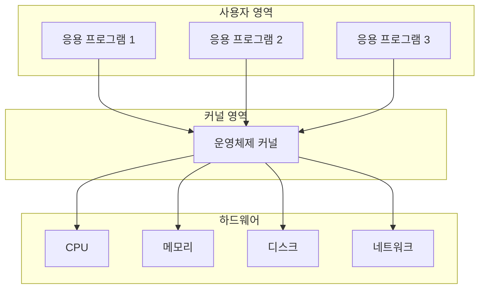

  

### 1.2 운영체제의 종류

  

- **데스크톱 OS**: Windows, macOS, Linux

- **모바일 OS**: Android, iOS

- **서버 OS**: Linux, Windows Server

- **임베디드 OS**: RTOS, VxWorks

  

### 1.3 운영체제의 핵심 구성 요소

  

운영체제의 핵심 기능을 담당하는 부분을 **커널(Kernel)**이라고 합니다.

  

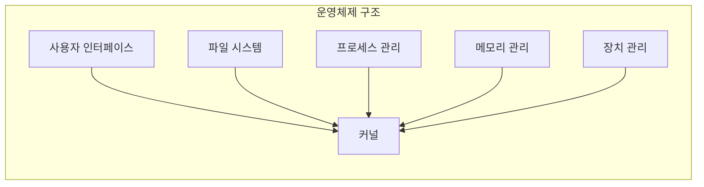

  

## 2. 운영체제의 핵심 기능

  

### 2.1 자원 할당 및 관리

  

운영체제의 가장 중요한 역할은 **컴퓨터의 모든 자원을 효율적으로 관리**하는 것입니다.

  

#### 자원(Resource)이란?

  

- **CPU**: 연산 처리 능력

- **메모리**: 프로그램과 데이터 저장 공간

- **디스크**: 영구 저장 공간

- **네트워크**: 통신 능력

- **주변장치**: 프린터, 키보드, 마우스 등

  

### 2.2 프로세스 및 스레드 관리

  

- **프로세스**: 메모리에 올라간 실행 중인 프로그램

- **스레드**: 프로세스 내에서 실행되는 작업의 단위

  

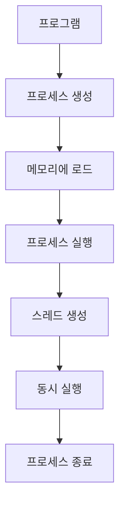

  

## 3. 시스템 콜과 이중 모드

  

### 3.1 메모리 보호와 이중 모드

  

운영체제는 메모리를 **커널 영역**과 **사용자 영역**으로 분리하여 보호합니다.

  

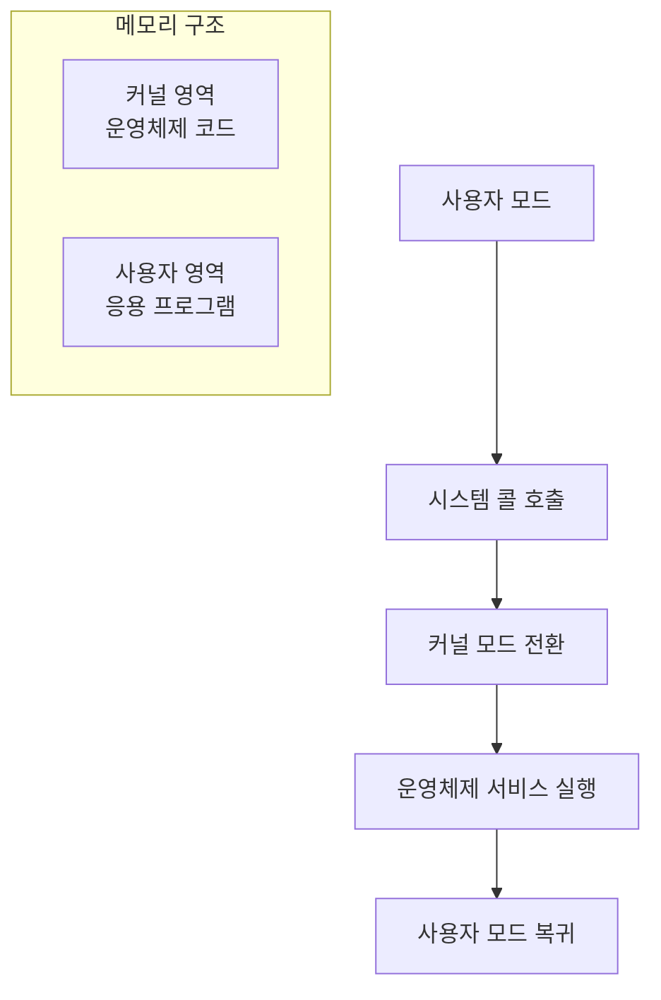

  

### 3.2 시스템 콜의 동작 과정

  

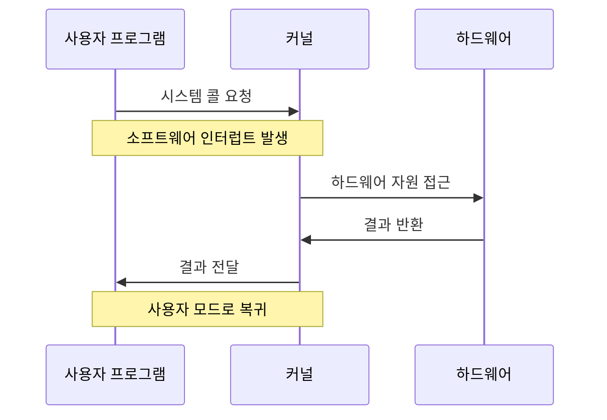

  

#### 주요 시스템 콜 종류

  

- **프로세스 관리**: `fork()`, `exec()`, `exit()`, `wait()`

- **파일 관리**: `open()`, `read()`, `write()`, `close()`

- **메모리 관리**: `malloc()`, `free()`, `mmap()`

- **통신**: `pipe()`, `socket()`, `send()`, `recv()`

  

## 4. CPU 관리: CPU 스케줄링

  

### 4.1 CPU 스케줄링이 필요한 이유

  

CPU는 **한 번에 하나의 프로세스만 실행**할 수 있으므로, 여러 프로세스가 효율적으로 CPU를 사용할 수 있도록 스케줄링이 필요합니다.

  

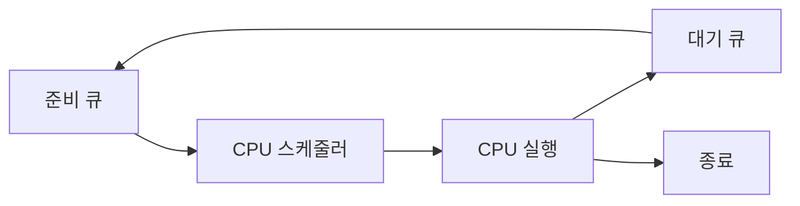

  
## 5. 메모리 관리: 가상 메모리

  

### 5.1 메모리 관리의 필요성

  

- **메모리 부족 문제**: 프로그램이 물리 메모리보다 클 때

- **메모리 단편화**: 메모리 공간이 비효율적으로 사용되는 문제

- **메모리 보호**: 프로세스 간 메모리 침범 방지

  

### 5.2 가상 메모리 시스템

  

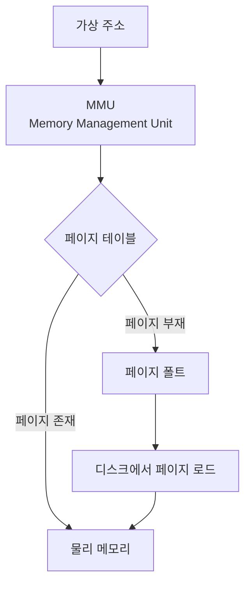

  

#### 페이징(Paging)

  

- 메모리를 **페이지(Page)** 단위로 나누어 관리

- 가상 주소를 물리 주소로 변환하는 **페이지 테이블** 사용

  

#### 페이지 교체 알고리즘

  

- **FIFO**: 먼저 들어온 페이지부터 교체

- **LRU**: 가장 오래 사용되지 않은 페이지 교체

- **LFU**: 가장 적게 사용된 페이지 교체

  

## 6. 파일 시스템

  

### 6.1 파일 시스템의 역할

  

운영체제는 보조기억장치를 효율적으로 관리하기 위해 **파일 시스템**을 제공합니다.

  

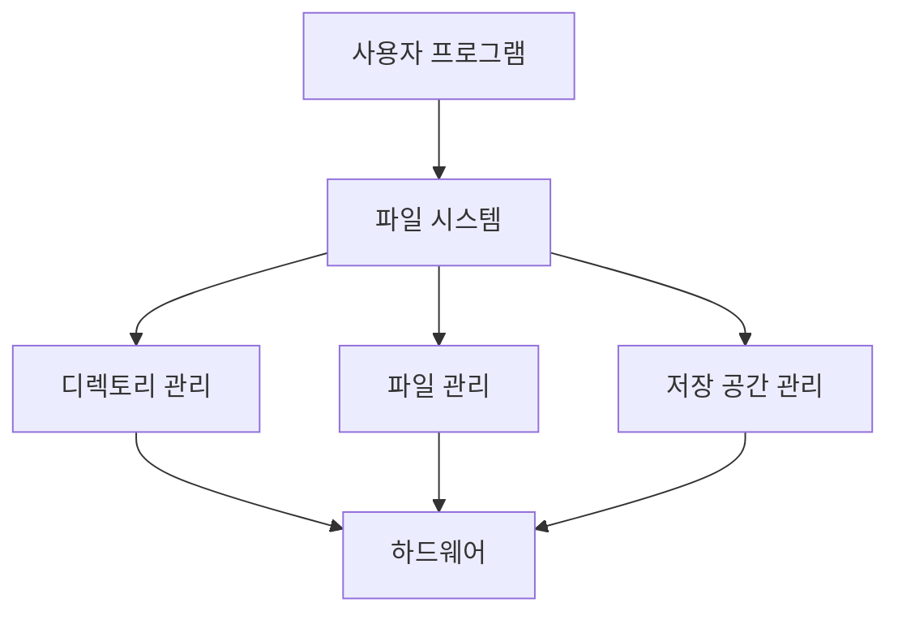

  

### 6.2 파일 시스템 구조

  

- **파일**: 데이터의 논리적 단위

- **디렉토리**: 파일들을 체계적으로 관리하는 구조

- **파티션**: 물리적 저장 공간의 논리적 분할

  

## 7. 동기화와 상호 배제

  

### 7.1 경쟁 상태(Race Condition)

  

여러 프로세스나 스레드가 **공유 자원에 동시에 접근**할 때 발생하는 문제입니다.

  

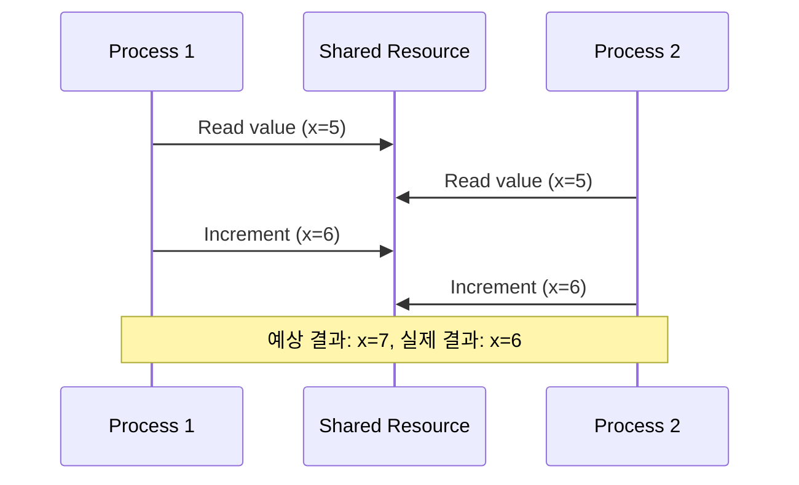

  

### 7.2 임계 구역(Critical Section)

  

**공유 자원에 접근하는 코드 영역**으로, 한 번에 하나의 프로세스만 실행할 수 있어야 합니다.

  

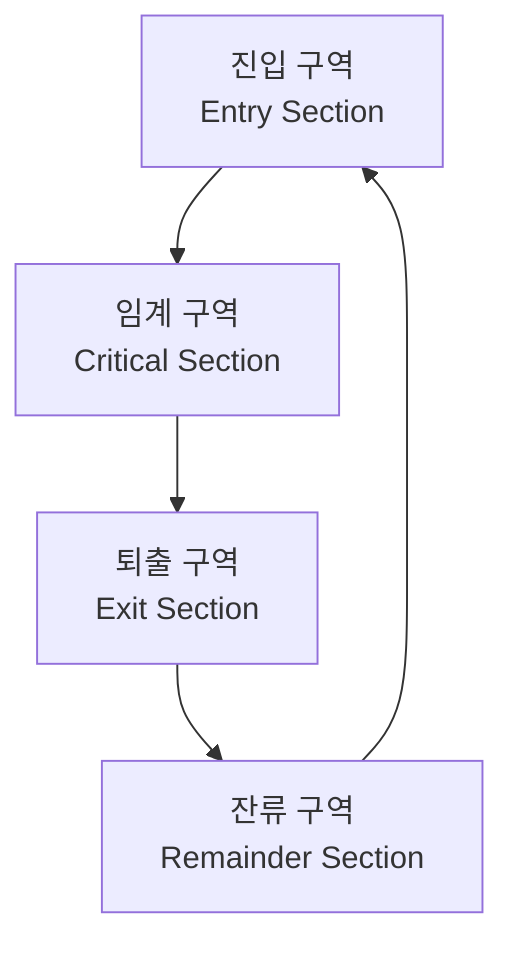

  

## 8. 세마포어(Semaphore)

  

### 8.1 세마포어의 개념

  

**멀티프로그래밍 환경에서 공유 자원에 대한 접근을 제한**하는 동기화 도구입니다.

  

#### 세마포어의 구성 요소

  

- **카운터(S)**: 사용 가능한 자원의 개수

- **대기 큐**: 자원을 기다리는 프로세스들의 큐

- **P 연산(wait)**: 자원 획득 시도

- **V 연산(signal)**: 자원 반환

  

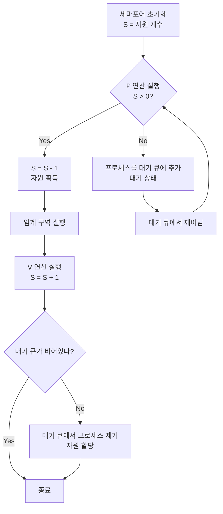

  

### 8.2 세마포어의 종류

  

#### 이진 세마포어(Binary Semaphore)

  

- **값**: 0 또는 1

- **용도**: 상호 배제 구현

- **동작**: 뮤텍스와 유사

  

#### 계수 세마포어(Counting Semaphore)

  

- **값**: 0 이상의 정수

- **용도**: 여러 개의 자원 관리

- **예시**: 데이터베이스 연결 풀 관리

  

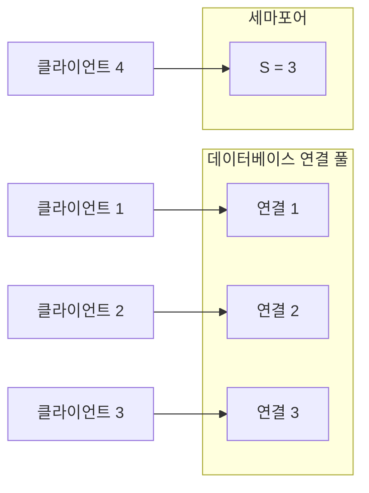

  

> **실제 예시**: 데이터베이스 연결 제한을 위해 **동시에 최대 3개의 연결**만 허용하려면 세마포어의 초기값을 `3`으로 설정합니다. 카운터가 0이 되면 새 연결을 대기 상태로 만들고, 기존 연결이 해제되면 카운터가 증가해 대기 중인 연결이 활성화됩니다.

  

## 9. 뮤텍스(Mutex)

  

### 9.1 뮤텍스의 개념

  

**임계 구역을 가진 스레드들의 실행시간이 서로 겹치지 않도록** 하는 동기화 도구입니다.

  

#### 뮤텍스의 특징

  

- **소유권**: 뮤텍스를 획득한 스레드만 해제 가능

- **상호 배제**: 한 번에 하나의 스레드만 임계 구역 접근

- **데드락 방지**: 소유권 기반으로 데드락 위험 감소

  

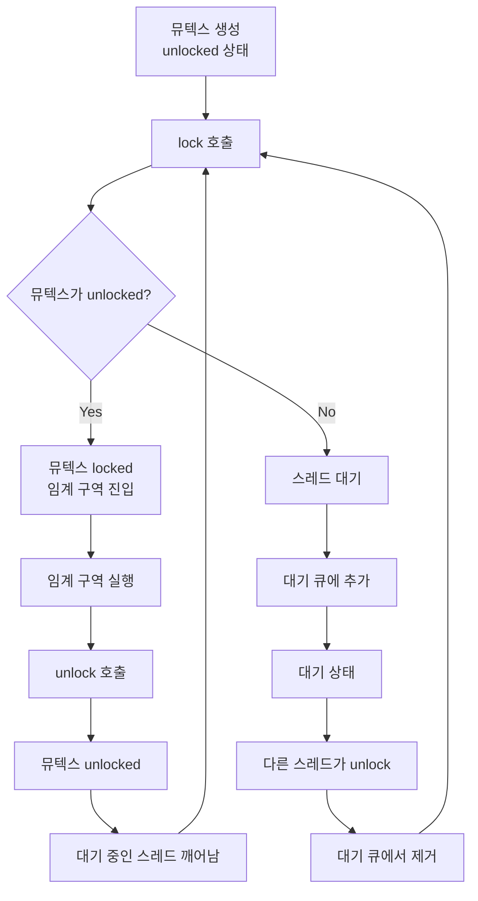

  

### 9.2 세마포어 vs 뮤텍스

  

| 구분              | 세마포어               | 뮤텍스              |
| --------------- | ------------------ | ---------------- |
| **값**           | 0 이상의 정수           | 0 또는 1           |
| **소유권**         | 없음                 | 있음               |
| **해제**          | 다른 프로세스도 가능        | 소유한 프로세스만        |
| **용도**          | 자원 관리, 상호 배제       | 상호 배제            |
| **데드락 위험**      | 높음                 | 낮음               |

  

> **주의사항**: 세마포어와 뮤텍스 모두 **데드락과 기아상태가 발생할 수 있습니다**.

>

> - 두 스레드가 서로 잠금을 기다리며 영원히 대기하는 데드락이 발생 가능

> - 높은 우선순위를 가진 스레드가 자원을 독점하면서 다른 스레드가 자원을 사용하지 못하는 기아 상태가 발생 가능

  

## 10. 교착상태(Deadlock)

  

### 10.1 교착상태의 정의

  

**두 개 이상의 프로세스나 스레드가 서로가 점유한 자원을 기다리며 무한히 대기하는 상태**입니다.

  

> 무한히 다음 자원을 기다리게 되는 상태

  

### 10.2 교착상태 발생 조건

  

교착상태가 발생하기 위해서는 다음 **4가지 조건이 모두 만족**되어야 합니다.

  

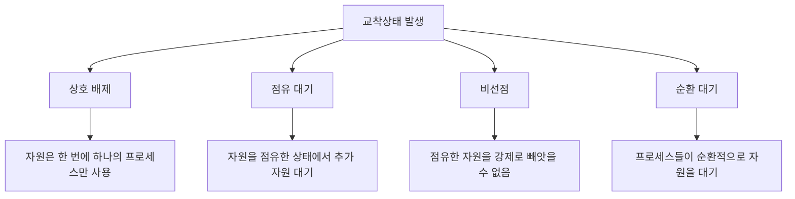

  

#### 1. 상호 배제(Mutual Exclusion)

  

- **의미**: 자원은 한 번에 하나의 프로세스만 사용할 수 있음

- **예시**: 프린터, CPU, 특정 메모리 영역

  

#### 2. 점유 대기(Hold and Wait)

  

- **의미**: 프로세스가 이미 자원을 점유한 상태에서 추가 자원을 요청하며 대기

- **예시**: 프로세스 A가 프린터를 점유한 상태에서 스캐너도 요청

  

#### 3. 비선점(No Preemption)

  

- **의미**: 프로세스가 점유한 자원은 해당 프로세스가 자발적으로 해제할 때까지 강제로 빼앗을 수 없음

- **예시**: 프린터 사용 중인 프로세스를 강제로 중단할 수 없음

  

#### 4. 순환 대기(Circular Wait)

  

- **의미**: 자원을 요청하는 프로세스들 사이에 순환적인 대기 관계가 존재

- **예시**: P1 → P2 → P3 → P1 형태의 대기 체인

  

### 10.3 교착상태 예시

  

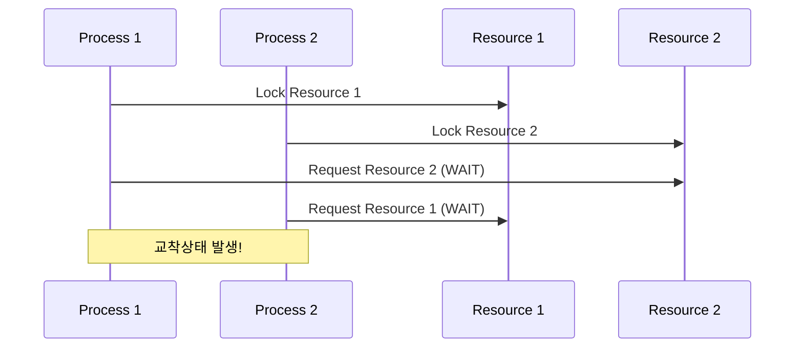

  

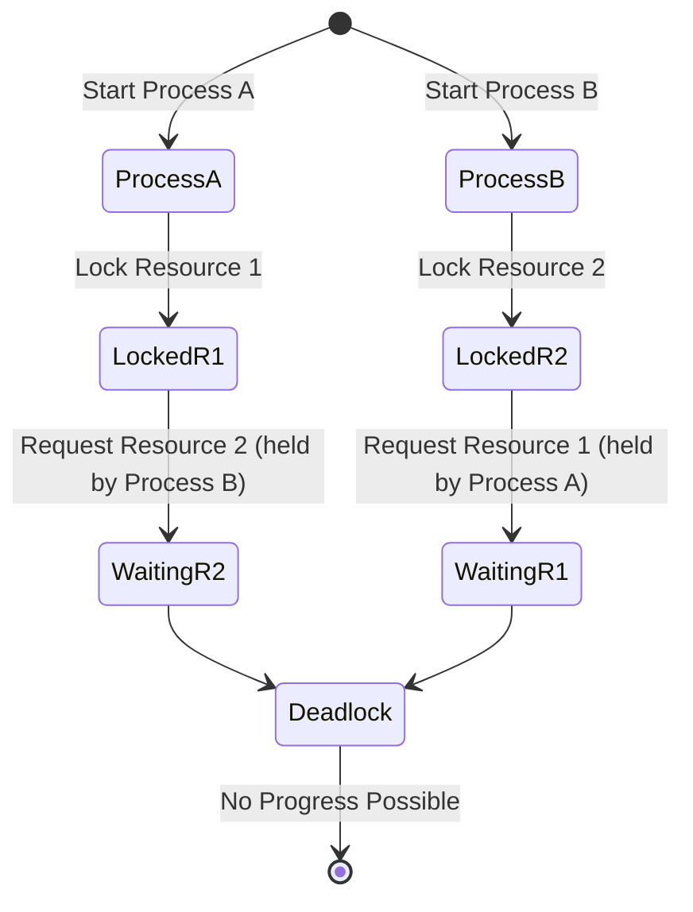

  

- **Process A**가 시작하여 **Resource 1**을 잠급니다.

- **Process B**가 시작하여 **Resource 2**를 잠급니다.

- **Process A**는 **Resource 2**를 요청하며 기다림 상태로 전환됩니다.

- **Process B**는 **Resource 1**을 요청하며 기다림 상태로 전환됩니다.

- 두 프로세스가 서로의 자원을 기다리며 데드락 상태가 됩니다.

  

### 10.4 교착상태 처리 방법

  

#### 1. 교착상태 예방(Prevention)

  

**교착상태 발생 조건 중 하나 이상을 제거**하는 방법입니다.

  

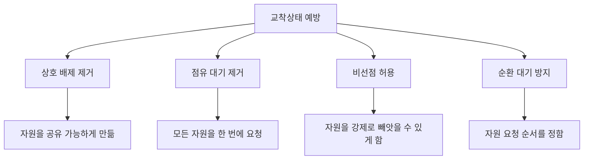

  

- **상호 배제 제거**: 자원을 공유 가능하게 만듦

- **점유 대기 제거**: 모든 자원을 한 번에 요청

- **비선점 허용**: 자원을 강제로 빼앗을 수 있게 함

- **순환 대기 방지**: 자원 요청 순서를 정함

  

#### 2. 교착상태 회피(Avoidance)

  

**시스템이 안전한 상태에 있을 때만 자원을 할당**하는 방법입니다.

  

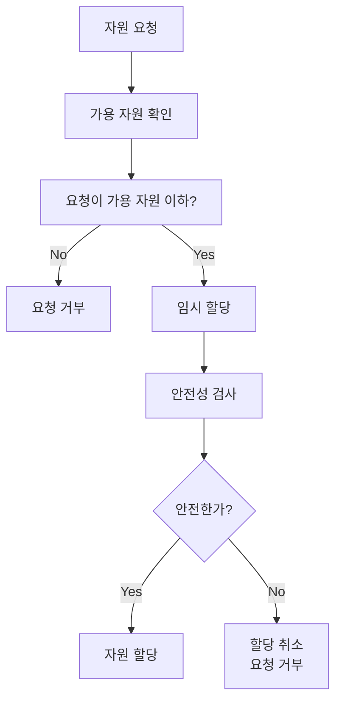

  

- **은행원 알고리즘(Banker's Algorithm)**: 은행이 대출을 승인할 때처럼 안전성을 검사

- **안전 상태**: 모든 프로세스가 자원을 할당받을 수 있는 상태

- **불안전 상태**: 교착상태가 발생할 가능성이 있는 상태

  

#### 3. 교착상태 탐지(Detection)

  

**교착상태가 발생하는 것을 허용하고, 주기적으로 탐지**하는 방법입니다.

  

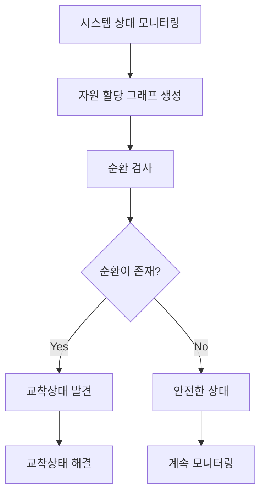

  

- 시스템 상태를 주기적으로 검사

- 자원 할당 그래프를 생성하여 순환 검사

- 교착상태 발견 시 해결 방법 적용

  

#### 4. 교착상태 회복(Recovery)

  

**교착상태가 탐지되면 이를 해결**하는 방법입니다.

  

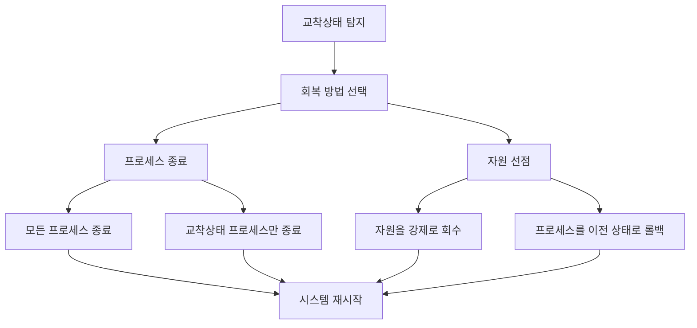

  

- **프로세스 종료**: 교착상태 프로세스 중 일부를 종료

- **자원 선점**: 자원을 강제로 회수하여 다른 프로세스에 할당
