## 1. 운영체제의 개요

  

### 1.1 운영체제란?

  

운영체제는 **컴퓨터 하드웨어와 사용자 프로그램 사이에서 중재자 역할**을 하는 시스템 소프트웨어입니다.

  

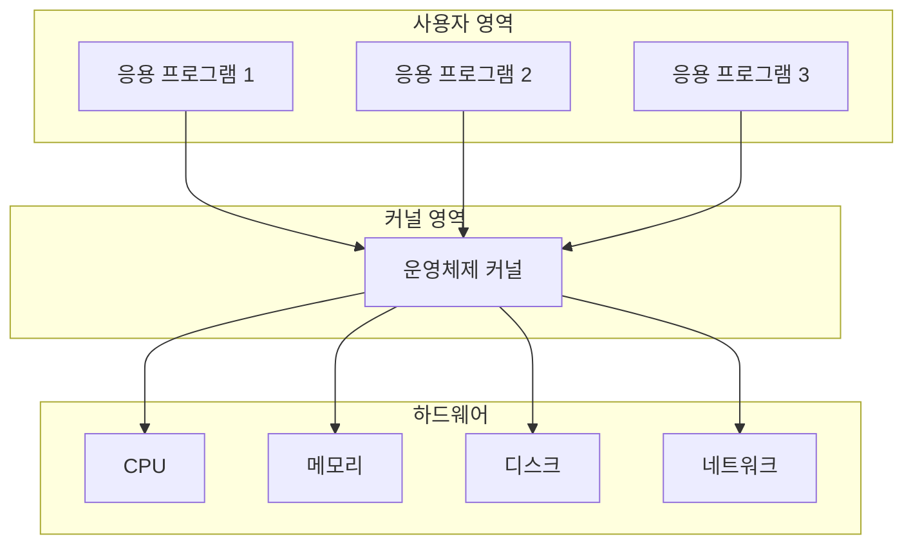

  

### 1.2 운영체제의 종류

  

- **데스크톱 OS**: Windows, macOS, Linux

- **모바일 OS**: Android, iOS

- **서버 OS**: Linux, Windows Server

- **임베디드 OS**: RTOS, VxWorks

  

### 1.3 운영체제의 핵심 구성 요소

  

운영체제의 핵심 기능을 담당하는 부분을 **커널(Kernel)**이라고 합니다.

  

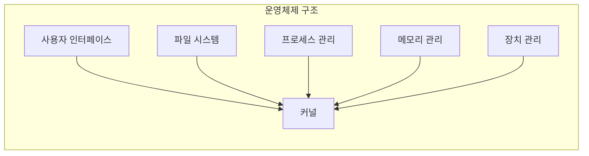

  

## 2. 운영체제의 핵심 기능

  

### 2.1 자원 할당 및 관리

  

운영체제의 가장 중요한 역할은 **컴퓨터의 모든 자원을 효율적으로 관리**하는 것입니다.

  

#### 자원(Resource)이란?

  

- **CPU**: 연산 처리 능력

- **메모리**: 프로그램과 데이터 저장 공간

- **디스크**: 영구 저장 공간

- **네트워크**: 통신 능력

- **주변장치**: 프린터, 키보드, 마우스 등

  

### 2.2 프로세스 및 스레드 관리

  

- **프로세스**: 메모리에 올라간 실행 중인 프로그램

- **스레드**: 프로세스 내에서 실행되는 작업의 단위

  

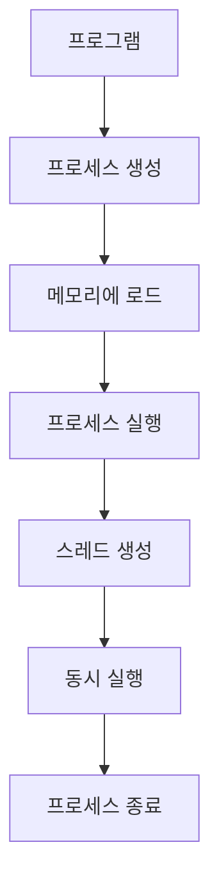

  

## 3. 시스템 콜과 이중 모드

  

### 3.1 메모리 보호와 이중 모드

  

운영체제는 메모리를 **커널 영역**과 **사용자 영역**으로 분리하여 보호합니다.

  

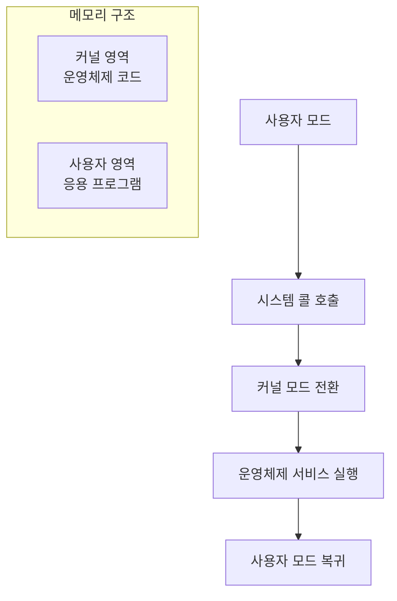

  

### 3.2 시스템 콜의 동작 과정

  

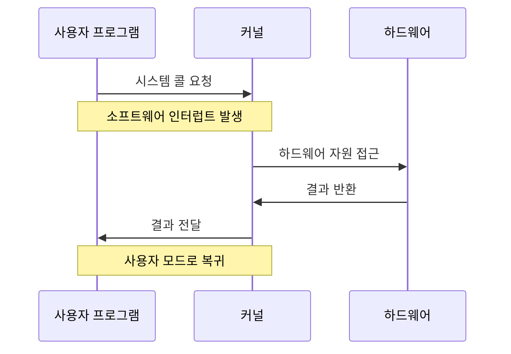

  

#### 주요 시스템 콜 종류

  

- **프로세스 관리**: `fork()`, `exec()`, `exit()`, `wait()`

- **파일 관리**: `open()`, `read()`, `write()`, `close()`

- **메모리 관리**: `malloc()`, `free()`, `mmap()`

- **통신**: `pipe()`, `socket()`, `send()`, `recv()`

  

## 4. CPU 관리: CPU 스케줄링

  

### 4.1 CPU 스케줄링이 필요한 이유

  

CPU는 **한 번에 하나의 프로세스만 실행**할 수 있으므로, 여러 프로세스가 효율적으로 CPU를 사용할 수 있도록 스케줄링이 필요합니다.

  

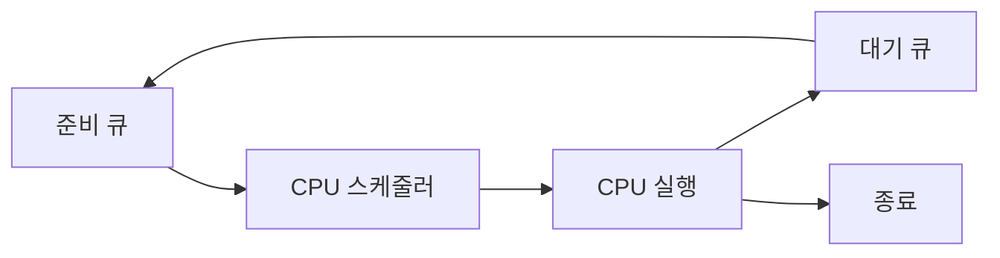

  
## 5. 메모리 관리: 가상 메모리

  

### 5.1 메모리 관리의 필요성

  

- **메모리 부족 문제**: 프로그램이 물리 메모리보다 클 때

- **메모리 단편화**: 메모리 공간이 비효율적으로 사용되는 문제

- **메모리 보호**: 프로세스 간 메모리 침범 방지

  

### 5.2 가상 메모리 시스템

  

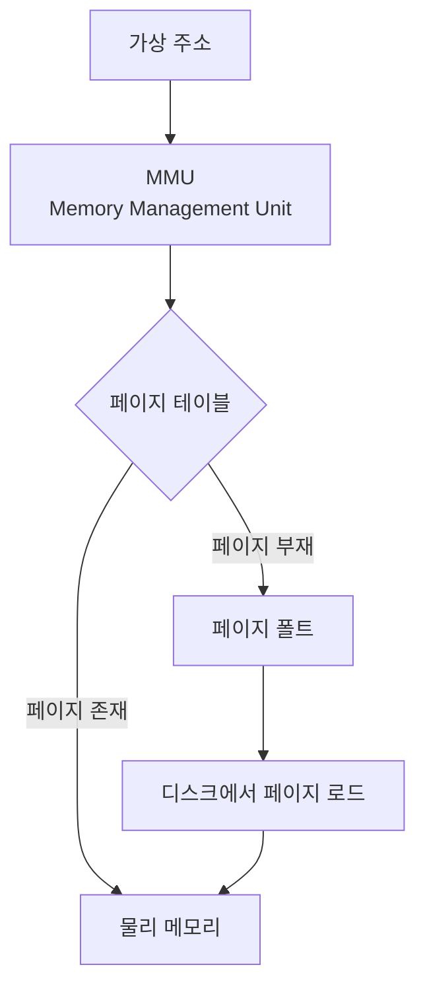

  

#### 페이징(Paging)

  

- 메모리를 **페이지(Page)** 단위로 나누어 관리

- 가상 주소를 물리 주소로 변환하는 **페이지 테이블** 사용

  

#### 페이지 교체 알고리즘

  

- **FIFO**: 먼저 들어온 페이지부터 교체

- **LRU**: 가장 오래 사용되지 않은 페이지 교체

- **LFU**: 가장 적게 사용된 페이지 교체

  

## 6. 파일 시스템

  

### 6.1 파일 시스템의 역할

  

운영체제는 보조기억장치를 효율적으로 관리하기 위해 **파일 시스템**을 제공합니다.

  

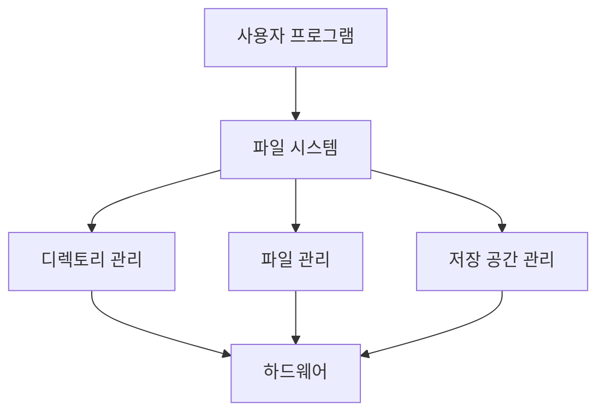

  

### 6.2 파일 시스템 구조

  

- **파일**: 데이터의 논리적 단위

- **디렉토리**: 파일들을 체계적으로 관리하는 구조

- **파티션**: 물리적 저장 공간의 논리적 분할

  

## 7. 동기화와 상호 배제

  

### 7.1 경쟁 상태(Race Condition)

  

여러 프로세스나 스레드가 **공유 자원에 동시에 접근**할 때 발생하는 문제입니다.

  

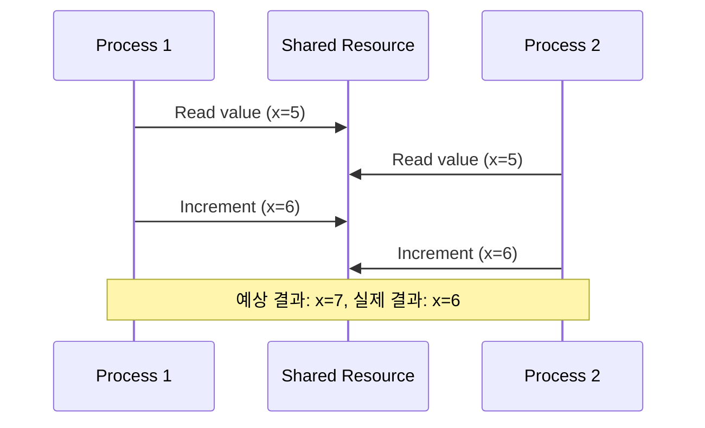

  

### 7.2 임계 구역(Critical Section)

  

**공유 자원에 접근하는 코드 영역**으로, 한 번에 하나의 프로세스만 실행할 수 있어야 합니다.

  

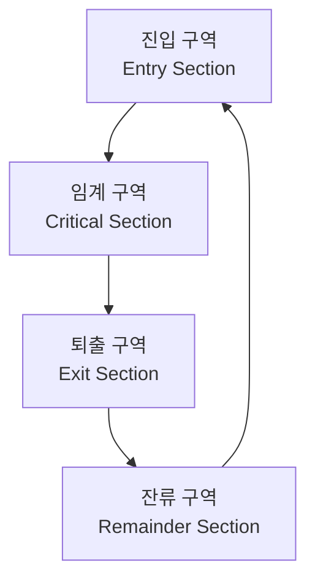

  

## 8. 세마포어(Semaphore)

  

### 8.1 세마포어의 개념

  

**멀티프로그래밍 환경에서 공유 자원에 대한 접근을 제한**하는 동기화 도구입니다.

  

#### 세마포어의 구성 요소

  

- **카운터(S)**: 사용 가능한 자원의 개수

- **대기 큐**: 자원을 기다리는 프로세스들의 큐

- **P 연산(wait)**: 자원 획득 시도

- **V 연산(signal)**: 자원 반환

  

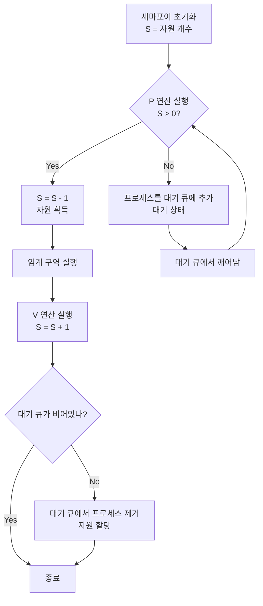

  

### 8.2 세마포어의 종류

  

#### 이진 세마포어(Binary Semaphore)

  

- **값**: 0 또는 1

- **용도**: 상호 배제 구현

- **동작**: 뮤텍스와 유사

  

#### 계수 세마포어(Counting Semaphore)

  

- **값**: 0 이상의 정수

- **용도**: 여러 개의 자원 관리

- **예시**: 데이터베이스 연결 풀 관리

  

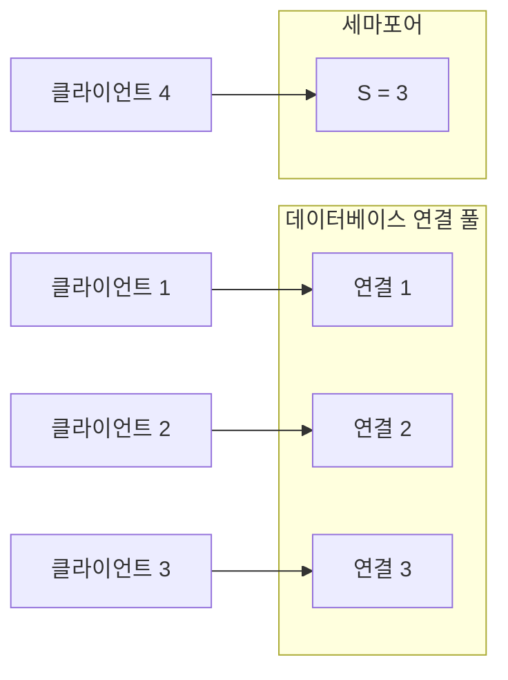

  

> **실제 예시**: 데이터베이스 연결 제한을 위해 **동시에 최대 3개의 연결**만 허용하려면 세마포어의 초기값을 `3`으로 설정합니다. 카운터가 0이 되면 새 연결을 대기 상태로 만들고, 기존 연결이 해제되면 카운터가 증가해 대기 중인 연결이 활성화됩니다.

  

## 9. 뮤텍스(Mutex)

  

### 9.1 뮤텍스의 개념

  

**임계 구역을 가진 스레드들의 실행시간이 서로 겹치지 않도록** 하는 동기화 도구입니다.

  

#### 뮤텍스의 특징

  

- **소유권**: 뮤텍스를 획득한 스레드만 해제 가능

- **상호 배제**: 한 번에 하나의 스레드만 임계 구역 접근

- **데드락 방지**: 소유권 기반으로 데드락 위험 감소

  

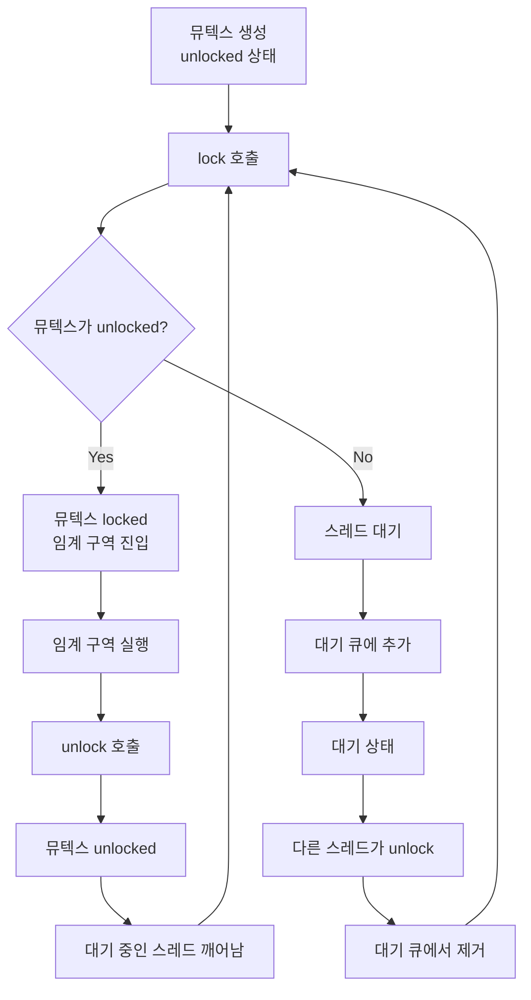

  

### 9.2 세마포어 vs 뮤텍스

  

| 구분              | 세마포어               | 뮤텍스              |
| --------------- | ------------------ | ---------------- |
| **값**           | 0 이상의 정수           | 0 또는 1           |
| **소유권**         | 없음                 | 있음               |
| **해제**          | 다른 프로세스도 가능        | 소유한 프로세스만        |
| **용도**          | 자원 관리, 상호 배제       | 상호 배제            |
| **데드락 위험**      | 높음                 | 낮음               |

  

> **주의사항**: 세마포어와 뮤텍스 모두 **데드락과 기아상태가 발생할 수 있습니다**.

>

> - 두 스레드가 서로 잠금을 기다리며 영원히 대기하는 데드락이 발생 가능

> - 높은 우선순위를 가진 스레드가 자원을 독점하면서 다른 스레드가 자원을 사용하지 못하는 기아 상태가 발생 가능

  

## 10. 교착상태(Deadlock)

  

### 10.1 교착상태의 정의

  

**두 개 이상의 프로세스나 스레드가 서로가 점유한 자원을 기다리며 무한히 대기하는 상태**입니다.

  

> 무한히 다음 자원을 기다리게 되는 상태

  

### 10.2 교착상태 발생 조건

  

교착상태가 발생하기 위해서는 다음 **4가지 조건이 모두 만족**되어야 합니다.

  

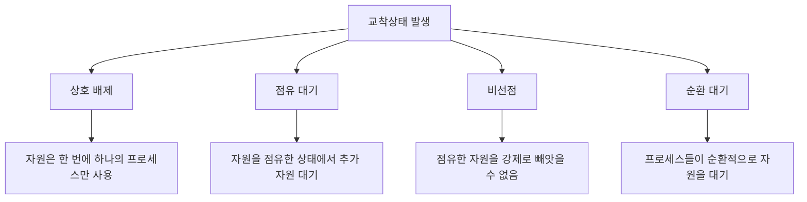

  

#### 1. 상호 배제(Mutual Exclusion)

  

- **의미**: 자원은 한 번에 하나의 프로세스만 사용할 수 있음

- **예시**: 프린터, CPU, 특정 메모리 영역

  

#### 2. 점유 대기(Hold and Wait)

  

- **의미**: 프로세스가 이미 자원을 점유한 상태에서 추가 자원을 요청하며 대기

- **예시**: 프로세스 A가 프린터를 점유한 상태에서 스캐너도 요청

  

#### 3. 비선점(No Preemption)

  

- **의미**: 프로세스가 점유한 자원은 해당 프로세스가 자발적으로 해제할 때까지 강제로 빼앗을 수 없음

- **예시**: 프린터 사용 중인 프로세스를 강제로 중단할 수 없음

  

#### 4. 순환 대기(Circular Wait)

  

- **의미**: 자원을 요청하는 프로세스들 사이에 순환적인 대기 관계가 존재

- **예시**: P1 → P2 → P3 → P1 형태의 대기 체인

  

### 10.3 교착상태 예시

  

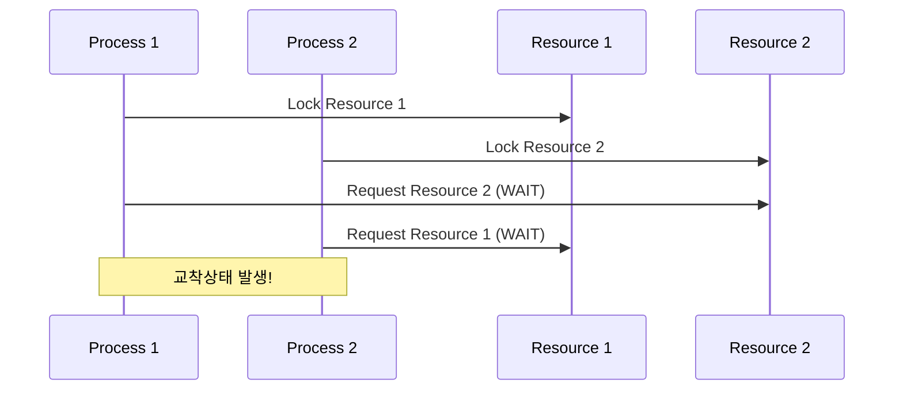

  

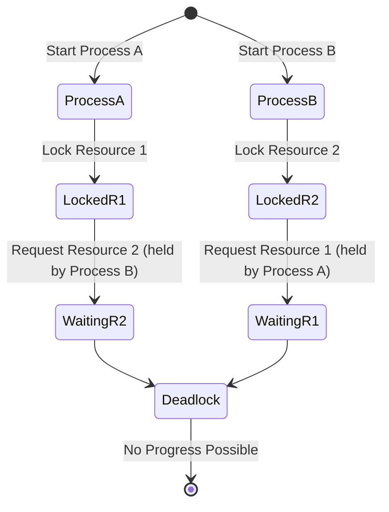

  

- **Process A**가 시작하여 **Resource 1**을 잠급니다.

- **Process B**가 시작하여 **Resource 2**를 잠급니다.

- **Process A**는 **Resource 2**를 요청하며 기다림 상태로 전환됩니다.

- **Process B**는 **Resource 1**을 요청하며 기다림 상태로 전환됩니다.

- 두 프로세스가 서로의 자원을 기다리며 데드락 상태가 됩니다.

  

### 10.4 교착상태 처리 방법

  

#### 1. 교착상태 예방(Prevention)

  

**교착상태 발생 조건 중 하나 이상을 제거**하는 방법입니다.

  

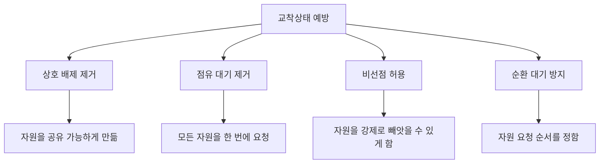

  

- **상호 배제 제거**: 자원을 공유 가능하게 만듦

- **점유 대기 제거**: 모든 자원을 한 번에 요청

- **비선점 허용**: 자원을 강제로 빼앗을 수 있게 함

- **순환 대기 방지**: 자원 요청 순서를 정함

  

#### 2. 교착상태 회피(Avoidance)

  

**시스템이 안전한 상태에 있을 때만 자원을 할당**하는 방법입니다.

  

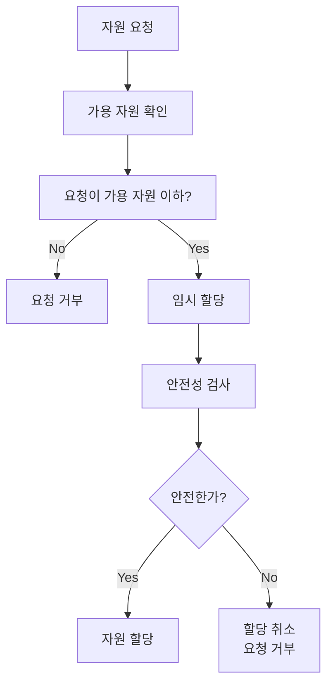

  

- **은행원 알고리즘(Banker's Algorithm)**: 은행이 대출을 승인할 때처럼 안전성을 검사

- **안전 상태**: 모든 프로세스가 자원을 할당받을 수 있는 상태

- **불안전 상태**: 교착상태가 발생할 가능성이 있는 상태

  

#### 3. 교착상태 탐지(Detection)

  

**교착상태가 발생하는 것을 허용하고, 주기적으로 탐지**하는 방법입니다.

  

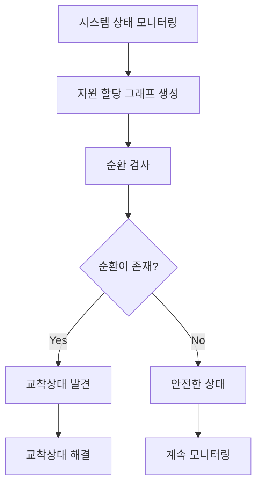

  

- 시스템 상태를 주기적으로 검사

- 자원 할당 그래프를 생성하여 순환 검사

- 교착상태 발견 시 해결 방법 적용

  

#### 4. 교착상태 회복(Recovery)

  

**교착상태가 탐지되면 이를 해결**하는 방법입니다.

  

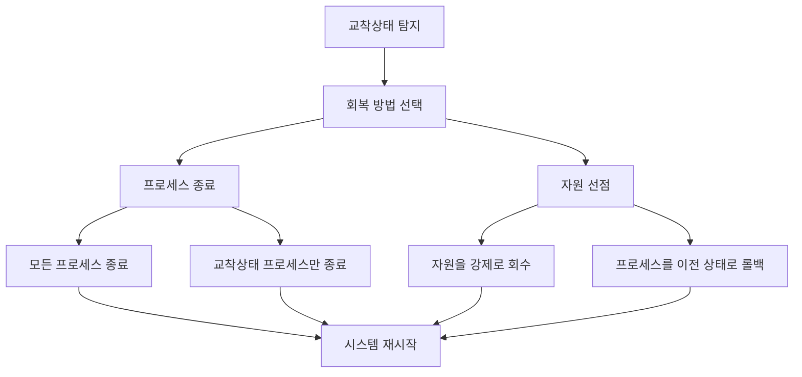

CPU 스케줄링

운영체제
- 다양한 프로세스와 스레드에 `CPU 사용을 배분` 하여 CPU 자원을 관리
- 이 배분방법이 `CPU 스케줄링`


운영체제는 프로세스별 우선순위를 판단하여 PCB에 명시하고, 우선순위가 높은 프로세스에는 CPU의 자원을 더 빨리, 더 많이 할당한다.
> 사용자가 일부 프로세스의 우선순위를 높일 수 있음.


운영체제는 어떤 프로세스에 높고 낮은 우선순위를 할당?
- CPU 활용률이 대표적인 고려 요소
	- 작업을 처리하는 시간의 비율
- 운영체제는 높은 CPU 활용률을 유지하기 위해 기본적으로 입출력 작업이 많은 프로세스의 우선수위를 높게 유지함.

CPU를 이용하는 작업을 `CPU 버스트` 
입출력장치를 기다리는 작업을 `입출력 버스트`

입출력 집중 프로세스 vs CPU 집중 프로세스

- **입출력 집중 프로세스 (I/O-bound process)**
    
    - CPU보다는 **디스크, 네트워크, 키보드/마우스 같은 입출력 장치(I/O)** 작업에 더 많은 시간을 소모하는 프로세스.
        
    - CPU는 상대적으로 한가하고, 대부분 I/O 요청 대기 상태에 있음.
        
- **CPU 집중 프로세스 (CPU-bound process)**
    
    - 입출력보다 **계산 작업(산술, 논리 연산 등)**에 더 많은 시간을 소모하는 프로세스.
        
    - CPU를 최대한 활용하기 때문에 I/O 작업은 거의 병목 요인이 아님.

스케줄링 큐
- CPU 사용 혹은 메모리에 적재되고 싶은 PCB들을 큐에 삽입하여 줄을 세움

> 선입선출일 필요는 없음

운영체제가 관리하는 큐
- 준비 큐, 대기 큐


```mermaid
graph LR
  JQ["작업 큐 (Job Queue)"]
  RQ["준비 큐 (Ready Queue)"]
  CPU["실행 상태 (Running)"]
  WQ["대기 큐 (I/O Queue)"]
  END["종료"]

  JQ --> RQ
  RQ -->|Dispatch| CPU
  CPU -->|Timer Interrupt| RQ
  CPU -->|I/O 요청| WQ
  WQ -->|I/O 완료| RQ
  CPU -->|Exit| END

```


```mermaid
stateDiagram-v2
    [*] --> New: 프로세스 생성(Create)
    New --> Ready: Admit (로드/스케줄러 등록)

    Ready --> Running: Dispatch (CPU 할당)
    Running --> Ready: 선점/타이머 인터럽트 (Preemption)

    Running --> Waiting: I/O 요청 / 이벤트 대기 (Block)
    Waiting --> Ready: I/O 완료 인터럽트 (Wakeup)

    Running --> Terminated: Exit() / 정상 종료
    Terminated --> [*]
```


선점형과 비선점형의 차이 두괄식
선점 스케줄링 대표 알고리즘과 그 방식


```mermaid
flowchart TD
    subgraph 선점 스케줄링
    A[실행 중 프로세스] -- Timer Interrupt --> B[준비 큐의 다른 프로세스]
    end

    subgraph 비선점 스케줄링
    C[실행 중 프로세스] -- CPU 점유 유지 --> D[종료 or I/O 요청 시 반납]
    end

```

| 구분        | 선점형 스케줄링          | 비선점형 스케줄링        |
| --------- | ----------------- | ---------------- |
| CPU 강제 회수 | 가능 (OS가 빼앗음)      | 불가능 (자진 반납)      |
| 응답 속도     | 빠름 (대화형 시스템 적합)   | 느려질 수 있음         |
| 문맥 교환     | 자주 발생 → 오버헤드 있음   | 적음 → 단순, 효율적     |
| 활용 사례     | 멀티태스킹 OS, 실시간 시스템 | 배치 처리, 단순 처리 시스템 |
|           |                   |                  |

스켸줄링이란?
- 계획된 순서나 시간에 따라 일정한 작업을 배치하고 조정하는 과정

#### CPU Scheduling의 목표
> CPU 스케줄링의 주요 목적은 가능한 한 많은 작업이 동시에 실행되도록 하는 것입니다.
  오버헤드 ↓ / 사용률 ↑ / 기아 현상 ↓
- CPU 이용률 극대화
	- 쉬지 않고 프로세스를 처리 -> 시스템 전체의 생산성을 높이고 대기 시간을 줄임
- 공정성 보장
	- 모든 프로세스가 공정하게 CPU 사용 기회를 얻도록함
	- 특정 프로세스가 과도하게 기다리거나 무시하는 상황 방지
- 처리량 증가
	- 단위 시간당 완료되는 작업의 수를 높임

#### 선점 / 비선점 스케줄링
- **선점(preemptive)** 
	- OS가 CPU의 사용권을 선점할 수 있는 경우, 강제 회수하는 경우
	- ==처리시간 예측이 어려움==
- **비선점** 
	- 프로세스 종료 or I/O 등의 이벤트가 있을 때 까지 실행 보장
	- ==처리시간 예측 용이함==

---

```mermaid
sequenceDiagram

    participant Scheduler

    participant CPU

    participant ProcessA

    participant ProcessB

  

    ProcessA ->> CPU: Execute Process A

    CPU ->> Scheduler: Check for incoming processes

    Note right of Scheduler: Process B arrives with higher priority

    Scheduler -->> CPU: Preempt Process A

    CPU -->> ProcessA: Pause Process A

    Scheduler ->> CPU: Assign CPU to Process B

    ProcessB ->> CPU: Execute Process B

    CPU ->> ProcessB: Complete Process B

    CPU -->> Scheduler: Process B completed, resuming Process A

    Scheduler ->> CPU: Resume Process A

    ProcessA ->> CPU: Continue Execution
```


> 선점 스케줄링
> OS가 CPU의 사용권을 선점, 강제 회수하는 경우

- **Process A**가 실행 중인 상황에서 **CPU**가 `Process A`를 실행
- **Scheduler**는 새로운 프로세스 도착 여부를 확인하며, **Process B**가 도착하여 **Process A**보다 높은 우선순위를 가지고 있음을 인지합니다.
- **Scheduler**는 **CPU**에 선점 요청을 보내고, **CPU**는 **Process A**를 일시 중단합니다.
- **Scheduler**는 **Process B**를 **CPU**에 할당하고, **Process B**가 실행을 시작합니다.
- **Process B**가 완료되면 **Scheduler**는 **Process A**의 작업을 재개하도록 **CPU**에 지시합니다.

```mermaid
sequenceDiagram
    participant Scheduler
    participant CPU
    participant ProcessA
    participant ProcessB

    ProcessA ->> CPU: Execute Process A
    CPU ->> Scheduler: Check for incoming processes
    Note right of Scheduler: Process B arrives with lower or equal priority
    Scheduler -->> CPU: No preemption, continue Process A
    CPU ->> ProcessA: Continue Execution of Process A
    ProcessA ->> CPU: Complete Process A
    CPU -->> Scheduler: Process A completed, check next process
    Scheduler ->> CPU: Assign CPU to Process B
    ProcessB ->> CPU: Execute Process B
```
> 비선점 스켸줄링
> 프로세스 종료 or I/O 등의 이벤트가 있을 때 까지 실행 보장
> 처리시간 계산이 용이함

- **Process A**가 CPU에서 실행을 시작
- **Scheduler**는 새로운 프로세스의 도착 여부를 확인하며, **Process B**가 도착
- **Scheduler**는 비선점 정책에 따라 **Process B**의 우선순위를 고려하지 않고 **Process A**의 실행을 계속
- **Process A**가 완료될 때까지 **Process B**는 대기
- **Process A**가 종료된 후, **Scheduler**는 **CPU**를 **Process B**에 할당하여 실행을 시작


#### CPU  스켸줄링의 종류

---

# ✅ 선점형 스케줄링 (Preemptive Scheduling)

> 운영체제가 **실행 중인 프로세스를 강제로 중단**하고 CPU를 다른 프로세스에 할당할 수 있는 방식

### 📌 대표 알고리즘

1. **라운드 로빈 (Round Robin, RR)**
    
    - **방식**: 준비 큐의 프로세스들에게 **시간 할당량(Time Quantum)** 만큼 CPU를 번갈아 줌.
        
    - **특징**: 공평성 보장, 대화형 시스템에 적합, 문맥 교환이 잦음.
        
2. **최단 잔여 시간 우선 (Shortest Remaining Time First, SRTF)**
    
    - **방식**: CPU 버스트 시간이 가장 짧게 **남은** 프로세스에 우선순위 부여.
        
    - **특징**: 평균 대기시간 최소화, 잦은 선점으로 오버헤드 발생.
        
3. **선점형 우선순위 스케줄링 (Preemptive Priority Scheduling)**
    
    - **방식**: 우선순위가 높은 프로세스가 CPU를 차지. 낮은 우선순위 프로세스 실행 중에도 빼앗김.
        
    - **특징**: 중요 작업 우선 처리, 하지만 **기아(Starvation)** 발생 가능 → Aging 기법으로 해결.
        

---

# ✅ 비선점형 스케줄링 (Non-preemptive Scheduling)

> 프로세스가 **스스로 CPU를 반납할 때까지** 계속 실행되는 방식

### 📌 대표 알고리즘

1. **FCFS (First Come, First Served)**
    
    - **방식**: 도착 순서대로 CPU 할당.
        
    - **특징**: 단순, 공정. 하지만 평균 대기시간이 길어질 수 있음 (**Convoy Effect**).
        
2. **SJF (Shortest Job First)**
    
    - **방식**: CPU 버스트 시간이 가장 짧은 프로세스부터 실행.
        
    - **특징**: 평균 대기시간 최소화. 실행 시간 예측이 어렵고, 긴 프로세스는 기아 문제 발생.
        
3. **비선점형 우선순위 스케줄링 (Non-preemptive Priority Scheduling)**
    
    - **방식**: 우선순위 높은 프로세스가 먼저 CPU 차지. 단, 실행이 시작되면 끝까지 유지.
        
    - **특징**: 기아 문제 존재. 하지만 선점보다 단순.
        

---

# 📊 비교 요약

|구분|선점형 (Preemptive)|비선점형 (Non-preemptive)|
|---|---|---|
|CPU 강제 회수|가능|불가능|
|대표 알고리즘|RR, SRTF, 선점형 Priority|FCFS, SJF, 비선점 Priority|
|장점|응답 속도 빠름, 대화형 환경 적합|단순, 문맥 교환 적음|
|단점|문맥 교환 오버헤드, 기아 가능|응답 지연, Convoy Effect|

---

👉 정리하면:

- **선점형**은 **응답성과 공정성**을 강조 (대화형 시스템에 적합).
    
- **비선점형**은 **단순성과 효율성**을 강조 (배치 시스템에 적합).
    

---

리눅스 

| 정책                    | 유형  | 특징                | 활용 예시              |
| --------------------- | --- | ----------------- | ------------------ |
| **SCHED_OTHER (CFS)** | 일반  | 가상 런타임 기반, 공정성 추구 | 기본 프로세스 실행         |
| **SCHED_BATCH**       | 일반  | 배치 작업 최적화, 반응성↓   | 대규모 계산, 데이터 처리     |
| **SCHED_IDLE**        | 일반  | 최저 우선순위, 유휴 시 실행  | 백그라운드 태스크          |
| **SCHED_FIFO**        | 실시간 | 선점형, 같은 우선순위 FIFO | 오디오, 모터 제어         |
| **SCHED_RR**          | 실시간 | 선점형, 같은 우선순위 RR   | 실시간 통신, 네트워크 패킷 처리 |
|                       |     |                   |                    |
[[리눅스 CPU 스케줄링]]


####  페이지 교체 알고리즘(Page Replacement Algorithm)

## 1. 정의

- 가상 메모리에서 **필요한 페이지가 메모리에 없을 때(페이지 폴트 발생)** → 디스크에서 불러와야 함.
    
- 하지만 메모리 프레임이 가득 차 있으면, 기존에 있던 페이지 중 하나를 내보내야 함.
    
- 이때 **어떤 페이지를 교체할지 결정하는 규칙**이 페이지 교체 알고리즘임.
    

---

## 2. 대표 알고리즘들

### 1) FIFO (First-In First-Out)

- **가장 먼저 들어온 페이지를 가장 먼저 교체**.
    
- 구현 간단 (큐 구조).
    
- 단점: 오래됐다고 반드시 덜 쓰이는 게 아님 → **Belady’s Anomaly** 발생 가능.
    

---

### 2) OPT (Optimal, 최적 알고리즘)

- **앞으로 가장 오랫동안 사용되지 않을 페이지를 교체**.
    
- 페이지 폴트 횟수를 최소화.
    
- 단점: 미래 참조를 알아야 해서 실제 구현 불가 → 성능 비교 기준으로만 사용됨.
    

---

### 3) LRU (Least Recently Used)

- **가장 오래 사용되지 않은 페이지를 교체**.
    
- 지역성(Locality) 원리를 반영 → 성능 우수.
    
- 구현 방법:
    
    - 최근 사용 시각 기록 (타임스탬프).
        
    - 스택/리스트 구조로 최근 사용 순서 관리.
        
- 단점: 구현 비용(하드웨어/소프트웨어)이 큼.
    

---

### 4) LFU (Least Frequently Used)

- **사용 횟수가 가장 적은 페이지 교체**.
    
- 장점: 장기적으로 사용 빈도 반영.
    
- 단점: 최근 패턴을 반영하기 어려움 (예: 갑자기 많이 쓰다 안 쓰이는 페이지).
    

---

### 5) Clock (Second-Chance Algorithm)

- FIFO 개선 버전. **원형 큐 + 참조 비트(Reference Bit)** 사용.
    
- 교체 대상 후보가 된 페이지를 검사:
    
    - 참조 비트 = 1 → 최근 사용됨 → 기회(Second Chance) 주고 비트 0으로 초기화.
        
    - 참조 비트 = 0 → 교체 대상 선정.
        
- 구현 단순 + 성능 LRU 근사.
    

---

## 3. 비교 요약

|알고리즘|원리|장점|단점|
|---|---|---|---|
|**FIFO**|가장 먼저 들어온 것 교체|단순|Belady 현상 가능|
|**OPT**|앞으로 가장 늦게 쓰일 것 교체|페이지 폴트 최소|구현 불가 (이론적)|
|**LRU**|가장 오래 안 쓴 것 교체|성능 우수, 지역성 반영|구현 복잡|
|**LFU**|사용 빈도 적은 것 교체|장기적 사용 패턴 반영|최근 패턴 반영 약함|
|**Clock**|FIFO+참조 비트 검사|구현 단순, LRU 근사|완전 LRU보단 부정확|

---


  

- **프로세스 종료**: 교착상태 프로세스 중 일부를 종료

- **자원 선점**: 자원을 강제로 회수하여 다른 프로세스에 할당
