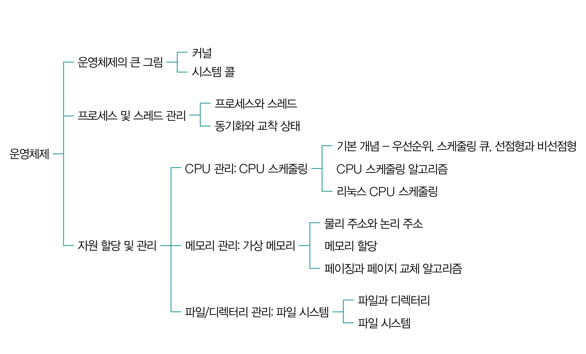
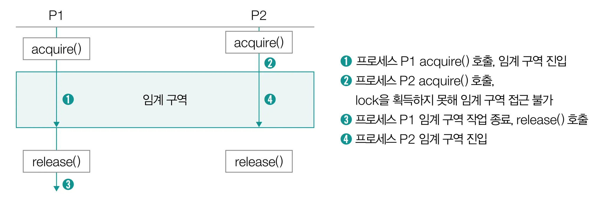
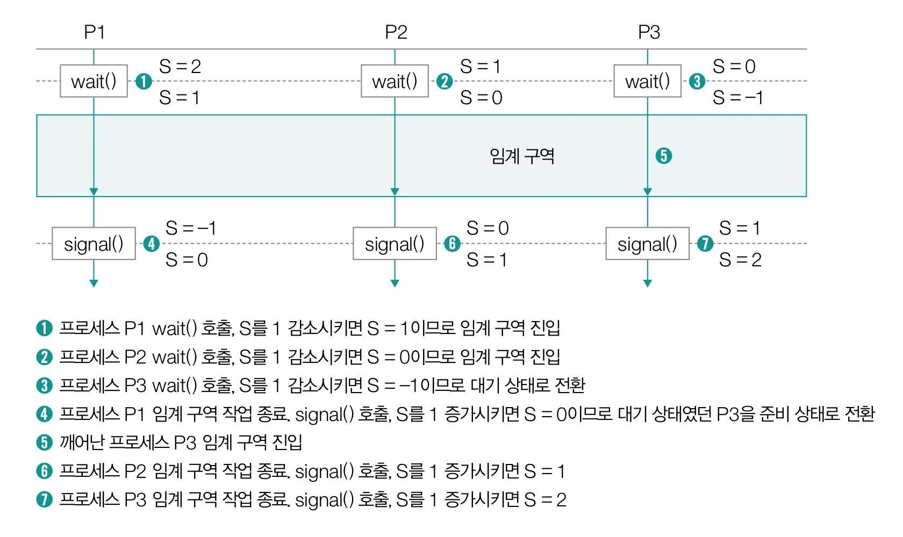

# CH03. 운영체제

## 📌 핵심 개념 요약

- 운영체제의 역할
- 시스템 콜과 이중 모드
- 프로세스와 스레드
- 프로세스 간 통신 (공유 메모리, 메시지 전달)
- 동기화 기법 (뮤텍스 락, 세마포, 모니터, 스레드 안전)
- 교착 상태 (발생 조건, 해결 방법)

## 💡 면접 예상 질문

-

## ❓스터디에서 논의하고 싶은 질문

-

## 🔗 참고 자료

- **[책]** 이것이 취업을 위한 컴퓨터 과학이다 with CS 기술 면접

# 1. 운영체제의 큰 그림

- 운영체제는 종류에 관계없이 운영체제가 제공하는 핵심적인 기능은 비슷하며, 이 핵심 기능을 담당하는 부분을 ‘**커널**’이라고 한다. (운영체제 == 커널)
- 운영체제의 핵심기능은 무엇일까!
  1. **_자원 할당 및 관리_**
  2. **_프로세스 및 스레드 관리_**

## 운영체제의 역할

- ‘자원 할당 및 관리’
  - **자원:** 프로그램 실행에 마땅히 필요한 요소
    - ex) 실행에 필요한 데이터(소프트웨어), 부품(하드웨어), 컴퓨터의 핵심 부품 등
  - 사용자가 실행하는 응용 프로그램을 대신하여 **CPU, 메모리, 보조기억장치 등의 컴퓨터 부품**에 접근하고 각각의 부품들이 효율적으로 사용되도록 관리
  - 응용 프로그램이 컴퓨터 부품들을 효율적으로 할당받아 문제 없이 실행할 수 있도록 **응용 프로그램에게 자원을 할당**

### CPU 관리: CPU 스케줄링

- CPU는 한정된 자원이기 때문에! 공정하고 합리적으로 CPU를 할당받도록 CPU의 할당 순서와 사용 시간을 결정한다.
  - 기본 개념 - 우선순위, 스케줄링 큐, 선점형과 비선점형
  - CPU 스케줄링 알고리즘
  - 리눅스 CPU 알고리즘

### 메모리 관리: 가상 메모리

- 운영체제는 새롭게 실행하는 프로그램을 **메모리에 적재**하고, 종료된 프로그램을 **메모리에서 삭제**한다.
  - 동시에 낭비되는 메모리 용량이 없도록 효율적으로 관리!!
  - → **`가상메모리`**(5절에서 학습): 실제 물리적인 메모리 크기보다 더 큰 메모리를 이용할 수 있도록
    - 물리 주소와 논리 주소
    - 메모리 할당
    - 페이징과 페이지 교체 알고리즘

### 파일/디렉터리 관리: 파일 시스템

- (메모리보다 더 큰 용량을 가지고 있는) 보조기억장치에 아무렇게나 정보를 저장한다면 정보 접근에 오랜 시간이 소요될 것!
  - → **`파일 시스템`**
    - 보조기억장치 내의 정보를 **파일 및 폴더(디렉터리) 단위**로 접근,관리할 수 있도록 만드는 운영체제 내부 프로그램
      - 파일과 디렉터리
      - 파일시스템

### 입출력장치와 캐시 메모리 관리

- 일부 입출력장치의 장치 드라이버, 하드웨어 인터럽트 서비스 루틴을 제공
- 캐시 메모리의 일관성을 유지

### 프로세스 및 스레드 관리

- 메모리에는 여러 프로세스가 적재될 수 있는데, **운영체제**는 이 **프로세스**에 필요한 **자원을 할당**하고, **스레드**는 프로세스가 할당받은 자원을 이용해 **프로세스의 작업을 수행**한다.
  - 프로세스 process
    - 실행 중인 프로그램
  - 스레드 thread
    - 프로세스를 이루는 실행의 단위
    - 스레드가 둘 이상인 경우?
      - 동일한 작업을 동시에 실행할 수 있다
- 프로세스와 스레드가 올바르게 처리되도록, 실행의 순서를 제어하고 요구하는 자원을 적절하게 배분할 수 있어야 한다!
  - **동기화와 교착 상태** 문제를 고려해야함!



## 시스템 콜과 이중 모드

- 메모리 → 커널 영역과 사용자 영역으로 구성
  - 커널 영역: 운영체제가 적재되는 공간
  - 사용자 영역: 사용자 응용 프로그램이 적재되는 공간
    - CPU, 메모리 같은 자원에 직접 접근하거나 조작할 수 없다
- 운영체제 기능을 제공받기 위해서는 커널 영역에 적재된 운영체제 코드를 실행해야한다
  - **Q. 그럼 응용 프로그램은 어떻게 운영체제의 코드를 실행할 수 있을까?**
  - A. **시스템 콜**을 호출한다.
- **시스템 콜 system call**
  - 운영체제의 서비스를 제공받기 위한 수단(인터페이스)
  - 호출 가능한 함수의 형태
  - 응용 프로그램이 운영체제로부터 어떤 기능을 제공받고자한다면 다음과 같이 그 기능에 해당하는 시스템 콜을 호출하면 된다.
  - 종류
    - 프로세스 관리
      - fork(), execve(), exit(), waitpid()
    - 파일 관리
      - open(), close(), read(), write(), stat()
    - 디렉터리 관리
      - chdir(), mkdir(), rmdir()
    - 파일 시스템 관리
      - mount(), umount()
- 참고) 부모 프로세스와 자식 프로세스
  - fork() 시스템 콜처럼 프로세스는 시스템 콜을 통해 또 다른 프로세스를 생성하고, 그렇게 생성된 프로세스는 또 다른 프로세스를 생성할 수 있다
  - 이때 새 프로세스를 생성한 프로세스를 **부모 프로세스**, 부모 프로세스에 의해 생성된 프로세스를 **자식 프로세스**라고 한다.
- **컴퓨터 내부에서 시스템 콜이 호출이 되면 어떤 작업이 수행될까?**
  1. 소프트웨어 인터럽트 발생 (ex. 자원에 접근하는 입출력 명령어)
  2. CPU의 커널 모드 전환
  3. 운영체제 코드 실행
  4. 사용자 모드로 재전환
- 시스템 콜 과정 (자세하게)
  1. 사용자 영역을 실행하는 과정에서 시스템 콜 호출
     1. CPU는 현재 수행 작업 백업
  2. 커널 영역에서 인터럽트 처리 코드 실행 (운영체제 코드 실행)
  3. 다시 사용자 영역의 코드 실행 재개
- 사용자 모드, 커널 모드, 이중 모드
  > 프로그램은 시스템 콜을 통해 사용자모드와 커널 모드를 빈번히 오가며 운영체제의 소스코드를 실행
  - **사용자 모드**: 사용자 영역에 적재된 코드를 실행할 때의 실행모드
    - 운영체제 서비스를 제공받을 수 없는 실행모드
    - 커널 영역의 코드 실행 불가
    - 사용자모드로 실행 중인 CPU는 입출력 명령어와 같이 자원에 접근하는 명령어를 만나도 이를 실**행하지 않는다!**
  - **커널 모드**: 커널 영역에 적재된 코드를 실행할 때의 실행모드
    - 운영체제 서비스를 제공받을 수 있는 실행모드
    - 자원에 접근하는 명령어를 비롯한 모든 명령어를 실행할 수 있다.
  - **이중 모드**: 이렇게 두개의 모드로 구분하여 실행하는 것
- CPU가 어떤 모드인지는 어떻게 알까?
  - **플래그 레지스터** 속 슈퍼바이저 플래그를 보면 알 수 있다.

# 2. 프로세스와 스레드

- 프로세스의 유형
  - **포그라운드 프로세스**: 사용자가 보는 공간에서 사용자와 상호작용하며 실행된다
  - **백그라운드** **프로세스**: 사용자가 보지 못하는 곳에서 실행된다.
    - **데몬**: 백그라운드 프로세스 중에서도 사용자와 별다른 상호작용 없이 주어진 작업만을 수행하는 프로세스 (윈도우 에서는 **서비스**라고 부름)
- 하나의 프로세스를 구성하는 메모리 구조
  - 커널 영역
    - PCB(Process Control Block) 프로세스 제어 블록이 저장됨
  - 사용자 영역
    1. 코드 영역
       - 실행 가능한 **명령어가 저장되는 공간**
       - 텍스트 영역
       - CPU가 읽고 실행할 명령어가 담겨있기 때문에 읽기 전용(read-only)
    2. 데이터 영역
       - 프로그램이 실행되는 동안 유지할 **데이터가 저장되는 공간**
       - ex) 정적 변수나 전역 변수가 대표적
    3. 힙 영역
       - 프로그램을 만드는 사용자가 직접 할당 가능한 저장 공간
       - 프로그램 실행 도중 비교적 자유롭게 할당하여 사용 가능한 메모리 공간
       - 언젠가는 할당했던 메모리 공간을 반환해야한다.
         - **메모리 누수**
           - 반환하지않으면 할당한 공간이 계속 메모리 내에 남아 메모리를 낭비하는 문제
           - **해결방법**) 프로그래밍 언어에서 자체적으로 사용되지 않는 힙 메모리를 해제하는 **가비지컬렉션** 기능을 제공하기도 함
    4. 스택 영역
       - 데이터 영역에 담기는 값과 달리 **일시적으로 사용할 값들이 저장되는 공간**
       - ex) 매개변수, 지역변수, 함수 복귀 주소 등이 저장됨
       - **스택 트레이스**
         - 특정 시점에 스택 영역에 저장된 함수 호출 정보
         - 문제의 발생지점을 추적할 수 있어 디버깅에 유용하게 사용됨
    5. (BSS)
       - 데이터 영역과 유사하지만 초기값이 있는 데이터는 데이터 영역에, 초기값이 없는 데이터가 저장된다.
    ***
    - 코드 영역과 데이터 영역 → 정적 할당 영역
    - 힙 영역과 스택 영역 → 동적 할당 영역

## PCB와 문맥 교환

- **프로세스 제어 블록 (`PCB`: Process Control Block)**
  - 프로세스와 관련된 다양한 정보를 내포하는 구조체의 일종
  - 운영체제가 메모리에 적재된 다수의 프로세스를 관리하려면, 프로세스를 식별할 수 있는 커널 영역 내의 정보가 필요하기 때문에!!
  - 새로운 프로세스가 메모리에 적재됐을 때 커널 영역에 만들어지고, 프로세스의 실행이 끝나면 폐기된다.
  - PCB가 담는 정보는?
    - 프로세스 ID (**PID**)
    - 프로세스가 실행 과정에서 사용한 **레지스터 값**
    - **프로세스 상태**
    - **CPU 스케줄링**(우선순위) 정보
    - **메모리** 관련 정보 (프로세스의 메모리 상 적재 위치)
    - 프로세스가 사용한 **파일 및 입출력장치** 관련 정보
  - **프로세스 테이블** 형태로 관리된다
    - 실행중인 PCB의 모음
      - 새롭게 실행되는 프로세스가 있다면 해당 프로세스의 PCB를 프로세스 테이블에 추가하고, 필요한 자원을 할당
      - 종료되는 프로세스가 있다면 사용 중이던 자원을 해제하고 PCB도 프로세스 테이블에서 삭제
- 좀비 프로세스
  - 프로세스가 비정상 종료되어 사용한 자원이 회수되었음에도 프로세스 테이블에 종료된 프로세스의 PCB가 남아있음
- 메모리에 적재된 프로세스들은 한정된 시간 동안 번갈아가며 실행됨
  - 프로세스가 실행된다라는 말은 운영체제에 의해 CPU 자원을 할당받았다는 말
  - CPU가 프로세스를 구성하는 명령어와 데이터를 인출하여 실행하고, 운영체제가 CPU 자원을 할당하기 때문
- **프로세스의 CPU 시간은 어떻게 제한될까?**
  - 타이머 인터럽트에 의해 제한된다
    - 시간이 끝났음을 알리는 인터럽트
  - 프로세스는 자신의 차례가 되면 정해진 시간만큼 CPU를 이용하고, 타이머 인터럽트가 발생하면 자신의 차례를 양보하고 다음 차례가 올 때까지 기다린다.
- 프로세스 A를 실행하다가 타이머 인터럽트가 발생하면 어떻게 될까?
  - 프로세스A는 프로그램 카운터를 비롯한 각종 레지스터 값과, 메모리 정보, 실행을 위해 열었던 파일, 사용한 입출력 장치 등 지금까지의 중간 정보를 백업해야한다.
  - **문맥**(**`Context`**)
    - 프로세스의 수행을 재개하기 위해 기억해야할 정보
    - 프로세스의 문맥은 해당 **프로세스의 PCB에 명시된다**
  - **문맥 교환 (`Context Switching`)**
    - 기존 프로세스의 문맥을 PCB에 백업하고, PCB에서 문맥을 복구하여 새로운 프로세스를 실행하는 것
    - ex) 인터럽트가 발생하면, A의 PCB에 Context를 백업하고, 뒤이어 실행할 프로세스B의 Context를 복구한다.
- 문맥 교환이 자주 발생하는 것은 좋은 것일까?
  - 많은 프로세스를 동시에 실행할 수 있긴하지만, 프로세스 간에 너무 잦은 문맥 교호나이 발생하면 캐시 미스가 발생할 가능성이 높아져 메모리로부터 실행할 프로세스의 내용을 가져오는 작업이 빈번해지고, 이는 큰 오버헤드로 이어질 수 있다.

## 프로세스의 상태

- 운영체제는 PCB를 통해 프로세스의 상태를 인식하고 관리한다.
  - `생성 상태`
    - 프로세스를 생성 중인 상태로 메모리에 적재되어 PCB를 할당받은 상태
      - 생성 상태를 거쳐 실행할 준비가 완료된 프로세스는 준비 상태가 되어 CPU할당을 기다림
  - `준비 상태`
    - 당장이라도 CPU를 할당받아 실행할 수 있지만 아직 자신의 차레가 아니기 때문에 기다리고 있는 상태
      - 준비 상태인 프로세스가 CPU를 할당받으면 실행 상태가 되며 준비 상태인 프로세스가 실행 상태로 전환되는 것을 디스패치라고 한다.
  - `실행 상태`
    - CPU를 할당받아 실행 중인 상태로 일정 시간 동안만 CPU를 사용할 수 있다.
      - 타이머 인터럽트가 발생하여 프로세스가 할당된 시간을 모두 사용하면 다시 준비 상태가 되고, 실행 도중 입출력장치를 사용하여 입출력장치의 작업이 끝날 때까지 기다려야 하면 대기 상태가 된다.
  - `대기 상태`
    - 프로세스가 입출력 작업을 요청하거나 바로 확보할 수 없는 자원을 요청하는 등 곧장 실행이 불가능한 조건에 놓이는 경우 대기상태가 된다.
      - 입출력 작업을 요청하는 경우가 대표적
      - 대기 상태였던 해당 프로세스는 입출력 작업이 완료되는 등 실행 가능한 상태가 되면 다시 준비 상태가 되어 CPU 할당을 기다린다.
  - 종료 상태
    - 프로세스가 종료된 상태
- **블로킹 입출력과 논블로킹 입출력**
  - 블로킹 입출력
    - 프로세스 실행 도중 입출력 작업을 수행하는 상황
    - 일반적으로는 프로세스는 대기 상태에 접어들고, 입출력 작업이 완료되면 준비 상태가 되어 실행을 재개한다.
  - 논블로킹 입출력
    - 입출력장치에게 입출력 작업을 맡긴 뒤, 곧바로 이어질 명령어를 실행

## 멀티프로세스와 멀티스레드

- 한 프로세스를 구성하는 코드를 동시에 실행하려면?
  1. 같은 프로그램을 서로 다른 여러 프로세스로 생성하여 실행 (동시에 여러 프로세스)**→ 멀티 프로세스**
     - 웹 브라우저 (일반적으로 하나의 탭마다 하나의 프로세스)
     - 자원을 공유하지않고 독립적으로 실행된다!
       - PID(프로세스ID)도 다르고, 프로세스별로 파일과 입출력장치 등의 자원이 독립적으로 할당되어 다른 프로세스에 영향을 거의 끼치지 않는다.
  2. 프로세스를 동시에 실행하는 **여러 스레드 → 멀티 스레드**
     - 하나의 스레드는 스레드ID, 프로그램 카운터, 레지스터 값, 스택 등으로 구성
     - 스레드마다 각각의 프로그램 카운터 값과 스택을 가지고 있기 때문에 스레드마다 다음에 실행할 주소를 가질 수 있고, 연산 과정의 임시 저장 값을 가질 수 있다.
- 멀티프로세스와 멀티스레드의 차이점은??
  - 가장 큰 차이점은 **자원 공유 여부**
    - 서로 다른 프로세스들은 기본적으로 자원을 공유하지 않기 때문에 독립적으로 실행되는 반면(**멀티프로세스**) , 같은 프로세스를 수행하는 여러 스레드들은 프로세스의 자원을 공유합니다. (**멀티스레드**)
    - 따라서 멀티스레드 환경에서는 한 스레드에 생긴 문제가 프로세스 전체의 문제가 될 수 있습니다.
- thread.join()
  - 스레드를 생성할 때 많이 보는 join()
  - join은 스레드를 생성한 주체가 생성/실행된 스레드가 **종료될 때까지 대기해야함**을 의미

## 프로세스 간 통신 (IPC: Inter-Process Communication)

- 프로세스 간에도 자원을 공유하고 데이터를 주고받을 수 있는 방법이 있다!
  > 두가지 방식!
  >
  > 1. **_공유 메모리_**
  > 2. **_메시지 전달_**

### 공유 메모리

> 데이터를 주고받는 프로세스가 공통적으로 사용할 메모리 영역을 두는 것

- 프로세스 A가 공유메모리 공간에 데이터를 쓰고, 프로세스B는 해당 메모리 공간을 읽는다고 가정했을 때 결과적으로 프로세스 A가 프로세스 B에게 데이터를 공유한 것과 같다.
- 공유하는 메모리 영역을 확보하는 시스템 콜을 기반으로 수행될 수도 있고, 간단하게 프로세스가 공유하는 변수나 파일을 활용할 수도 있다.
- 중요한 특징!
  - **_마치 자신의 메모리 영역을 읽고 쓰는 것처럼 통신한다!_**
    - 프로세스가 주고받는 과정에 **_커널의 개입이 거의 없다!_**
    - \*메시지 전달 방식보다 **통신 속도가 빠르다!\***
- 대신!
  - **레이스 컨디션**, 즉 **_데이터의 일관성이 훼손될 수 있다!_**

### 메시지 전달

> 프로세스 간에 주고 받을 데이터가 커널을 거쳐 송수신 되는 통신 방식

- 각가의 프로세스가 자신의 메모리 영역(사용자 영역)을 읽고 쓰는 것으로 통신이 가능한 공유 메모리기반 IPC와 다르게, 메시지 전달 기반 IPC는 **_메시지를 보내는 수단과 받는 수단이 명확하게 구분되어있다!_**
  - `send()`. `recv()` 라는 두 시스템 콜이 정해져있다.
  - 공유 메모리 기반 IPC보다 **_커널의 도움을 적극적으로_** 받을 수 있어 **_레이스컨디션, 동기화 등을 고려하는 일이 상대적으로 적다._**
  - \*공유 메모리 방식보다 **통신 속도가 느리다!\***
- 예시
  - **`파이프`**
    - 단방향 프로세스 간의 통신 도구
    - 양방향 통신) 읽기용/쓰기용 파이프 2개를 이용
    - 익명 파이프(unnamed pipe)와 지명 파이프 (named pipe)
      - 익명) 양방향 통신을 지원하지 않고 부모 프로세스와 자식 프로세스 간에만 통신이 가능
      - 지명) 양방향 통신을 지원하며, 부모 프로세스와 자식 프로세스 간 + 임의의 프로세스 간에도 통신 가능
  - `시그널`
    - 특정 이벤트가 발생했음을 알리는 비동기적 신호
      - IPC만을 위해 존재하는 개념은 아니고 시그널을 적절히 활용해 IPC를 수행한다 이정도
    - 시그널의 종류는 다양! (이벤트 종류 다양)
    - 프로세스는 시그널이 발생하면 인터럽트 처리과정과 유사하게 **하던 일을 중단하고 시그널 처리를 위한 시그널 핸들러를 실행한 뒤 실행을 재개**
      - 프로세스는
        - 직접 특정 시그널 발생시킬 수 있고
        - 직접 일부 시그널 핸들러 (재)정의 할 수 있고
        - 특정 시그널이 발생했을 때 동작을 미리 정의할 수 있다.
    - **_직접적으로 메시지를 주고받지는 않지만 비동기적으로 원하는 동작을 수행할 수 있는 좋은 수단!_**
    - **코어 덤프**
      - 비정상적으로 종료하는 경우에 생성되는 파일
      - 프로그램이 특정 시점에 작업하던 메모리 상태가 기록되어있음
  - 네트워크 `소켓`
    - 추후 학습
  - `원격 프로시저 호출 (RPC)`
    - 원격 코드를 실행
    - 프로그램 언어나 플랫폼과 무관하게 성능 저하를 최소화하고, 메시지 송수신이 가능하기 때문에 대규모 트래픽 처리 환경, 특히 서버 간 통신 환경에서 사용되는 경우가 많다.

# 3. 동기화와 교착 상태

- 임계구역: 동일한 자원을 동시에 접근하는 작업(e.g. 공유하는 변수 사용, 동일 파일을 사용하는 등)을 실행하는 코드 영역
- 레이스 컨디션: 프로세스 혹은 스레드가 동시에 임계 구역의 코드를 실행하여 문제가 발생하는 상황

## 동기화 기법

레이스 컨디션을 방지하면서 임계 구역을 관리하기 위해서는 프로세스와 스레드가 동기화 되어야한다.

- 동기화 조건
  1. 실행 순서 제어: 프로세스 및 스레드를 올바른 순서로 실행하기
  2. 상호 배제: 동시에 접근해서는 안되는 자원에 하나의 프로세스 및 스레드만 접근하기

### 뮤텍스 락 mutex lock

> 동시에 접근해서는 안 되는 자원에 동시 접근이 불가능하도록 **상호 배제**를 보장하는 동기화 도구
>
> `acquire()` 락을 획득하기 위한 함수, `release()` 획득한 락을 해제하기 위한 함수

- acquire()는 특정 락에 대해 한 번만 호출 가능. 이후 다른 프로세스 및 스레드가 lock.acquire()을 호출하더라도 이전 ‘락이 해제될 때까지’ 기다려야한다.
- 임계 구역 앞에서 대기하는 프로세스 혹은 스레드가 있을 때 비로소 락을 획득하고 임계 구역에 진입한다.
  - **임계 구역 진입 전후로 뮤텍스 락을 획득하고 해제!**



### 세마포 semaphore

> 한 번에 여러 개의 프로세스 및 스레드가 공유 자원을 이용할 때

- 뮤텍스 락과 세마포의 차이점은?
  - 한 번에 하나의 프로세스 및 스레드만 공유 자원을 이용하는 상황 → 뮤텍스 락
  - 한번에 여러개의 프로세스 및 스레드까지 공유 자원을 이용하는 상황 → 세마포
- 임계 구역 앞에서 멈추라는 신호를 받으면 멈추고, 가도 좋다는 신호를 받으면 임계 구역에 들어가도 되는 철도 신호기처럼 생각하면 된다~
- 하나의 변수와 2개의 함수로 구성

  - S: **사용 가능한 공유 자원**의 개수를 나타내는 변수
  - wait(): 임계 구역 **진입 전** 호출하는 함수
  - signal(): 임계 구역 **진입 후** 호출하는 함수

  ```c
  wait() {
      S--;                 // 자원 하나 차지 (들어가기 전에 줄 서는 개념)
      if (S < 0) {         // 자원이 모자란가?
          sleep();         // 네, 모자라면 기다려!
      }
  }

  ```

  1. wait()은 함수 호출 시 가장 먼저 사용 가능한 공유 자원의 개수(S)를 1 감소 시키고,
  2. S의 값이 0보다 작은지 확인
     (S에서 1을 감소시킨 값이 0 미만 → **사용 가능한 공유 자원의 개수가 남아있지않음**)
  3. 따라서 S가 0보다 작으면 wait()을 호출한 프로세스 및 스레드는 **대기 상태로 전환**되어 **임계 구역에 진입할 수 없게 된다.**

  ```c
  signal() {
      S++;                 // 자원 반환 (임계 구역 사용 후)
      if (S <= 0) {        // 여전히 기다리는 사람이 있나?
          wakeup(p);       // 기다리던 사람 중 하나를 깨움
      }
  }
  ```

  1. signal()은 임계구역에서의 **작업이 끝난** 프로세스 및 스레드가 호출한다. 가장 먼저 사용 가능한 공유 자원의 개수(S)를 1 증가 시키고,
  2. S의 값이 0이하 인지 확인한다.
     (S가 0보다 크다는 것은 사용 가능한 공유 자원의 개수가 1개 이상 남아있음을 의미,
     S가 **0이하라는 것은 임계 구역에 진입하기 위해 대기하는 프로세스가 존재함**)
  3. 대기 상태로 접어든 프로세스 중 하나를 준비 상태로 전환한다.

- 예시) 공유자원이 2개, 접근하려는 프로세스가 3개 (P1,P2,P3)이고, 순서대로 임계구역에 접근한다면!
  
  ### cf) 이진 세마포와 카운팅 세마포
  - 카운팅 세마포: 지금까지 다룬 세마포, 공유 자원이 여러 개 존재하는 경우에 사용할 수 있는 세마포
  - 이진 세마포: S가 0과 1의 값을 가지는 세마포 → 뮤텍스 락과 유사하게 동작

### 모니터 (feat. 조건 변수)

- **조건 변수**: 실행 순서 제어를 위한 동기화 도구
  - 특정 조건 하에 프로세스를 실행/일시중단함으로써 프로세스나 스레드의 실행 순서를 제어
  - wait(), signal()함수를 호출하여 대기 상태로 전환하거나, 실행을 재개한다!
- **모니터**
  - 공유 자원과 그 공유 자원을 다루는 함수로 구성된 동기화 도구
  - **상호 배제를 위한 동기화**뿐만 아니라 **실행 순서 제어를 위한 동기화**까지 가능
    - 상호 배제
      - 반드시 정해진 공유 자원 연산을 통해 모니터 내로 진입해야하고, 모니터 안에 진입하여 실행되는 프로세스 및 스레드는 항상 하나여야한다!
    - 실행 순서 제어
      - 조건 변수 활용!

### 스레드 안전

- **스레드 안전**: 멀티스레드 환경에서 어떤 변수나 함수, 객체에 동시 접근이 이루어져도 실행에 문제가 없는 상태 (레이스 컨디션이 발생하지 않음)
  - ex) 자바 Vector 클래스의 **add 메서드**는 **모니터 기반의 동기화를 제공하는 synchronized 키워드**로 구현되어 있음. (ArrayList의 add 메서드는 스레드 안전성이 보장되지 않는다)

## 교착 상태

- 프로세스를 실행하기 위해서는 자원이 필요
- 2개 이상의 프로세스가 각자 가지고 있는 자원을 무작정 기다린다면 더 이상 어떤 프로세스도 진행할 수 없는 교착 상태가 발생할 수 있다.
- **교착상태**: 일어나지 않은 사건을 기다리며 프로세스의 진행이 멈춰 버리는 현상

### 교착 상태 발생 조건

> 교착 상태 발생에는 4가지 필요 조건이 있다. 이 중 하나라도 만족하지 않는다면 교착상태는 발생하지 않고 4개의 조건이 모두 만족할 때 교착상태가 발생할 **가능성이 생긴다.**

1. 상호 배제
   - 한 프로세스가 사용하는 자원을 다른 프로세스가 사용할 수 없는 **상호 배제**의 상황에서 교착 상태가 발생할 수 있다.
     - 교착 상태의 근본적인 원인은, 한 번에 하나의 프로세스만 해당 자원을 이용 가능했기 때문이다!
2. 점유와 대기
   - 한 프로세스가 어떤 자원을 할당받은 상태(점유)에서 다른 자원 할당받기를 기다린다면 (대기) 교착상태가 발생할 수 있다.
3. 비선점
   - 어떤 프로세스도 다른 프로세스의 자원을 강제로 빼앗지 못하는 경우, 교착상태가 발생할 수 있다.
   - 자원이 비선점되었다 : 자원을 이용하는 프로세스의 작업이 끝나야만 비로소 자원을 이용할 수 있다는 것을 의미
4. 원형 대기
   - 프로세스와 프로세스가 요청한 자원이 원의 형태를 이루는 경우
   - 각각의 프로세스가 서로 점유한 자원을 할당받기 위해 원의 형태로 대기할 경우 교착 상태가 발생

### 교착 상태 해결 방법

> 자원을 분배하는 방식으로 예방할 수도, 조금씩 할당하다가 교착 상태의 위험이 있을 때 자원을 할당하지 않게 회피할 수도, 제약없이 할당하다가 교착 상태를 검출한 후 회복할 수 도 있다!

1. 교착 상태 예방
   - 교착 상태를 발생시키는 4가지 필요 조건 중 하나를 충족하지 못하게 하는 방법이다. (상호 배제, 점유와 대기, 비선점, 원형 대기)
   - 점유와 대기 예방) 한 프로세스에 필요한 자원들을 몰아주고, 그 다음에 다른 프로세스에 필요한 자원을 몰아주기
   - 원형 대기 예방) 할당 가능한 모든 자원에 번호를 매기고 오름차순으로 할당하기
2. 교착 상태 회피
   - 교착 상태가 발생하지 않을 정도로만 조심하면서 자원을 할당하는 방법
   - 기본적으로 교착 상태를 한정된 자원의 무분별한 할당으로 인해 발생하는 문제로 간주
3. 교착 상태 검출 후 회복
   - 교착 상태의 발생을 인정하고 처리하는 사후 조치
     - 운영체제는 프로세스가 자원을 요구할 때마다 그때 그때 자원을 할당하고 주기적으로 교착 상태의 발생 여부를 검사
     - 그러다가 교착 상태가 검출되면 프로세스를 자원 선점을 통해 회복시키거나, 교착 상태에 놓인 프로세스를 강제 종료함으로써 회복시킬 수 있음
       (자원 선점을 통한 회복: 교착 상태가 해결될 때까지 다른 프로세스로부터 강제로 자원을 빼앗아 한 프로세스에 몰아서 할당하는 것)
