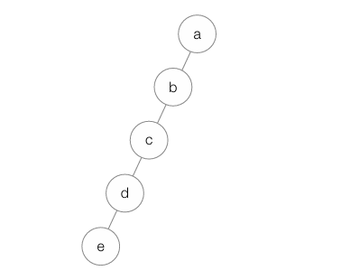

# CH00. 목차

- [목차]()

## 📌 핵심 개념 요약

### 목차를 입력하세요

## 💡 면접 예상 질문

- 캐시 메모리는 왜 필요한가요?
- RISC와 CISC의 차이점은?

## ❓스터디에서 논의하고 싶은 질문

- 컨트롤 유닛이 명령어 디코딩 시 수행하는 실제 동작은?

## 🔗 참고 자료

- [CS 정리 블로그](https://example.com)

##  

  
  

    
    

        
이것은 

    

