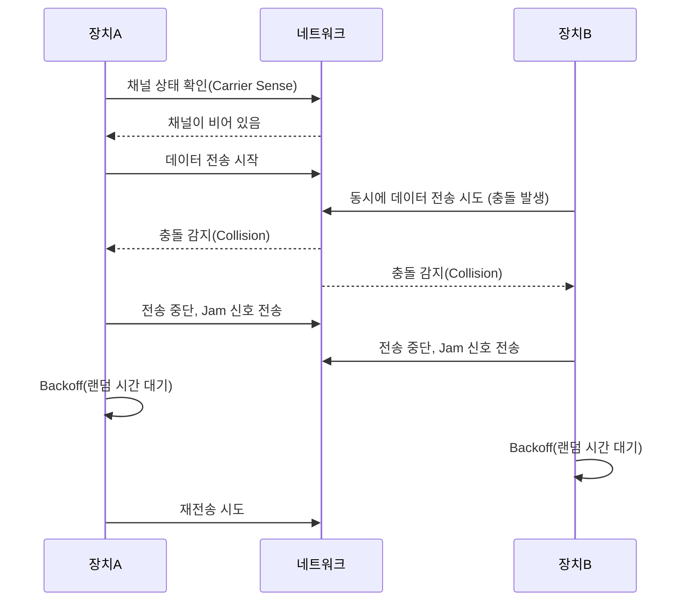

# 1. 네트워크의 큰 그림

### 1) 네트워크의 기본 구조

- **구성요소**: 호스트(PC/서버/모바일), **NIC**, 스위치(L2), 라우터(L3), 방화벽, AP, 게이트웨이.
    
- **영역**: **LAN**(사내망) ↔ **WAN/Internet**(사업자 경유).
    
- **계층모델**: OSI(7) ↔ TCP/IP(4) 맵핑
    
    - L1 물리 ↔ 링크의 물리 부분
        
    - L2 데이터링크 ↔ 링크
        
    - L3 네트워크(IP) ↔ 인터넷
        
    - L4 전송(TCP/UDP) ↔ 전송
        
    - L5~7(세션/표현/응용) ↔ 응용(HTTP/SMTP/…)
        
- **핵심 원리**: L2는 **MAC 기반 전달**, L3는 **IP 기반 라우팅**, L4는 **프로세스(포트) 간 통신**.
    

### 2) 두 호스트가 패킷을 주고받는 과정

1. URL → **DNS 조회**(도메인 → IP)
    
2. 동일 서브넷이면 **ARP**(IP→MAC)로 목적지 MAC 획득, 아니면 **기본 게이트웨이** MAC으로 전송
    
3. **TCP 3-way handshake**(SYN, SYN-ACK, ACK) 혹은 UDP 송신
    
4. **데이터 전송**(세그먼트/데이터그램 → IP 패킷 → 이더넷 프레임)
    
5. **라우터**가 목적지 네트워크까지 홉-바이-홉 전달, TTL 감소
    
6. 수신측에서 역과정(디캡슐레이션) 후 응답
    

- 실무 확인: `nslookup`, `arp -a`, `ping`, `tracert/traceroute`, `tcpdump/wireshark`.
    

### 3) 네트워크 지도 그리기

- **주소계획**: RFC1918(10/8, 172.16/12, 192.168/16)에서 서브넷 나누기. 예) 192.168.0.0/24 → /26 네 개(62호스트씩).
    
- **VLAN**: 부서/보안영역 분리(802.1Q 태깅). **Access**(단일 VLAN), **Trunk**(다중 VLAN).
    
- **라우팅 경계**: L3 스위치/라우터. **기본 게이트웨이**는 서브넷 당 1개.
    
- 다이어그램에는 **대역, 게이트웨이, VLAN ID, 방화벽 정책**을 표기.
    

---

# 2. 물리 계층과 데이터 링크 계층

### 1) 이더넷

- **프레임**: Dst MAC | Src MAC | Type | Payload | FCS. **MTU** 보통 1500B.
    이더넷(Ethernet)은 컴퓨터, 프린터, 라우터 등 여러 장치를 유선으로 연결해 데이터를 주고받을 수 있게 해주는 통신 기술입니다. 가장 일반적인 유선 LAN(Local Area Network) 방식으로, 일반적으로 RJ-45 커넥터와 UTP 케이블을 사용합니다. 전송 속도는 10Mbps부터 시작해 현재는 1Gbps, 10Gbps 이상까지 지원됩니다. 패킷 기반 통신을 하며, CSMA/CD라는 충돌 방지 기술을 사용합니다(현재는 스위치 사용으로 충돌 거의 없음). 빠르고 안정적인 네트워크를 구성할 수 있어 기업과 가정 모두에서 널리 사용됩니다. 
    
	MTU(Maximum Transmission Unit)는 네트워크에서 한 번에 전송할 수 있는 **최대 패킷 크기(바이트 단위)**를 말합니다. 일반적으로 이더넷의 MTU는 **1500바이트**입니다. 이보다 큰 데이터를 보내려면 쪼개서(fragmentation) 전송해야 합니다.  
	MTU가 너무 작으면 오버헤드가 늘고, 너무 크면 패킷 손실 시 재전송 부담이 커집니다. 최적의 MTU 설정은 네트워크 성능에 큰 영향을 줍니다. VPN이나 터널링을 사용할 경우 MTU 조정이 특히 중요합니다.
    
- **MAC 주소**: 48bit(예: 00:1C:42:…); NIC 제조사 OUI 포함.
    
- 전송방식: 유니캐스트/브로드캐스트/멀티캐스트.
- - **유니캐스트(Unicast)**: 한 장치에서 **특정 하나의 장치**로 데이터를 전송. 1:1 통신. (예: 웹사이트 접속)
    
- **브로드캐스트(Broadcast)**: 한 장치가 **같은 네트워크 내 모든 장치**에 데이터를 전송. 1:전체 통신. (예: ARP 요청)
    
- **멀티캐스트(Multicast)**: 한 장치가 **특정 그룹에 속한 여러 장치**에만 데이터를 전송. 1:선택된 다수 통신. (예: IPTV, 스트리밍)
    

주로 IP 네트워크에서 구분되며, 효율성과 목적에 따라 선택적으로 사용됩니다.
    
- CSMA/CD는 반이중·허브 시절 개념, **스위치+전이중**에서는 사실상 미사용.
    **CSMA/CD(Carrier Sense Multiple Access with Collision Detection)**는 유선 이더넷에서 **데이터 충돌을 방지하기 위한 통신 방식**입니다.

1. **Carrier Sense**: 먼저 다른 장치가 통신 중인지 확인
    
2. **Multiple Access**: 여러 장치가 공유 매체 사용 가능
    
3. **Collision Detection**: 동시에 전송해 충돌 발생 시, 이를 감지하고 전송 중단
    
4. **Backoff**: 무작위 시간 후 재전송 시도

    

현재는 대부분 **스위치 기반 네트워크**로 충돌이 발생하지 않아 CSMA/CD는 거의 사용되지 않습니다.

### 2) 유·무선 통신 매체

- **유선**: UTP Cat5e/6/6A(1~~10GbE), **광(SMF/MMF)**(수 km~~수십 km, 낮은 지연/간섭).
    
- **무선(802.11)**: b/g/n/ac/ax(=Wi-Fi 4/5/6). 2.4GHz는 간섭↑, 5GHz는 속도↑, 6GHz(6E)는 혼잡↓.
    
- 트레이드오프: **속도·거리·간섭·보안**.
    

### 3) 네트워크 인터페이스: NIC

- 역할: **프레임 송수신, MAC 보유, 오프로딩**(체크섬/TSO 등).
    
- 종류: 물리 NIC, **가상 NIC**(가상화/클라우드), SR-IOV/DPU 등.
    
- 상태 확인: 링크 속도/듀플렉스/에러(`ethtool`, `ifconfig`/`ip`/`Get-NetAdapter`).
    

### 4) 허브와 스위치

- **허브**: 전 포트 브로드캐스트, 충돌도메인 공유(구형).
    
- **스위치**: **MAC 학습**(CAM 테이블) 기반 포워딩, 포트별 충돌도메인 분리.
    
- **L3 스위치**: VLAN 간 라우팅, 정적/동적 라우팅(OSPF 등) 일부 지원.
    
- 안정성: **STP/RSTP**로 루프 방지, **포트 시큐리티**로 MAC 제한.
    

---

# 3. 네트워크 계층 – IP

### 1) IP의 목적과 특징

- **비연결성·최선형 전달(best-effort)**, 순서/신뢰 보장은 L4(TCP)에서.
    
- **헤더(IPv4)**: Src/Dst IP, TTL, Protocol(TCP=6/UDP=17/ICMP=1), Fragment/ID 등.
    
- **조각화**: MTU 초과 시 단편화(권장X). Path MTU Discovery로 회피.
    

### 2) IP 주소의 구조

- **CIDR 표기**: 192.168.10.0/24 (넷마스크 255.255.255.0).
    
- 빠른 암기: /24=256개(254사용), /25=128(126), /26=64(62), /30=4(2).
    
- **IPv6**: 128bit, 콜론 16진수, 예 `2001:db8::/32`. **링크로컬** `fe80::/10`, **NAT 불필요**, **NDP** 사용.
    

### 3) 공인 IP vs 사설 IP

- 사설: **10/8, 172.16–31/12, 192.168/16**, CGNAT: **100.64/10**.
    
- **NAT**(SNAT/DNAT, PAT): 주소 절약·보안 경계. P2P/VoIP에 영향 가능.
    

### 4) IP 주소의 할당

- **정적(Static)** vs **동적(DHCP)**.
    
- **DHCP DORA**: Discover → Offer → Request → Acknowledge. (옵션: Router, DNS, NTP 등)
    
- IPv6: **SLAAC**(+RA) 또는 DHCPv6.
    

### 5) IP 전송 보완: ICMP

- **Echo(req/reply)**(ping), **Destination Unreachable**, **Time Exceeded**(traceroute), **Redirect**.
    
- 보안상 레이트 제한/차단 가능(과도 차단은 진단 곤란).
    

### 6) IP↔MAC 대응: ARP / NDP

- **ARP**: 브로드캐스트 쿼리 → 캐시 저장. **Gratuitous ARP**로 충돌 탐지/테이블 갱신.
    
- 위협: **ARP 스푸핑** → **DAI/DHCP Snooping**으로 완화.
    
- IPv6는 **NDP(NS/NA, RA)** 사용.

**MAC 주소**와 **IP 주소**는 네트워크에서 장치를 식별하기 위한 서로 다른 방식의 주소

- **MAC 주소 (물리 주소)**
    
    - 네트워크 카드에 부여된 고유한 식별자 (예: `00:1A:2B:3C:4D:5E`)
        
    - 계층: **2계층 (데이터 링크 계층)**
        
    - 변경 불가 (보통), 로컬 네트워크 식별
        
    - 스위치 등에서 사용
        
- **IP 주소 (논리 주소)**
    
    - 네트워크 상에서 위치를 나타내는 주소 (예: `192.168.0.1`)
        
    - 계층: **3계층 (네트워크 계층)**
        
    - 변경 가능, 인터넷 통신에 사용
        
    - 라우터에서 사용
        
---

# 4. 전송 계층 – TCP와 UDP

### 1) 목적과 특징

- **TCP**: 연결지향, **신뢰성(재전송, 순서보장)**, **흐름제어(rwnd)**, **혼잡제어(cwnd)**. 파일전송/웹/DB.
    
- **UDP**: 비연결/경량/낮은 지연. 스트리밍/게임/VoIP/DNS.
    

### 2) TCP 연결부터 종료까지

- **3-way**: SYN(Seq=x) → SYN-ACK(Seq=y, Ack=x+1) → ACK(Ack=y+1).
    
- 협상: MSS, 윈도우 스케일링, SACK 등 옵션.
    
- **4-way 종료**: FIN/ACK 왕복, **TIME_WAIT**로 지연 패킷 흡수.
    
- 이슈: SYN flood(백로그 고갈) → SYN cookies/방화벽으로 방어.
    

### 3) TCP 상태 관리·성능

- 상태: LISTEN → SYN_SENT/RECV → **ESTABLISHED** → FIN_WAIT/ CLOSE_WAIT → **TIME_WAIT**.
    
- 재전송 타이머(RTO), RTT 측정, **혼잡제어 알고리즘**: Reno/Cubic/BBR 등.
    
- 트러블슈팅: `ss -tuna`, `netstat -an`, `tcpdump port 80`, Wireshark로 **3-way/윈도우/재전송** 확인.
    

---

## 실무 체크리스트 (요 정도면 현업 기본기 통과)

- **VLAN/서브넷 계획**: 대역표 + 게이트웨이 + DHCP 스코프 정의.
    
- **방화벽 정책**: 최소허용 원칙. 관리(22/3389/VPN), 서비스(80/443/**서비스 포트**), 내부-DB 포트 세분화.
    
- **MTU/PMTUD** 문제 회피(터널/클라우드 환경 주의).
    
- **모니터링**: `ping`/`mtr`, NetFlow/sFlow, Syslog, SNMP, 업링크/포트 에러(입출력 드롭) 확인.
    
- **보안**: ARP/NDP 보호, 포트시큐리티, DHCP Snooping, 기본 패스워드/원격관리 포트 교체.
    

---

## 한 장 요약(암기 포인트)

- **MTU 1500B**, **UDP 헤더 8B**, **TCP 기본 20B**(+옵션).
    
- 사설 대역: **10/8, 172.16–31/12, 192.168/16**, **게이트웨이**는 서브넷당 1개.
    
- **DHCP DORA**, **DNS→ARP→TCP 3-way**가 웹요청의 표준 흐름.
    
- **ICMP**는 진단 필수, 과도 차단 금물.
    
- **브로드캐스트 도메인**은 VLAN으로, **충돌 도메인**은 스위치 포트 단위로 분리.
    

---

**질문 1: TCP와 UDP의 가장 큰 차이와 사용 사례는 무엇인가요?**  
**답변:**  
TCP는 연결지향형으로 3-way handshake를 통해 연결을 맺고, 신뢰성(재전송·순서 보장), 흐름제어, 혼잡제어를 제공해 안정성이 중요할 때 사용됩니다. 예를 들어 웹 서버(HTTP/HTTPS), DB 연결, 파일 전송(FTP) 등이 있습니다.  
UDP는 비연결형으로 빠르고 가벼우며, 실시간성이 필요한 스트리밍, VoIP, DNS 질의, 온라인 게임 등에 활용됩니다.

---

**질문 2: TCP 3-way handshake 과정과 4-way 종료 과정을 설명해보세요.**  
**답변:**

- **연결 수립(3-way):**
    
    1. 클라이언트가 SYN(Seq=x) 전송
        
    2. 서버가 SYN-ACK(Seq=y, Ack=x+1) 응답
        
    3. 클라이언트가 ACK(Ack=y+1) 응답 → 연결 성립
        
- **연결 종료(4-way):**
    
    1. 클라이언트 FIN → 서버 ACK
        
    2. 서버 FIN → 클라이언트 ACK → `TIME_WAIT` 유지 후 종료
        

---

**질문 3: ARP의 역할과 동작 원리를 설명해주세요.**  
**답변:**  
ARP는 IP 주소를 MAC 주소로 변환하는 프로토콜입니다. 브로드캐스트로 "이 IP 가진 장치 MAC 주소 알려달라"는 요청을 보내고, 대상 장치가 자신의 MAC 주소를 유니캐스트로 응답합니다. 응답은 ARP 테이블에 캐시되어 이후 빠르게 통신할 수 있습니다.

---

**질문 4: NAT(Network Address Translation)의 개념과 필요한 이유는 무엇인가요?**  
**답변:**  
NAT는 사설 IP 주소를 공인 IP 주소로 변환하는 기술입니다. IPv4 주소 고갈 문제를 해결하고 내부망 구조를 외부에 숨기는 보안 이점도 있습니다. PAT(포트기반 NAT)는 여러 내부 IP를 하나의 공인 IP로 동시에 매핑할 때 사용합니다.

---

**질문 5: TCP의 흐름제어와 혼잡제어의 차이를 설명해보세요.**  
**답변:**

- **흐름제어:** 송신자가 수신자의 처리 속도보다 빠르게 보내 과부하가 생기지 않도록 **수신 윈도우(rwnd)** 크기를 조절합니다.
    
- **혼잡제어:** 네트워크의 전체 혼잡 상황을 고려하여 **전송 속도(cwnd)**를 동적으로 조절하는 기법입니다. 예로 Reno, Cubic, BBR 알고리즘이 있습니다.
    

---

**질문 6: PMTUD(Path MTU Discovery)의 필요성과 동작 원리를 설명해주세요.**  
**답변:**  
PMTUD는 경로 상 최소 MTU를 탐지해 패킷 단편화를 방지하는 기술입니다. 송신 측이 DF(단편화 금지) 플래그를 설정하고 패킷을 보내며, 경로 상 MTU보다 큰 패킷이 차단되면 ICMP Fragment Needed 메시지를 받아 패킷 크기를 줄여 재전송합니다.

---

**질문 7: 스위치와 허브의 차이를 설명해보세요.**  
**답변:**  
허브는 단순 브로드캐스트로 모든 포트에 동일한 데이터를 보내고, 충돌 도메인이 공유됩니다. 반면 스위치는 MAC 주소 학습 테이블을 이용해 목적지 포트로만 전달하며, 포트 단위로 충돌 도메인이 분리되어 효율성과 보안성이 높습니다.

---

**질문 8: TCP 연결에서 TIME_WAIT 상태가 필요한 이유는 무엇인가요?**  
**답변:**  
TIME_WAIT은 연결 종료 후 지연 패킷이 네트워크 상에 남아 있는 상황을 처리하고, 포트 재사용 시 세션 충돌을 방지하기 위한 상태입니다. 일반적으로 2MSL 동안 유지되며, 서버나 클라이언트 모두 이 상태를 가질 수 있습니다.

---

**질문 9: ICMP 프로토콜의 역할은 무엇인가요?**  
**답변:**  
ICMP는 네트워크 진단과 제어 메시지 전송에 사용됩니다. 예를 들어 `ping`은 Echo Request/Reply로 통신 가능 여부를 확인하고, `traceroute`는 Time Exceeded 메시지를 활용해 경로 추적을 합니다. 단, 보안상 과도한 차단은 문제 분석을 어렵게 만듭니다.

---

**질문 10: TCP 혼잡제어 알고리즘의 종류와 특징을 설명해보세요.**  
**답변:**

- **Reno:** 손실 발생 시 윈도우 절반 감소, 단순하지만 느린 회복.
    
- **Cubic:** 대역폭 활용도를 높여 고속 네트워크에 적합.
    
- **BBR:** 대역폭·지연을 추정해 전송, 최신 환경에서 효율적.  
    선택은 네트워크 특성과 트래픽 특성에 따라 달라집니다.
    
****질문: 반이중(Half-Duplex) 통신과 전이중(Full-Duplex) 통신의 차이점은 무엇인가요?**  
**답변:**

- **반이중(Half-Duplex)**
    
    - 한 번에 **한 방향**으로만 통신이 가능합니다.
        
    - 송신 중에는 수신이 불가능하고, 수신 중에는 송신이 불가능합니다.
        
    - 예: 무전기, 구형 허브 환경의 이더넷.
        
    - **특징:** 충돌(Collision) 가능성이 있어 **CSMA/CD** 같은 충돌 감지 메커니즘이 필요합니다.
        

---

- **전이중(Full-Duplex)**
    
    - **양방향 동시 통신**이 가능합니다.
        
    - 송신과 수신이 동시에 이루어지므로 대역폭 활용 효율이 높습니다.
        
    - 예: 현대 이더넷 스위치 환경, 전화 통화, 광통신.
        
    - **특징:** 충돌이 발생하지 않아 **CSMA/CD가 필요하지 않음**.
        

**추가 포인트:**

- 현대 네트워크는 거의 전이중 모드가 기본이며, **자동 협상(auto-negotiation)** 문제로 전이중-반이중 불일치가 발생하면 속도 저하나 패킷 손실이 생길 수 있습니다.
    
- `ethtool`이나 `Get-NetAdapter` 같은 명령어로 현재 링크 상태를 확인할 수 있습니다.

---

**질문:** 애플리케이션 서버 에서 TCP와 UDP 중 어떤 것을 선택해야 하는 상황을 예로 들어 설명해보세요.  
**답변:**

- TCP는 **HTTP, HTTPS, gRPC**처럼 **신뢰성과 순서 보장**이 필요한 통신에서 사용합니다.
    
- UDP는 **빠른 응답과 낮은 지연**이 중요한 경우, 예를 들어 실시간 로그 수집, 모니터링, 스트리밍 같은 곳에 사용합니다.

---

**질문:** HTTP 요청이 실제로 TCP/IP 계층을 통해 어떻게 전달되는지 설명해주세요.  
**답변:**

- 애플리케이션 계층에서 **HTTP 요청**이 만들어지고,
    
- TCP 계층에서 **3-way handshake**로 연결 후 세그먼트 단위로 전송,
    
- IP 계층에서 **라우팅과 패킷 전송**,
    
- 데이터 링크 계층에서 **프레임 단위로 송수신**됩니다.

---

**질문:** 대규모 트래픽 처리 시 서버에서 TIME_WAIT이 많이 쌓일 수 있는데, 이 원인과 해결 방법을 설명해주세요.  
**답변:**

- 원인: TCP 연결 종료 후 지연 패킷을 처리하기 위해 **TIME_WAIT** 상태 유지(기본 2MSL).
    
- 해결:
    
    - 커넥션 재사용(Keep-Alive)
        
    - HTTP/2로 **멀티플렉싱**
        
    - 로드밸런서로 트래픽 분산
        
    - 서버 설정 튜닝 (`tcp_tw_reuse` 옵션, 단 주의 필요)
