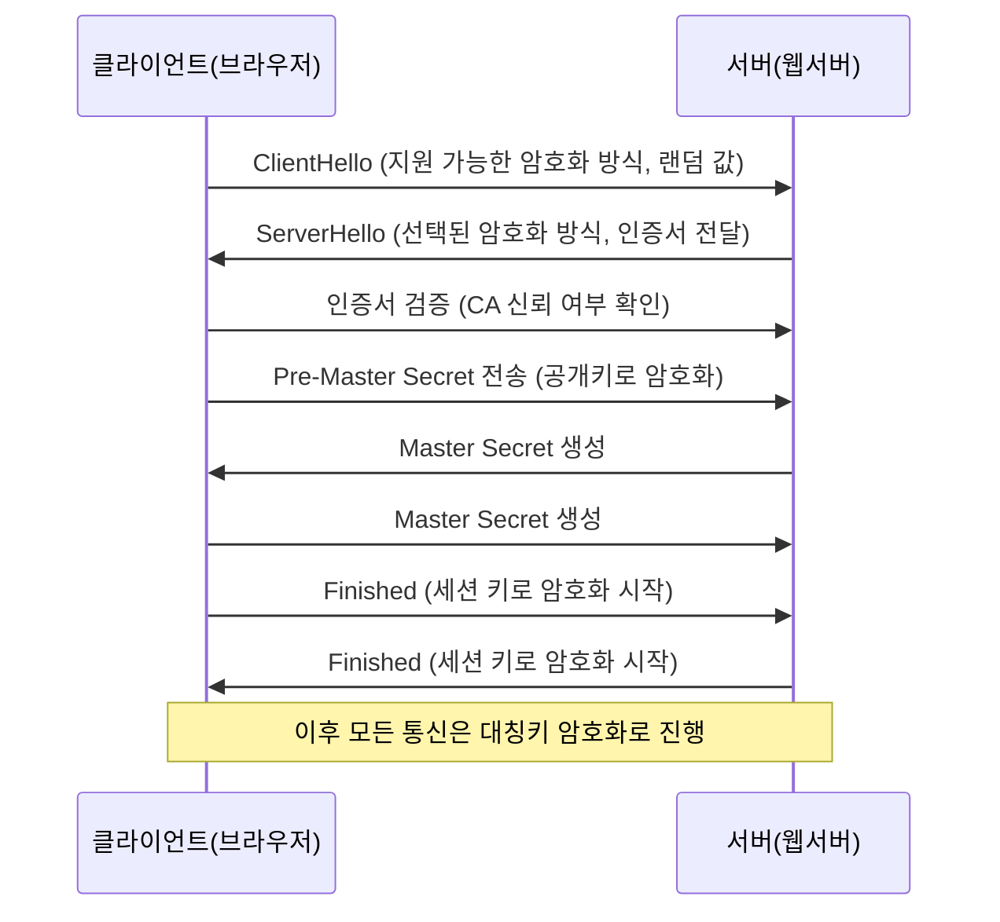

[[#응용 계층 - HTTP의 기초]]
[[#응용 계층 - HTTP의 응용]]
[[#프록시와 안정적인 트래픽]]

# 응용 계층 - HTTP의 기초

## DNS와 URI/URL

### 도메인 네임과 DNS

네트워크 상의 호스트를 식별하기 위해 기본적으로 사용되는 정보는 IP 주소임.
IP 주소로는 특정 호스트의 특징을 나타내기도 어려움. 그리고 호스트의 IP는 언제든 바뀔 수 있음.

그래서 `도메인 네임`이라는 것을 활용함. 

`도메인 네임`

`네임 서버` : 도메인 네임과 그에 대응하는 IP 주소를 관리

IP주소를 모르는 상태에서 도메인 네임에 대응되는 IP주소를 알아내는 과정을 `리졸빙`이라고 함.

도메인 네임의 계층적 구조
도메인 네임을 관리하는 네임 서버의 계층적 구조

`루트도메인`.`최상위 도메인`,

최상위 도메인 : com, net, org, 등
> 최상위 도메인을 도메인 네임의 마지막 부분으로 간주하여 `최상위`라고 표현함.


계층적 형태로 이뤄진 도메인 네임을 관리하는 네임서버도 계층적 형태를 이룸
>네임서버는 분산되어 관리되며, 전 세계 여러 곳에 위치함. DNS라고함.

1. 호스트는 먼저 로컬 네임 서버에 질의함
2. 로컬 네임 서버는 클라이언트랑 맞닿아 있음. (가장 가까운 DNS 서버)
3. 보통 ISP가 로컬 네임 서버의 주소를 자동으로 할당해줌. (로켈 네임 서버 주소가 아닌 공개 DNS 서버를 이용할 수 있음.)

![[Pasted image 20250901133329.png]]


근데 이러한 `질의` 가 반복되는 트래픽이 많아짐. 때문에 `DNS 캐시`를 함.
이걸 활용하면 보다 ㅉ랍은 시간 안에 원하는 IP 주소를 얻어낼 수 있음.
대부분의 IP 주소는 로컬 네임 서버에 캐시되어 있음.
> TTL 값이 정해져 있음


| 레코드 유형    | 설명                                 |
| --------- | ---------------------------------- |
| **A**     | 특정 호스트에 대한 도메인 네임과 IPv4 주소와의 대응 관계 |
| **AAAA**  | 특정 호스트에 대한 도메인 네임과 IPv6 주소와의 대응 관계 |
| **CNAME** | 호스트 네임에 대한 별칭 지정                   |
| **NS**    | 특정 호스트의 IP 주소를 찾을 수 있는 네임 서버       |
| **MX**    | 해당 도메인과 연동되어 있는 메일 서버              |

### 자원과 URI/URL
> 네트워크의 맥락에서 자원이란, 네트워크 상의 메시지를 통해 주고 받는 최종 대상을 의미함. (HTML, 이미지, 동영상, 텍스트)
> 즉, 두 호스트가 네트워크를 통해 서로 정보를 주고받을 떄 송수신하는 대상이 바로 자원.

URI
```
웹 상에서의 자원을 식별하기 위한 정보를 의미. (Resource Indentifier Uniform)
URI로 자원을 식별할 때는 `이름` 또는 `위치`를 기반으로 식별하기도 함.

`이름`으로 하는 방식은 `URN`
`위치`로 하는 방식은 `URL`
```

![[Pasted image 20250901134933.png]]

scheme
- 자원에 접근하는 방법, 사용할 프로토콜이 명시
authority
- 호스트를 특정할 수 있는 IP or 도메인 네임 명시
path
- 자원이 위치하고 있는 경로가 명시
query
- URL에 대한 매개변수 역할을 하는 문자열
- 자원을 식별하기 위해 추가적인 정보가 필요할 때 쓰임
fragment
- 자원의 일부분, 자원의 한 조각을 가리키기 위한 정보


## HTTP의 특징과 메시지 구조

HTTP의 목적은 애플리케이션의 다양한 자원을 네트워크를 통해 송수신 하는 것.
데이터의 형식에 구애받지 않고 다양한 애플리케이션 데이터의 송수신을 가능하게 하는 것이 HTTP의 주된 목적

## HTTP 메서드와 상태 코드

#### **1. 요청-응답 기반 (Request-Response)**

- HTTP는 **클라이언트가 요청을 보내고, 서버가 응답하는 방식**으로 동작합니다.
    
- 서버는 **클라이언트가 요청하기 전에는 아무 동작도 하지 않음**.
    
- 예: 브라우저가 `GET /index.html` 요청을 보내야 서버가 페이지를 돌려줌.
    

---

#### **2. 미디어 독립성 (Media Independent)**

- HTTP는 **어떤 형태의 데이터도 전송 가능**합니다.
    
- 전송되는 데이터는 `Content-Type` 헤더로 타입을 지정합니다.
    
    - 예: `text/html`, `application/json`, `image/png` 등
        
- **단순히 전송만 할 뿐, 데이터 해석은 애플리케이션 레벨의 책임**입니다.
    

---

#### **3. 무상태성 (Statelessness)**

- 서버는 요청 간 **상태를 저장하지 않음**.
    
- 각 요청은 독립적으로 처리되며, **서버 입장에서 매번 새로운 요청**으로 간주됨.
    
- 로그인 유지나 장바구니 같은 기능은 **쿠키, 세션, 토큰** 등 별도 상태 관리가 필요함.
    

---

#### **4. 지속 연결 (Persistent Connection)**

- **HTTP/1.1부터 기본 동작**.
    
- 한 번 연결한 TCP 소켓을 여러 요청·응답에 재사용 (`Connection: keep-alive`).
    
- **장점**
    
    - 연결 설정/해제 오버헤드 감소
        
    - 속도와 효율 개선
        
- **확장**:
    
    - HTTP/2 → 멀티플렉싱 지원
        
    - HTTP/3 → QUIC 기반 더 빠르고 안정적인 전송 지원
        


상태를 유지하지 않는 이유는? 모든 상태 정보를 유지하는 것은 서버의 큰 부담임

확장성과 견고성에 있음.
서버가 상태를 유지하지 않고 모든 요청을 독립적인 요청으로 처리하면 특정 클라이언트가 특정 서버에 종속되지 않아 서버 추가 or 대체가 쉬워짐


## HTTP 주요 헤더

### 요청 메시지에서 주로 활용되는 HTTP 헤더

Host, User-Agent, Referer

좋습니다! 요청 메시지에서 자주 쓰이는 주요 HTTP 헤더를 간단히 정리해드릴게요.

---

## 요청 메시지에서 주로 활용되는 HTTP 헤더

### 1. **Host**

* **의미**: 요청이 전달될 대상 서버(호스트명과 포트번호)를 지정
* **이유**: 하나의 IP 주소에 여러 도메인(가상 호스팅)이 존재할 수 있으므로, 정확히 어떤 도메인을 요청하는지 서버에 알려줌
* **예시**

  ```
  Host: www.example.com
  ```

---

### 2. **User-Agent**

* **의미**: 클라이언트(브라우저, 앱 등)의 정보 전달
* **이유**: 서버가 클라이언트 환경(브라우저/OS 종류 등)에 맞는 콘텐츠를 제공하거나 로그를 분석할 때 활용
* **예시**

  ```
  User-Agent: Mozilla/5.0 (Windows NT 10.0; Win64; x64)
  ```

---

### 3. **Referer**

* **의미**: 현재 요청을 보낸 페이지의 URL(이전 페이지 주소)
* **이유**: 유입 경로 분석, 보안(요청이 올바른 페이지에서 온 것인지 확인) 등에 활용
* **예시**

  ```
  Referer: https://www.google.com/
  ```

---

👉 이외에도 자주 쓰이는 요청 헤더에는

* **Accept** (클라이언트가 처리 가능한 미디어 타입)
* **Accept-Language** (선호 언어)
* **Authorization** (인증 정보, 예: 토큰)
* **Cookie** (클라이언트가 가진 세션/쿠키 데이터)


### 응답 메시지에서 주로 활용되는 HTTP 헤더
Server, Allow, Location

## 응답 메시지에서 주로 활용되는 HTTP 헤더

### 1. **Server**

* **의미**: 응답을 보낸 서버 소프트웨어의 정보
* **이유**: 서버의 종류(Apache, Nginx, Tomcat 등)와 버전을 알 수 있음 → 클라이언트 디버깅, 호환성 확인, 로그 분석 등에 사용
* **예시**

  ```
  Server: Apache/2.4.41 (Ubuntu)
  ```

---

### 2. **Allow**

* **의미**: 특정 리소스에 대해 서버가 허용하는 HTTP 메서드 목록을 명시
* **이유**: 클라이언트가 어떤 메서드를 사용할 수 있는지 확인 가능 (주로 `405 Method Not Allowed` 응답 시 포함됨)
* **예시**

  ```
  Allow: GET, POST, HEAD
  ```

---

### 3. **Location**

* **의미**: 클라이언트가 이동해야 할 리소스의 URL
* **이유**: 주로 리다이렉션(`3xx` 상태 코드)이나 새로운 리소스 생성(`201 Created`) 시 사용
* **예시**

  ```
  Location: https://www.example.com/welcome
  ```

---

👉 그 외에도 자주 쓰이는 응답 헤더에는:

* **Content-Type** (본문의 MIME 타입, 예: `application/json`)
* **Set-Cookie** (클라이언트에 쿠키 저장 지시)
* **Cache-Control** (캐싱 정책)
* **WWW-Authenticate** (인증 요구 시 사용)

---

### 요청과 응답 메시지 모두에서 활용되는 HTTP 헤더
Data, Content-Length, Content-Type, Content-Language, Content-Encoding, Connection

## 요청과 응답 메시지 모두에서 활용되는 HTTP 헤더

### 1. **Date**

* **의미**: 메시지가 생성된 날짜와 시간(UTC 기준)
* **요청 시**: 클라이언트 요청 생성 시각을 나타낼 수 있음
* **응답 시**: 서버가 응답을 생성한 시각을 제공
* **예시**

  ```
  Date: Tue, 02 Sep 2025 10:15:00 GMT
  ```

---

### 2. **Content-Length**

* **의미**: 메시지 본문의 크기(바이트 단위)
* **요청 시**: 클라이언트가 서버에 보내는 데이터 크기 (예: POST 요청 본문)
* **응답 시**: 서버가 보내는 데이터 크기를 알림 → 클라이언트가 수신 완료 시점 판단 가능
* **예시**

  ```
  Content-Length: 348
  ```

---

### 3. **Content-Type**

* **의미**: 메시지 본문의 데이터 형식(MIME 타입)
* **요청 시**: 전송하는 데이터 형식을 서버에 알림 (예: JSON, XML, multipart 등)
* **응답 시**: 서버가 반환하는 데이터 형식을 클라이언트에 알림
* **예시**

  ```
  Content-Type: application/json; charset=UTF-8
  ```

---

### 4. **Content-Language**

* **의미**: 메시지 본문이 어떤 언어로 작성되었는지 명시
* **요청 시**: 클라이언트가 선호하는 언어 전달 가능
* **응답 시**: 서버가 실제 제공하는 본문의 언어 알림
* **예시**

  ```
  Content-Language: ko-KR
  ```

---

### 5. **Content-Encoding**

* **의미**: 본문이 어떤 방식으로 인코딩(압축) 되었는지 표시
* **요청 시**: 클라이언트가 서버에 보내는 데이터 압축 방식
* **응답 시**: 서버가 응답 데이터를 압축하여 보낼 경우 명시
* **예시**

  ```
  Content-Encoding: gzip
  ```

---

### 6. **Connection**

* **의미**: 전송 후 연결을 유지할지 종료할지 결정
* **요청 시**: 클라이언트가 연결을 재사용할지 여부 전달
* **응답 시**: 서버가 연결 유지 여부 결정
* **예시**

  ```
  Connection: keep-alive
  Connection: close
  ```


# 응용 계층 - HTTP의 응용
## 쿠키

HTTP는 기본적으로 스테이트리스 프로토콜
HTTP 요청 메시지는 독립된 메시지로 간주됨.

좋습니다 👍 이번에는 \*\*HTTP 응용 계층에서 쿠키(Cookie)\*\*를 정리해드릴게요.

---

# 쿠키(Cookie)

## 1. 쿠키란?

* **클라이언트(브라우저)와 서버 간의 상태 정보를 유지하기 위한 작은 데이터 조각**
* HTTP는 기본적으로 **무상태(stateless) 프로토콜** → 매 요청은 독립적이므로, 쿠키를 사용해 상태를 기억하게 함.
* 서버가 `Set-Cookie` 헤더로 클라이언트에 쿠키를 저장하도록 지시 → 이후 클라이언트는 요청 시 `Cookie` 헤더에 담아 전송.

---

## 2. 쿠키 동작 과정

1. 클라이언트가 서버에 최초 요청
2. 서버가 응답 시 `Set-Cookie` 헤더를 포함

   ```
   Set-Cookie: sessionId=abc123; Path=/; HttpOnly
   ```
3. 브라우저가 해당 쿠키를 로컬에 저장
4. 이후 같은 서버에 요청 시 자동으로 쿠키를 `Cookie` 헤더에 포함

   ```
   Cookie: sessionId=abc123
   ```

---

## 3. 쿠키의 주요 속성

* **Name=Value** : 쿠키의 이름과 값
* **Domain** : 쿠키가 전송될 서버 도메인 지정
* **Path** : 쿠키가 유효한 URL 경로 지정
* **Expires / Max-Age** : 쿠키의 만료 시간
* **Secure** : HTTPS 연결에서만 전송
* **HttpOnly** : JavaScript에서 접근 불가 (보안 강화)
* **SameSite** : CSRF 공격 방지 (Strict, Lax, None 옵션)

---

## 4. 쿠키의 활용

* **세션 관리**: 로그인 상태 유지, 장바구니 등
* **개인화**: 사용자 맞춤 페이지, 선호 설정 저장
* **트래킹**: 광고 및 사용자 행동 분석

---

## 5. 쿠키의 한계

* 클라이언트 저장 용량 제한(대부분 4KB 정도, 도메인당 20개 내외)
* 보안 취약점 존재(Cookie 탈취 → 세션 하이재킹)
* 네트워크 요청마다 자동 전송되므로 불필요한 트래픽 증가

---

| 구분        | **localStorage**                                          | **sessionStorage**     |
| --------- | --------------------------------------------------------- | ---------------------- |
| **저장 기간** | 브라우저를 닫아도 남아있음 (영구 저장)                                    | 브라우저 탭/세션 종료 시 삭제      |
| **저장 범위** | 같은 도메인 내 모든 탭/창에서 공유                                      | 현재 탭(세션)에서만 사용         |
| **용도**    | 사용자 환경설정, 장기 데이터 저장                                       | 임시 상태 저장, 특정 세션 한정 데이터 |
| **공통점**   | 둘 다 클라이언트(브라우저)에 저장, 보통 5MB 내외 용량 제한, HTTP 요청에 자동 전송되지 않음 |                        |

## 캐시

### 1. 캐시란?

* **웹 브라우저나 중간 프록시 서버가 이전에 받은 응답(리소스)을 저장해두고, 동일 요청 시 재사용하는 메커니즘**
* 목적: **네트워크 트래픽 절감, 응답 속도 향상, 서버 부하 감소**
* HTTP는 기본적으로 무상태이므로, 캐시를 통해 효율적으로 리소스를 재활용함.

---

### 2. 캐시 동작 방식

1. 클라이언트가 요청 → 서버 응답 시 캐시 관련 헤더 전달
2. 클라이언트(또는 프록시)가 응답을 저장
3. 동일 요청 발생 시 저장된 캐시를 활용
4. 캐시 만료 시 서버에 검증 요청 후 새 데이터 갱신

---

### 3. 주요 캐시 관련 헤더

### (1) **Expires**

* 응답의 유효 기간(절대 시간, GMT 기준) 지정
* 예시:

  ```
  Expires: Wed, 02 Sep 2025 12:00:00 GMT
  ```

### (2) **Cache-Control**

* 캐시 정책을 세밀하게 제어 (HTTP/1.1 이후 권장)
* 주요 디렉티브:

  * `max-age=3600` : 캐시 유효 기간(초 단위)
  * `no-cache` : 캐시 사용 전 서버 검증 필요
  * `no-store` : 캐시 저장 금지 (민감 정보 등)
  * `public` : 모든 캐시 가능
  * `private` : 특정 사용자 전용, 공유 캐시에 저장 금지

### (3) **ETag (Entity Tag)**

* 리소스 버전 식별자(해시 값 등)
* 클라이언트는 `If-None-Match` 헤더로 서버에 확인 요청
* 서버는 변경 없으면 `304 Not Modified` 응답

### (4) **Last-Modified**

* 리소스 최종 수정 시각
* 클라이언트는 `If-Modified-Since` 헤더와 함께 요청
* 서버는 변경 없으면 `304 Not Modified` 반환

---

### 4. 캐시의 종류

* **브라우저 캐시**: 클라이언트 로컬에 저장
* **프록시 캐시**: ISP나 조직 내부의 프록시 서버에서 저장
* **CDN 캐시**: 전 세계 여러 노드에 분산 저장

---

### 5. 캐시의 장단점

✅ **장점**

* 서버 부하 감소
* 네트워크 트래픽 절감
* 빠른 응답 속도

❌ **단점**

* 데이터 최신성 문제(캐시 만료 전 변경 발생 시 구버전 노출)
* 보안 취약점 (민감 데이터 캐싱 시 노출 위험)

**`If-Modified-Since` 헤더**는 **조건부 요청(Conditional Request)**을 만드는 대표적인 방식
#### 1. 동작 개념

* 클라이언트가 캐시된 리소스를 가지고 있음 → 서버에 **마지막으로 수정된 시간**(`Last-Modified`)을 보냄
* 서버는 해당 리소스가 그 이후에 변경되었는지 확인

---

#### 2. 동작 과정

1. **클라이언트 요청**

   ```
   GET /index.html HTTP/1.1
   Host: www.example.com
   If-Modified-Since: Tue, 02 Sep 2025 09:00:00 GMT
   ```

2. **서버 처리**

   * 서버 리소스의 최종 수정 시각이 `2025-09-02 09:00:00 GMT` **이후라면** → 새로운 리소스 전달 (`200 OK`)
   * 서버 리소스가 **그 이후로 변경되지 않았다면** → 본문 없이 `304 Not Modified` 반환

3. **서버 응답 예시**

   * **변경된 경우**

     ```
     HTTP/1.1 200 OK
     Last-Modified: Tue, 02 Sep 2025 10:30:00 GMT
     Content-Length: 1024
     Content-Type: text/html
     ```
   * **변경 없음**

     ```
     HTTP/1.1 304 Not Modified
     ```

---

#### 3. 장점

* **네트워크 절약**: 리소스가 바뀌지 않았으면 본문 전송 안 함
* **빠른 응답**: 캐시 재사용 가능
* **효율적 동기화**: 클라이언트와 서버의 리소스 일관성 유지

---

#### 4. 유사 개념

* `If-Modified-Since` ↔ `Last-Modified`
* `If-None-Match` ↔ `ETag`
  → `ETag`가 더 정밀한 캐시 검증 가능(시간 단위가 아닌 리소스 버전 자체 비교)

---

클라이언트가 `If-Modified-Since` 헤더를 보내면, **서버는 리소스가 갱신되었는지 판단해서** `200 OK` 또는 `304 Not Modified`로 응답하게 됨.


|구분|**쿠키 (Cookie)**|**세션 (Session)**|**캐시 (Cache)**|
|---|---|---|---|
|**저장 위치**|클라이언트(브라우저)|서버(메모리, DB 등)|클라이언트(브라우저), 프록시, CDN 등|
|**목적**|상태 유지 (로그인, 장바구니, 개인화)|사용자 인증/상태 관리|성능 최적화 (속도, 트래픽 절감)|
|**저장 크기**|약 4KB 제한 (브라우저별 차이 있음)|서버 자원에 따라 제한|리소스 크기만큼 저장 가능|
|**수명**|만료일 설정 가능 (지속/세션 쿠키)|일반적으로 브라우저 종료 시 만료 (또는 서버 설정)|유효 기간(Cache-Control, Expires) 기반|
|**보안성**|클라이언트에 저장 → 탈취 위험|서버에 저장 → 상대적으로 안전|보안 목적 아님 (민감 데이터 캐싱 시 주의)|
|**동작 방식**|서버가 `Set-Cookie` 응답 → 브라우저가 저장 후 `Cookie` 헤더로 재전송|서버에 상태 저장, 클라이언트는 `Session ID`만 전달|서버가 캐시 지시 → 클라이언트/중간 서버가 응답 저장 후 재사용|
|**대표 헤더**|`Set-Cookie`, `Cookie`|`Cookie` (세션 ID 전달용)|`Cache-Control`, `Expires`, `ETag`, `Last-Modified`|
|**대표 활용**|로그인 유지, 사용자 맞춤 환경|로그인 인증, 장바구니 상태 관리|정적 리소스(js, css, 이미지), API 응답 재사용|

# 공용 캐시 vs 개인 전용 캐시

## 1. 공용 캐시 (Shared Cache)

* **정의**: 여러 사용자가 공유하는 캐시
* **위치**: 주로 프록시 서버, CDN 등 네트워크 중간에 존재
* **특징**:

  * 여러 클라이언트가 동일 리소스를 요청할 때, 캐시에서 재사용 가능 → 서버 부하 및 트래픽 절감
  * `Cache-Control: public` 헤더가 있을 때 저장 가능
* **예시**:

  * ISP의 프록시 서버
  * Cloudflare, Akamai 같은 CDN 노드

---

## 2. 개인 전용 캐시 (Private Cache)

* **정의**: 특정 사용자만을 위한 캐시
* **위치**: 클라이언트의 브라우저 내부
* **특징**:

  * 로그인 정보, 사용자 맞춤 데이터 등 **민감한 리소스**는 개인 전용 캐시에만 저장
  * `Cache-Control: private` 헤더가 있으면 **공용 캐시에 저장 불가**
* **예시**:

  * 내 브라우저에 저장된 로그인 세션 페이지
  * 내 장바구니 데이터

---

## 3. 한눈에 비교

| 구분          | **공용 캐시 (Shared Cache)** | **개인 전용 캐시 (Private Cache)** |
| ----------- | ------------------------ | ---------------------------- |
| **저장 위치**   | 프록시 서버, CDN 등 중간 서버      | 브라우저(클라이언트)                  |
| **사용 범위**   | 여러 사용자 공유                | 특정 사용자 전용                    |
| **헤더 제어**   | `Cache-Control: public`  | `Cache-Control: private`     |
| **적합한 데이터** | 정적 리소스 (이미지, CSS, JS)    | 맞춤형 페이지, 로그인 정보              |

---

✅ 정리:

* **공용 캐시**: 여러 사용자가 공유 (주로 CDN/프록시)
* **개인 전용 캐시**: 사용자 1명 전용 (브라우저 내부)

## 콘텐츠 협상


### 1. 개념

* **클라이언트와 서버가 리소스를 어떤 형태로 주고받을지 결정하는 과정**
* 같은 리소스라도 언어, 인코딩, 형식(JSON/XML/HTML 등)에 따라 다르게 전달될 수 있음.
* HTTP 요청 헤더를 기반으로 서버가 적절한 응답을 선택함.

---

### 2. 콘텐츠 협상 방식

#### (1) **서버 주도 협상 (Server-driven Negotiation)**

* 클라이언트가 요청 시 **Accept 계열 헤더**를 보냄
* 서버가 이를 참고해 가장 적합한 응답을 결정
* **장점**: 클라이언트는 단순 요청만 보내면 됨
* **단점**: 서버가 클라이언트의 선호를 완벽히 알 수 없어 최적 선택이 어려움

#### (2) **클라이언트 주도 협상 (Agent-driven Negotiation)**

* 서버가 여러 가지 표현(representation)의 선택지를 응답에 포함 (`300 Multiple Choices`)
* 클라이언트가 직접 어떤 것을 사용할지 선택
* **장점**: 클라이언트가 원하는 형식을 확실히 선택 가능
* **단점**: 구현 복잡, 사용자 경험 저하 가능

#### (3) **투명 협상 (Transparent Negotiation)**

* 서버와 중간 캐시 프록시가 함께 협상 참여
* 클라이언트 요청 헤더를 기반으로 캐시 서버가 적절한 응답을 선택
* **장점**: 네트워크 효율 향상
* **단점**: 구현과 관리가 복잡

---

### 3. 주요 헤더

* **Accept** : 클라이언트가 원하는 MIME 타입 지정

  ```
  Accept: text/html, application/json
  ```

* **Accept-Language** : 선호 언어 지정

  ```
  Accept-Language: ko-KR, en-US;q=0.8
  ```

* **Accept-Charset** : 문자 인코딩 지정

  ```
  Accept-Charset: utf-8, iso-8859-1;q=0.7
  ```

* **Accept-Encoding** : 전송 인코딩(압축 방식) 지정

  ```
  Accept-Encoding: gzip, deflate, br
  ```

---

### 4. 예시 시나리오

1. 한국 사용자가 브라우저에서 요청:

   ```
   GET /article HTTP/1.1
   Host: example.com
   Accept-Language: ko-KR
   Accept: text/html
   ```

2. 서버 응답:

   ```
   HTTP/1.1 200 OK
   Content-Language: ko-KR
   Content-Type: text/html; charset=UTF-8
   ```


## 보안 SSL/TLS와 HTTPS

좋습니다 👍 요청하신 대로 `##`부터 시작해서 정리해드릴게요. 필요할 경우 **mermaid 시퀀스 다이어그램**도 포함했습니다.

---

## 보안 SSL/TLS와 HTTPS

### 1. HTTPS의 개념

- **HTTPS(HyperText Transfer Protocol Secure)**
    
- HTTP + SSL/TLS를 결합하여 **보안 통신**을 제공하는 프로토콜
    
- 기본 포트: **443**
    
- 목적: 기밀성(암호화), 무결성(위변조 방지), 인증(서버/클라이언트 신뢰 확인)
    

---

### 2. SSL/TLS의 역할

1. **암호화(Encryption)**
    
    - 데이터를 제3자가 볼 수 없도록 암호화
        
2. **무결성(Integrity)**
    
    - 메시지가 전송 중에 변조되지 않았음을 보장 (MAC/해시 사용)
        
3. **인증(Authentication)**
    
    - 디지털 인증서를 통해 서버(필요 시 클라이언트도)의 신원 확인
        

---

### 3. SSL/TLS 핸드셰이크 과정 (간단 흐름)



---

### 4. HTTPS 통신 방식

1. **대칭키 암호화 (빠름)**
    
    - 실제 데이터 교환 시 사용
        
    - 예: AES
        
2. **비대칭키 암호화 (느림)**
    
    - 초기 키 교환 시 사용 (공개키/개인키)
        
    - 예: RSA, ECDHE
        
3. **해시 기반 무결성**
    
    - 메시지가 위·변조되지 않았음을 검증
        
    - 예: HMAC
        

---

### 5. 디지털 인증서

- **CA(Certificate Authority, 인증기관)**가 발급
    
- 포함 내용:
    
    - 서버 공개키
        
    - 서버 도메인
        
    - CA 서명
        
- 클라이언트는 CA 신뢰 체인(Trust Chain)을 통해 서버 인증
    

---

### 6. HTTPS의 장단점

✅ **장점**

- 데이터 도청 방지
    
- 위변조 방지
    
- 피싱 사이트 예방 (인증서 검증)
    

❌ **단점**

- 암호화/복호화로 인한 오버헤드 발생
    
- 인증서 발급/갱신 관리 필요
    

---

👉 요약:

- **HTTP는 평문 → 보안 취약**
    
- **HTTPS는 SSL/TLS 적용 → 암호화 + 무결성 + 인증 제공**
    
- 오늘날 대부분의 웹은 기본적으로 HTTPS 사용 (브라우저 경고 강화, SEO 영향 등)
    

## 보안 SSL/TLS와 HTTPS

### 1. HTTPS의 개념

* **HTTPS(HyperText Transfer Protocol Secure)**
* HTTP + SSL/TLS를 결합하여 **보안 통신**을 제공하는 프로토콜
* 기본 포트: **443**
* 목적: 기밀성(암호화), 무결성(위변조 방지), 인증(서버/클라이언트 신뢰 확인)

---

### 2. SSL/TLS의 역할

1. **암호화(Encryption)**

   * 데이터를 제3자가 볼 수 없도록 암호화
2. **무결성(Integrity)**

   * 메시지가 전송 중에 변조되지 않았음을 보장 (MAC/해시 사용)
3. **인증(Authentication)**

   * 디지털 인증서를 통해 서버(필요 시 클라이언트도)의 신원 확인

---

### 3. SSL/TLS 핸드셰이크 과정 (간단 흐름)


---

### 4. HTTPS 통신 방식

1. **대칭키 암호화 (빠름)**

   * 실제 데이터 교환 시 사용
   * 예: AES
2. **비대칭키 암호화 (느림)**

   * 초기 키 교환 시 사용 (공개키/개인키)
   * 예: RSA, ECDHE
3. **해시 기반 무결성**

   * 메시지가 위·변조되지 않았음을 검증
   * 예: HMAC

---

### 5. 디지털 인증서

* **CA(Certificate Authority, 인증기관)**가 발급
* 포함 내용:

  * 서버 공개키
  * 서버 도메인
  * CA 서명
* 클라이언트는 CA 신뢰 체인(Trust Chain)을 통해 서버 인증

---

### 6. HTTPS의 장단점

✅ **장점**

* 데이터 도청 방지
* 위변조 방지
* 피싱 사이트 예방 (인증서 검증)

❌ **단점**

* 암호화/복호화로 인한 오버헤드 발생
* 인증서 발급/갱신 관리 필요

---

* **HTTP는 평문 → 보안 취약**
* **HTTPS는 SSL/TLS 적용 → 암호화 + 무결성 + 인증 제공**
* 오늘날 대부분의 웹은 기본적으로 HTTPS 사용 (브라우저 경고 강화, SEO 영향 등)

# 프록시와 안정적인 트래픽
## 오리진 서버와 중간 서버: 포워드 프록시와 리버스 프록시
## 고가용성: 로드 밸런싱과 스케일링
## Nginx로 알아보는 로드 밸런싱
## 웹 서버와 웹 애플리케이션 서버
## 스케줄 프로그램

