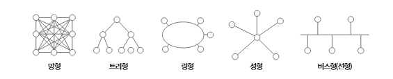
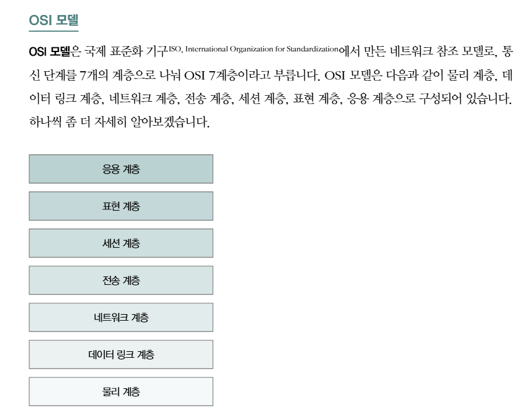

## 네트워크의 큰 그림

### 네트워크의 기본 구조

* **정의**: 여러 장치(컴퓨터, 서버, 라우터 등)가 **통신 매체**(케이블, 무선 등)로 연결되어 **데이터 교환**을 수행하는 구조.
* **주요 구성 요소**

  * **호스트(Host)**: 통신의 종단 장치. PC, 서버, 스마트폰 등.
  * **네트워크 장비**:

    * **허브/스위치**: LAN 내부에서 데이터 중계.
    * **라우터**: 다른 네트워크로 패킷을 전달.
    * **게이트웨이**: 서로 다른 프로토콜 간 변환.
  * **전송 매체**: UTP 케이블, 광섬유, 무선 주파수 등.
* **네트워크 종류**

  * LAN(Local Area Network): 회사/집 내부 네트워크.
  * WAN(Wide Area Network): ISP, 백본망.
  * 인터넷: WAN+LAN의 집합체.

**핵심 개념**: 인터넷은 하나의 거대한 네트워크가 아니라 “**네트워크들의 네트워크**”.

---

### 두 호스트 간 패킷 송수신 과정

1. **응용 계층**: 브라우저가 “[www.example.com”에](http://www.example.com”에) HTTP 요청.
2. **전송 계층**: TCP가 세그먼트 단위로 쪼개고, 포트 번호(예: 80, 443) 추가.
3. **네트워크 계층**: IP 주소(출발지, 목적지) 붙여 **IP 패킷** 생성.
4. **데이터링크 계층**: 패킷을 프레임으로 감싸고 MAC 주소 추가.
5. **물리 계층**: 비트(0과 1)를 전기 신호/광 신호/전파로 변환해 전송.
6. **수신 측**: 반대로 계층을 따라 올라가며 역캡슐화(decapsulation) → 최종적으로 응용 계층에서 데이터 확인.

---

### 네트워크 지도 (토폴로지)

* **버스형**: 하나의 선로 공유, 충돌 많음 → 현재는 잘 안 씀.
* **스타형**: 중앙 스위치에 모든 장치 연결. 현대 LAN 기본.
* **링형**: 원형 연결. 장애에 취약.
* **메시형**: 모든 노드가 다수 연결. 안정적이지만 비용↑ → 인터넷 구조와 유사.

현대 네트워크: **스타형 LAN + 메시형 WAN** 혼합 구조.


---

### OSI 7계층


## 2. 물리 계층과 데이터 링크 계층

### 이더넷(Ethernet)

* 가장 널리 쓰이는 LAN 프로토콜.
* **데이터 단위**: 프레임(Frame).
* **CSMA/CD**: 매체 감지 → 충돌 시 재전송 (현재는 스위치 기반이라 충돌 거의 없음).
* 프레임 구조:

  ```
  [목적지 MAC | 출발지 MAC | 타입 | 데이터 | CRC(FCS)]
  ```

---

### 유무선 통신 매체

* **유선**

  * UTP 케이블(Cat5e, Cat6): 근거리 LAN.
  * 광섬유: 초고속/장거리 통신.
* **무선**

  * Wi-Fi (IEEE 802.11): 전파 기반 근거리.
  * Bluetooth: 저전력 근거리.
  * 셀룰러(4G, 5G): 통신사 기지국 기반 광역.
* 장단점:

  * 유선: 안정적·보안 ↑ / 설치 불편.
  * 무선: 편리 / 간섭·보안 취약.

---

### 네트워크 인터페이스 카드(NIC)

* 하드웨어 장치, OSI 2계층 담당.
* **고유 식별자**: MAC 주소(48비트, 전 세계 유일).
* IP 패킷을 프레임 단위로 변환하고, CPU와 협력하여 전송.

---

### 허브(Hub) vs 스위치(Switch)

* **허브** (2계층 장비 아님, 단순 신호 증폭기):

  * 모든 포트에 브로드캐스트.
  * 충돌 도메인 = 네트워크 전체.
* **스위치** (2계층 장비):

  * MAC 주소 테이블 기반 → 목적지 포트만 전달.
  * 충돌 도메인 분리 → 효율성 ↑.
* **라우터**: 3계층 장비, IP 기반 패킷 전달.

---

## 네트워크 계층 – IP

### IP의 목적과 특징

* **주소 지정**: 전 세계적으로 유일한 논리적 주소.
* **라우팅**: 목적지까지 최적 경로를 탐색.
* **특징**:

  * 비연결성(Connectionless): 연결 설정 없음.
  * 비신뢰성(Unreliable): 손실, 중복, 순서 바뀔 수 있음 → TCP로 보완.

---

### IP 주소 구조

* **IPv4**: 32비트, 4바이트. (예: 192.168.1.1)

  * 네트워크 부분 + 호스트 부분.
  * 서브넷 마스크로 구분 (예: 255.255.255.0).
* **IPv6**: 128비트. 주소 부족 문제 해결, 보안·QoS 강화.

---

### 공인/사설 IP

* **공인 IP**: 인터넷에서 고유하게 할당, ISP가 제공.
* **사설 IP**: 내부망용 (RFC1918 규약)

  * 10.0.0.0 \~ 10.255.255.255
  * 172.16.0.0 \~ 172.31.255.255
  * 192.168.0.0 \~ 192.168.255.255
* 인터넷 연결 시 NAT(Network Address Translation) 필요.

---

### IP 주소 할당 방식

* **정적 할당**: 관리자가 직접 IP 입력.
* **동적 할당(DHCP)**: DHCP 서버가 자동으로 임대(lease) 방식으로 부여.

  * 장점: 관리 효율 ↑
  * 단점: 서버 다운 시 할당 불가.

---

### ICMP (Internet Control Message Protocol)

* **IP 보조 프로토콜**.
* 용도:

  * Ping(Echo Request/Reply): 네트워크 연결 확인.
  * Traceroute: 패킷 경로 추적.
  * 오류 메시지: 목적지 도달 불가(Destination Unreachable).
* 데이터 전송용 X → 진단/제어용 O.

---

### ARP (Address Resolution Protocol)

* 목적: **IP 주소 ↔ MAC 주소 변환**.
* 동작 과정:

  1. 송신자: 브로드캐스트
  2. 해당 장치: 응답
  3. 송신자는 캐시(ARP Cache)에 저장 후 사용.
* 보안 이슈: ARP 스푸핑(가짜 MAC으로 응답).


좋습니다 👍
네트워크 Part 1\~3(큰 그림 \~ IP)에서 나올 법한 **면접 질문 6개**를 정리해 드릴게요.
각 질문마다 **핵심 답변 포인트**도 같이 붙였습니다.

---
### 예상 질문
1. 웹 브라우저에 [www.naver.com을](http://www.naver.com을) 입력하면 어떤 일이 일어나나요?

2. 허브와 스위치의 차이점은?

3. IP 주소와 MAC 주소의 차이를 설명해 보세요.

4. ARP가 무엇이고 어떻게 동작하나요?

5. IPv4의 한계와 이를 해결하기 위한 방법은 무엇인가요?

6. ICMP는 어떤 역할을 하나요?